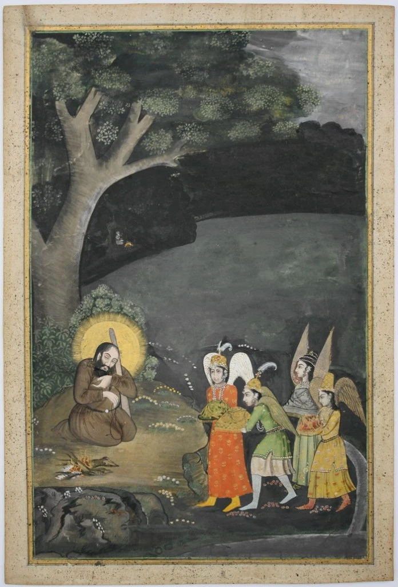

ਚੋਰ ਕਰਨ ਨਿੱਤ ਚੋਰੀਆਂ,  
ਅਮਲੀ ਨੂੰ ਅਮਲਾਂ ਦੀਆਂ ਘੋੜੀਆਂ,  
ਕਾਮੀ ਨੂੰ ਚਿੰਤਾ ਕਾਮ ਦੀ,  
ਅਸਾਂ ਤਲਬ ਸਾਂਈਂ ਦੇ ਨਾਮੁ ਦੀ ।1।ਰਹਾਉ।  
  
ਪਾਤਿਸ਼ਾਹਾਂ ਨੂੰ ਪਾਤਿਸ਼ਾਹੀਆਂ,  
ਸ਼ਾਹਾਂ ਨੂੰ ਉਗਰਾਹੀਆਂ,  
ਮਿਹਰਾਂ ਨੂੰ ਪਿੰਡ ਗਰਾਂਵ ਦੀ ।1।  
  
ਅਸਾਂ ਤਲਬ ਸਾਂਈਂ ਦੇ ਨਾਮੁ ਦੀ  
  
ਇਕੁ ਬਾਜੀ ਪਾਈ ਸਾਈਆਂ,  
ਇਕ ਅਚਰਜ ਖੇਲ ਬਣਾਈਆਂ,  
ਸਭਿ ਖੇਡ ਖੇਡ ਘਰਿ ਆਂਵਦੀ ।2।  
  
ਅਸਾਂ ਤਲਬ ਸਾਂਈਂ ਦੇ ਨਾਮੁ ਦੀ  
  
ਲੋਕ ਕਰਨ ਲੜਾਈਆਂ,  
ਸਰਮੁ ਰਖੀਂ ਤੂੰ ਸਾਈਆਂ,  
ਸਭ ਮਰਿ ਮਰਿ ਖ਼ਾਕ ਸਮਾਂਵਦੀ ।3।  
  
ਅਸਾਂ ਤਲਬ ਸਾਂਈਂ ਦੇ ਨਾਮੁ ਦੀ  
  
ਇਕ ਸ਼ਾਹੁ ਹੁਸੈਨ ਫ਼ਕੀਰ ਹੈ,  
ਤੁਸੀਂ ਨ ਕੋਈ ਆਖੋ ਪੀਰ ਹੈ,  
ਅਸਾਂ ਕੂੜੀ ਗੱਲ ਨ ਭਾਂਵਦੀ ।4।  
  
ਅਸਾਂ ਤਲਬ ਸਾਂਈਂ ਦੇ ਨਾਮੁ ਦੀ

चोर करन नित्त चोरियां,  
अमली नूं अमलां दियां घोड़ियां,  
कामी नूं चिंता काम दी,  
असां तलब सांईं दे नामु दी ।1।रहाउ।  
  
पातिशाहां नूं पातिशाहियां,  
शाहां नूं उगराहियां,  
मेहरां नूं पिंड गरांव दी ।1।  
  
असां तलब सांईं दे नामु दी  
  
इकु बाजी पाई साईआं,  
इक अचरज खेल बणाईआं,  
सभि खेड खेड घरि आंवदी ।2।  
  
असां तलब सांईं दे नामु दी  
  
लोक करन लड़ाईआं,  
सरमु रखीं तूं साईआं,  
सभ मरि मरि ख़ाक समांवदी ।3।  
  
असां तलब सांईं दे नामु दी  
  
इक शाहु हुसैन फ़कीर है,  
तुसीं न कोई आखो पीर है,  
असां कूड़ी गल्ल न भांवदी ।4।  
  
असां तलब सांईं दे नामु दी

چور کرن نت چوریاں،  
عملی نوں عملاں دیاں گھوڑیاں،  
کامی نوں چنتا کام دی،  
اساں طلب سانئیں دے نامُ دی ۔1۔رہاؤ۔  
  
پاتشاہاں نوں پاتشاہیاں،  
شاہاں نوں اگراہیاں،  
مہراں نوں پنڈ گرانو دی ۔1۔  
  
اساں طلب سانئیں دے نامُ دی  
  
اکُ باجی پائی سائیاں،  
اک اچرج کھیل بنائیاں،  
سبھِ کھیڈ کھیڈ گھرِ آنودی ۔2۔  
  
اساں طلب سانئیں دے نامُ دی  
  
لوک کرن لڑائیاں،  
سرمُ رکھیں توں سائیاں،  
سبھ مرِ مرِ خاک سمانودی ۔3۔  
  
اساں طلب سانئیں دے نامُ دی  
  
اک شاہُ حسین فقیر ہے،  
تسیں ن کوئی آکھو پیر ہے،  
اساں کوڑی گلّ ن بھانودی ۔4۔  
  
اساں طلب سانئیں دے نامُ دی

Glossary:
---------

**Amli:** Drug addict. _Nashebaaz._  
**Ghorhi:** Mare, A song in praise. Here the Amli is riding on the drug horse.  
**Kami:** One in pursuit of Kama, Sex, Desire.  
**Talab:** Craving

**Paatshah:** _Baadshaah_, Monarch, King.  
**Paatshahi:** Monarchy, Kingdom  
**Shah**: Merchant, Moneylender, Rich, Banker  
**Mihar**: Chaudhari, Village owner, Landlord.

**Bazi**: A game  
**Acharaz:** Astonishing  
**Khel**: Game, Theater, Play

**Saram:** Shame, Coyness, Shyness  
**Khaaq:** Mud, Earth, Ground, Dirt  
**Smanvdi:** Enmeshed. Mixed. Gets lowered.

**Pir**: Wise man  
**Koorhii:** Dirt, Trash  
**Bhaanvdi:** Like, Admire, Accept

**Somewhat literal translation/reading:**
-----------------------------------------

The thieves are into thievery.  
The addicts are riding high on drugs.  
The lustful are engrossed in lust all the time.  
I, on the other hand, crave for the beloved's name

The monarchs care for monarchy.  
The moneylenders care for the recovery.  
The landlords of the village care about their domain,  
I crave for the beloved's name.

You have played a trick.  
I have become a wondrous game.  
Everyone plays and goes back home.  
I crave for the beloved's name.

People fight with one another.  
Beloved, you should give me cover.  
Everyone will die and turn to dust.  
I crave for the beloved's name.

Shah Hussain is a fakir, a medicant.  
Do not call me a Pir, the wise man.  
I do not accept the unworthy names.  
I just crave for the beloved's name.  

### Composition:

https://soundcloud.com/abdulnasir-khan/pathanay-khan-asan-talab-sain?fbclid=IwAR1Jwz4RSNPsnLueoTEwLugJj6jC47dEWHQL9\_QH5ElTO-rYUNWoNVaxfq0

**Painting Credits:**  
  
Provincial Mughal, Awadh  
Sultan Ibrahim bin Adham visited by angels  
Circa late 18th century  
28.1 x 18.95cm  
Courtesy [http://www.indianminiaturepaintings.co.uk/](http://www.indianminiaturepaintings.co.uk/)

_Crossposted from [https://sayshussain.wordpress.com/2020/06/29/asan-talab-sayeen-de-naam-di/](https://sayshussain.wordpress.com/2020/06/29/asan-talab-sayeen-de-naam-di/)_