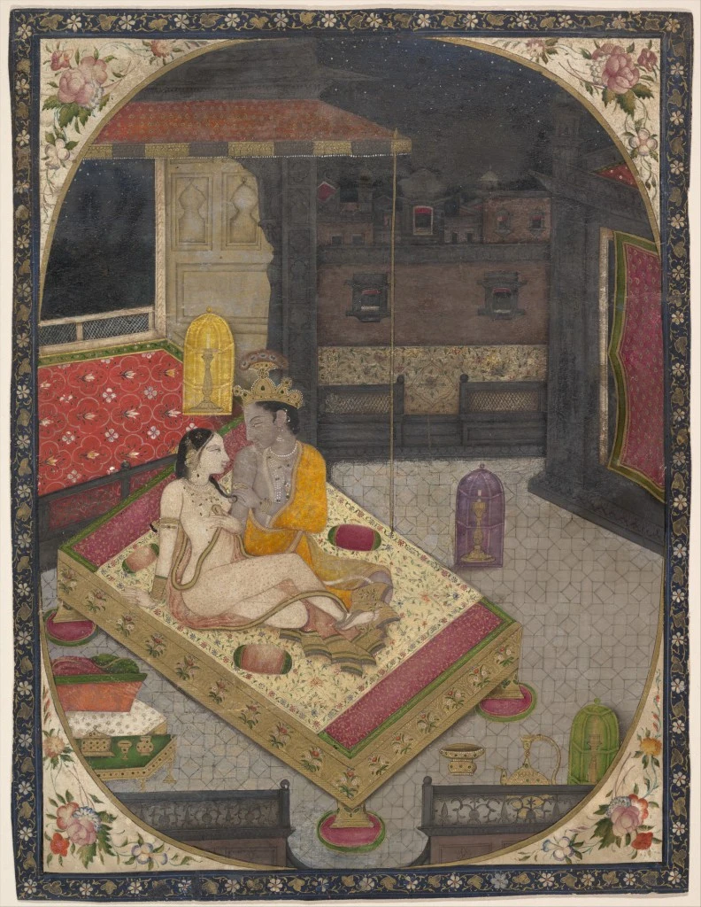

ਝੁਮੇ ਝੁਮ ਖੇਲਿ ਲੈ ਮੰਝ ਵੇਹੜੇ,  
ਜਪਦਿਆਂ ਨੂੰ ਹਰਿ ਨੇੜੇ।1।ਰਹਾਉ।  
  
ਵੇਹੜੇ ਦੇ ਵਿਚ ਨਦੀਆਂ ਵਗਣਿ,  
ਬੇੜੇ ਲੱਖ ਹਜ਼ਾਰ,  
ਕੇਤੀ ਇਸ ਵਿਚ ਡੁੱਬਦੀ ਡਿੱਠੀ,  
ਕੇਤੀ ਲੰਘੀ ਪਾਰਿ।1।  
  
ਝੁਮੇ ਝੁਮ ਖੇਲਿ ਲੈ ਮੰਝ ਵੇਹੜੇ,  
ਜਪਦਿਆਂ ਨੂੰ ਹਰਿ ਨੇੜੇ  
  
ਇਸ ਵੇਹੜੇ ਦੇ ਨੌਂ ਦਰਵਾਜ਼ੇ,  
ਦਸਵੇਂ ਕੁਲਫ਼ ਚੜ੍ਹਾਈ,  
ਤਿਸੁ ਦਰਵਾਜ਼ੇ ਦੀ ਮਹਿਰਮੁ ਨਾਹੀਂ,  
ਜਿਤੁ ਸਹੁ ਆਵਹਿ ਜਾਈ।2।  
  
ਝੁਮੇ ਝੁਮ ਖੇਲਿ ਲੈ ਮੰਝ ਵੇਹੜੇ,  
ਜਪਦਿਆਂ ਨੂੰ ਹਰਿ ਨੇੜੇ  
  
ਵੇਹੜੇ ਦੇ ਵਿਚਿ ਆਲਾ ਸੋਹੇ,  
ਆਲੇ ਦੇ ਵਿਚ ਤਾਕੀ,  
ਤਾਕੀ ਦੇ ਵਿਚਿ ਸੇਜ ਵਿਛਾਵਾਂ,  
ਅਪਣੇ ਪੀਆ ਸੰਗਿ ਰਾਤੀ।3।  
  
ਝੁਮੇ ਝੁਮ ਖੇਲਿ ਲੈ ਮੰਝ ਵੇਹੜੇ,  
ਜਪਦਿਆਂ ਨੂੰ ਹਰਿ ਨੇੜੇ  
  
ਇਸ ਵੇਹੜੇ ਵਿਚ ਮਕਨਾਂ ਹਾਥੀ,  
ਸੰਗਲ ਨਾਲ ਖਹੇੜੇ,  
ਕਹੈ ਹੁਸੈਨ ਫ਼ਕੀਰ ਸਾਂਈਂ ਦਾ,  
ਜਾਗਦਿਆਂ ਕਉਣ ਛੇੜੇ।4।  
  
ਝੁਮੇ ਝੁਮ ਖੇਲਿ ਲੈ ਮੰਝ ਵੇਹੜੇ,  
ਜਪਦਿਆਂ ਨੂੰ ਹਰਿ ਨੇੜੇ

جھمے جھم کھیلِ لے منجھ ویہڑے،  
جپدیاں نوں ہرِ نیڑے ۔1۔رہاؤ۔  
  
ویہڑے دے وچ ندیاں وگنِ،  
بیڑے لکھ ہزار،  
کیتی اس وچ ڈبدی ڈٹھی،  
کیتی لنگھی پارِ ۔1۔  
  
جھمے جھم کھیلِ لے منجھ ویہڑے،  
جپدیاں نوں ہرِ نیڑے  
  
اس ویہڑے دے نوں دروازے،  
دسویں کلف چڑھائی،  
تسُ دروازے دی مہرمُ ناہیں،  
جتُ سہُ آوہِ جائی ۔2۔  
  
جھمے جھم کھیلِ لے منجھ ویہڑے،  
جپدیاں نوں ہرِ نیڑے  
  
ویہڑے دے وچِ اعلیٰ سوہے،  
آلے دے وچ طاقی،  
طاقی دے وچِ سیج وچھاواں،  
اپنے پیا سنگِ راتی ۔3۔  
  
جھمے جھم کھیلِ لے منجھ ویہڑے،  
جپدیاں نوں ہرِ نیڑے  
  
اس ویہڑے وچ مکناں ہاتھی،  
سنگل نال کھہیڑے،  
کہےَ حسین فقیر سانئیں دا،  
جاگدیاں کؤن چھیڑے ۔4۔  
  
جھمے جھم کھیلِ لے منجھ ویہڑے،  
جپدیاں نوں ہرِ نیڑے

### Composition:

https://soundcloud.com/saminahasansyed/jhume-jhum-khed-le-shah-hussain-sung-by-samina-hasan-syed?in=saminahasansyed/sets/shah-hussain

Picture:

_Radha and Krishna on a Bed at Night, ca. 1830 India (Punjab Hills, Sirmur), Ink and opaque watercolor on paper; 7 3/8 x 9 3/4 in. (18.7 x 24.8 cm) The Metropolitan Museum of Art, New York, Gift of Cynthia Hazen Polsky, 1985 (1985.398.13) http://www.metmuseum.org/Collections/search-the-collections/37959_

_Crossposted from [https://sayshussain.wordpress.com/2020/06/17/jhumai-jhum-khel-lai-manjh-vehde/](https://sayshussain.wordpress.com/2020/06/17/jhumai-jhum-khel-lai-manjh-vehde/)_