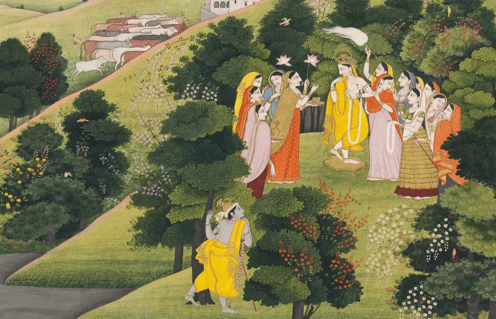

```
ਬੁਰੀਆਂ ਬੁਰੀਆਂ ਬੁਰੀਆਂ ਵੇ,
ਅਸੀਂ ਬੁਰੀਆਂ ਵੇ ਲੋਕਾ।

ਬੁਰੀਆਂ ਕੋਲ ਨ ਬਹੁ ਵੇ।
ਤੀਰਾਂ ਤੇ ਤਲਵਾਰਾਂ ਕੋਲੋਂ,
ਤਿੱਖੀਆਂ ਬਿਰਹੁੰ ਦੀਆਂ ਛੁਰੀਆਂ ਵੇ ਲੋਕਾ।1।ਰਹਾਉ।

ਲਡਿ ਸੱਜਣ ਪਰਦੇਸ ਸਿਧਾਣੇ,
ਅਸੀਂ ਵਿਦਿਆ ਕਰ ਕੇ ਮੁੜੀਆਂ ਵੇ ਲੋਕਾ।1।

ਜੇ ਤੂੰ ਤਖ਼ਤ ਹਜ਼ਾਰੇ ਦਾ ਸਾਂਈਂ,
ਅਸੀਂ ਸਿਆਲਾਂ ਦੀਆਂ ਕੁੜੀਆਂ ਵੇ ਲੋਕਾ।2।

ਸਾਝ ਪਾਤਿ ਕਾਹੂੰ ਸੋਂ ਨਾਹੀਂ,
ਸਾਂਈਂ ਖੋਜਨਿ ਅਸੀਂ ਟੁਰੀਆਂ ਵੇ ਲੋਕਾ।3।

ਜਿਨ੍ਹਾਂ ਸਾਂਈਂ ਦਾ ਨਾਉਂ ਨ ਲੀਤਾ,
ਓੜਕ ਨੂੰ ਉਹ ਝੁਰੀਆਂ ਵੇ ਲੋਕਾ।4।

ਕਹੈ ਹੁਸੈਨ ਫ਼ਕੀਰ ਸਾਂਈਂ ਦਾ,
ਸਾਹਿਬੁ ਸਿਉਂ ਅਸੀਂ ਜੁੜੀਆਂ ਵੇ ਲੋਕਾ।5।


``````
بریاں بریاں بریاں وے،
اسیں بریاں وے لوکا ۔

بریاں کول ن بہو وے ۔
تیراں تے تلواراں کولوں،
تکھیاں برہں دیاں چھریاں وے لوکا ۔1۔رہاؤ۔

لڈِ سجن پردیس سدھانے،
اسیں ودیا کر کے مڑیاں وے لوکا ۔1۔

جے توں تخت ہزارے دا سانئیں،
اسیں سیالاں دیاں کڑیاں وے لوکا ۔2۔

ساجھ پاتِ کاہوں سوں ناہیں،
سانئیں کھوجنِ اسیں ٹریاں وے لوکا ۔3۔

جنہاں سانئیں دا ناؤں ن لیتا،
اوڑک نوں اوہ جھریاں وے لوکا ۔4۔

کہےَ حسین فقیر سانئیں دا،
صاحبُ سیوں اسیں جڑیاں وے لوکا ۔5۔
```

#### Compositions:

https://soundcloud.com/saminahasansyed/buriyan-byriyan-buriyan-asi-buriyan-ve-loka-sangat-gavan-old-composition-by-najm-hosain-syed

_Sung by Risham Hussain Syed. Composition by Najm Hussain Syed_

https://soundcloud.com/saminahasansyed/buriyan-byriyan-buriyan-asi-buriyan-ve-loka-sangat-gavan-new-composition-by-najm-hosain-syed

_Sung by Risham Hussain Syed. Composition by Najm Hussain Syed_

Picture:

Krishna spies on radha dressed in Krishna’s clothes and pretending to be him  
Chamba, c. 1800–10, attributed to the Guler artist Chajju Opaque pigments and gold on paper Folio: 30.6 × 43.8 cm  
Painting: 22.9 × 35.8 cm, within a blue margin with gold and silver scroll and a cream border decorated with grey and black clouds  
Provenance Svetoslav Nikolaevich Roerich collection  
Courtesy: [Francesca Galloway](https://www.francescagalloway.com/exhibitions/past) Rajput Paintings from the Ludwig Habighorst Collection Asia Week New York 2019 13 - 22 March 2019

_Crossposted from [https://sayshussain.wordpress.com/2020/07/25/asin-burian-ve-loka/](https://sayshussain.wordpress.com/2020/07/25/asin-burian-ve-loka/)_