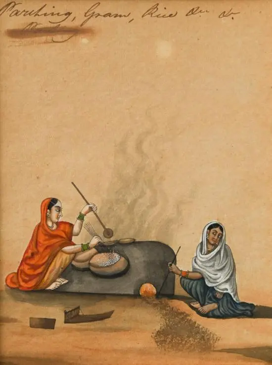

```
**ਭੁੰਨ ਦੇ ਫ਼ਕੀਰਾਂ ਦੇ ਦਾਣੇ
ਨੀ ਤੈਨੂੰ ਤਰਸ ਨਾਂ ਆਵੇ

ਪਿੱਛੇ ਆਇਆਂ ਨੂੰ ਭੁੰਨ ਭੁੰਨ ਦੇਨੀ ਏਂ
ਖੜੇ ਨੀ ਫ਼ਕੀਰ ਨਿਮਾਣੇ

ਲੋਕਾਂ ਦੇ ਭੁੰਨਨੀ ਏਂ ਕਣਕ ਤੇ ਛੋਲੇ
ਫ਼ੱਕਰਾਂ ਦੇ ਜੌਂ ਨੀਂ ਪੁਰਾਣੇ

ਕਹੇ ਹੁਸੈਨ ਫ਼ਕੀਰ ਸਾਈਂ ਦਾ
ਜੰਗਲ ਜਾਏ ਸਮਾਣੇ**
``````
**کھن دے فقیراں دے دانے
نی تینوں ترس نہ آوے

پچھے آیاں نوں بھن بھن دینی ایں
کھڑے نی فقیر نمانے

لوکاں دے بھننی ایں کنک تے
چھولے
فقراں دے جوں نیں پرانے

کہے حسین فقیر سائیں دا
جنگل جاء سمانے**
```

  
Painting:

Indian Company School, circa 1830  
Women parching grain and rice  
watercolour, pen and ink on laid paper (4)  
h:21 w:18 cm

_Crossposted from [https://sayshussain.wordpress.com/2020/07/14/bhun-de-fakiran-de-daane/](https://sayshussain.wordpress.com/2020/07/14/bhun-de-fakiran-de-daane/)_