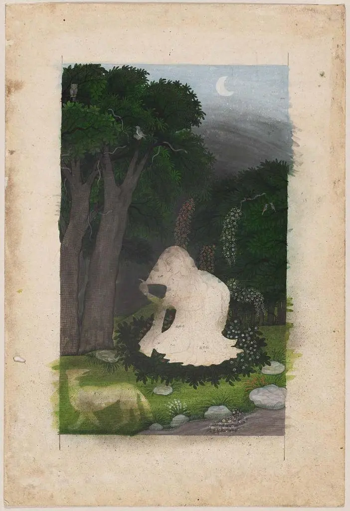

```
**ਮੇਰੇ ਸਾਹਿਬਾ ਮੈਂ ਤੇਰੀ ਹੋ ਮੁਕੀ ਆਂ ।ਰਹਾਉ ।

ਮਨਹੁ ਨਾ ਵਿਸਾਰੀਂ ਤੂੰ ਮੈਨੂੰ ਮੇਰੇ ਸਾਹਿਬਾ,
ਹਰਿ ਗਲੋਂ ਮੈਂ ਚੁਕੀ ਆਂ ।1।

ਅਉਗੁਣਿਆਰੀ ਨੂੰ ਕੋ ਗੁਣੁ ਨਾਹੀਂ,
ਬਖਸਿ ਕਰੇਂ ਤਾਂ ਮੈਂ ਛੁਟੀ ਆਂ ।2।

ਜਿਉਂ ਭਾਵੇ ਤਿਉਂ ਰਾਖ ਪਿਆਰਿਆ,
ਦਾਵਣ ਤੇਰੇ ਮੈਂ ਲੁਕੀ ਆਂ ।3।

ਜੇ ਤੂੰ ਨਜ਼ਰ ਮਿਹਰ ਦੀ ਪਾਵੇਂ,
ਚੜ੍ਹਿ ਚਉਬਾਰੇ ਮੈਂ ਸੁੱਤੀ ਆਂ ।4।

ਕਹੈ ਹੁਸੈਨ ਫ਼ਕੀਰ ਸਾਈਂ ਦਾ,
ਦਰ ਤੇਰੇ ਦੀ ਮੈਂ ਕੁੱਤੀ ਆਂ ।5।**


``````
**میرے صاحبہ میں تیری ہو مکی آں ۔رہاؤ ۔

منہُ نہ وساریں توں مینوں میرے صاحبہ،
ہرِ گلوں میں چکی آں ۔1۔

اؤگنیاری نوں کو گنُ ناہیں،
بخسِ کریں تاں میں چھٹی آں ۔2۔

جیوں بھاوے تؤں راکھ پیاریا،
داون تیرے میں لکی آں ۔3۔

جے توں نظر مہر دی پاویں،
چڑھِ چؤبارے میں ستی آں ۔4۔

کہےَ حسین فقیر سائیں دا،
در تیرے دی میں کتی آں ۔5۔**
```

Composition:

https://soundcloud.com/saminahasansyed/shah-hussain-mere-sahiba-main-trei-ho-muki-aan-by-risham-syed-at-49-jail-road-lahore

Picture:

Utka or Vasuka Nayika (The Heroine Who Waits Anxiously for Her Absent Lover)  
Attributed to: The Family of NainsukhIndian, Pahariabout 1800 with color added about 1850Object Place: Kangra style, Punjab Hills, Northern India  
MEDIUM/TECHNIQUE  
Ink and opaque watercolor on paper  
Courtesy: [Mueseum Of Fina Arts Boston](https://collections.mfa.org/objects/149054/utka-or-vasuka-nayika-the-heroine-who-waits-anxiously-for-h)

_Crossposted from [https://sayshussain.wordpress.com/2020/07/21/mere-sahiba-main-teri-ho-mukki-aan/](https://sayshussain.wordpress.com/2020/07/21/mere-sahiba-main-teri-ho-mukki-aan/)_