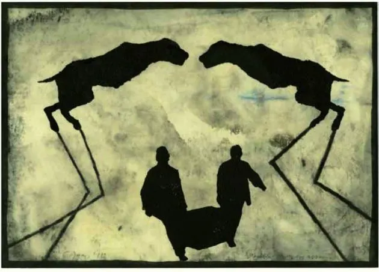

```
**1 ਜਿਸ ਨਗਰੀ ਠਾਕੁਰ ਜਸੁ ਨਾਹੀਂ,
2 ਸੋ ਕਾਕਰ ਕੂਕਰ ਬਸਤੀ ਹੈ ।

3 ਅਗਰ ਚੰਦਨ ਕੀ ਸਾਰੁ ਨ ਜਾਣੈ,
4 ਪਾਥਰ ਸੇਤੀ ਘਸਤੀ ਹੈ ।

5 ਛੈਲਾਂ ਸੇਤੀ ਘੁੰਘਟ ਕਾਢੇ,
6 ਬੈਲਾਂ ਸੇਤੀ ਹਸਤੀ ਹੈ ।

7 ਕਹੈ ਹੁਸੈਨ ਫ਼ਕੀਰ ਸਾਂਈਂ ਦਾ,
8 ਸਵਾ ਸੇਰ ਕੀ ਮਸਤੀ ਹੈ ।** 
``````
**1 جس نگری ٹھاکر جسُ ناہیں 
سو کاکر کوکر بستی ہے ۔2

3 اگر چندن کی سارُ ن جانے
4 پاتھر سیتی گھستی ہے ۔

5 چھیلاں سیتی گھونگھٹ کاڈھے
6 بیلاں سیتی ہنستی  ہے ۔

7 کہےَ حسین فقیر سانئیں دا
8 سوا سیر کی مستی ہے ۔**
```

### Glossary:

1.  Nagri – Wasti/Abadi/Shehr Graan, wasaib, smaaj, vehaar

Thakur – Sain, Maalik, Haakim, Zameendar, Mukhtar, Kartar, Rab, Devta

Jas    1) Sach, Sachai, Changyai, Sidq, Sachiarat, Gun, Wasf, Khoobi  
         2) Nek Na – Nek Naami, Izzat  
         3) Changay Kaam Di Vadiai, Changay Kaam Di Vadiai Lai Banaya Gaun  
         4) Sat, Satya, Kam lai himmat, capacity  
         5) Khul, Udhaar, Azaadi, Mukti  
        6) Saakh, Parteet, Aitbaar, Trust  
        7) Barkat  
        8) Asar, Taaseer

2.  So: Oh  
    Kaak: Kaag, Kaan (Crow)  
    Kookar: 1) Kutta  
                  2) Kook, Pukar, Faryaad, Duhaai  
                  3) Jo Kookay, Duhai Devey  
    Basti: Abaadi, Vasson, Vaas, Shehr, Pind, Lok
3.  Agar: 1) Ik Khushboo vaali Lakkar  
    2) Agal, Agla, Mohrla, agge da  
    Chandan: Sandal di lakri  
    Saar: 1) Khabar, patta  
            2) Asla, Andar da hissa, maghz, pith  
            3) Bantar, Banaawan, Tayaar karan, Marammat
4.  Paathar: Patthar, Sakht shai, Watta  
                  2) Sakht, be harkat, be hiss, sakht dil – seeti naal ghusdi, ghasti: ghasdi ai, ghasarr di ai (ghassan: ragarna, ghassaona, ghasaya jaana, ghis jana, raggar kha ke khatam ho jaana, mukkan, ghutan
5.  Chhail – banka, khoobsurat, jawaan, tarang wala

Ghunghat: Ghunght, ghund, ohla, parda, veil

Kaadhe: Kadhe

6.  Bail – Balad, Bull, Daand, Dhagga  
    2) Moorkh, be aql

Hans: Khush Hovan, raazi hovan, dil lawn, pasand karan, flirt karan

7.  Faqeer: Khaali, be mall

Saain- Malik, Murshid, Mehboob, Qudrat  
Sawaa Ser: Ser te ik paa, vadh, ziada, Muqable vich ziada: lodon(lorhon) wadh  
Masti: 1) Nasha, tarang  
          2) Shokhi, Main, Wakhala, aap huddar, ghamand, gharoor  
          3) Hawas, Lust

Glossary by _Najm Hussain Syed_  
Shared in Farsi script by _Abbas Ali_  
Typed into Roman by _Amit Julka_

### Composition:

https://soundcloud.com/saminahasansyed/jis-nagri-thakur-shah-hussain-by-samina-hasan-syed?in=saminahasansyed/sets/shah-hussain

_Recited by Farjad, Sung by Samina Hussain Syed_

### Picture:

Painting from Animalinside, by German artist Max Neuman, part of collaborative work with Laszlo Kraznoharkai  
[Pop Matters](https://www.popmatters.com/151035-animalinside-by-laszlo-krasznahorkai-and-max-neumann-2495920541.html)

_Crossposted from [https://sayshussain.wordpress.com/2020/08/02/jis-nagri-thakur-jas-naahi/](https://sayshussain.wordpress.com/2020/08/02/jis-nagri-thakur-jas-naahi/)_