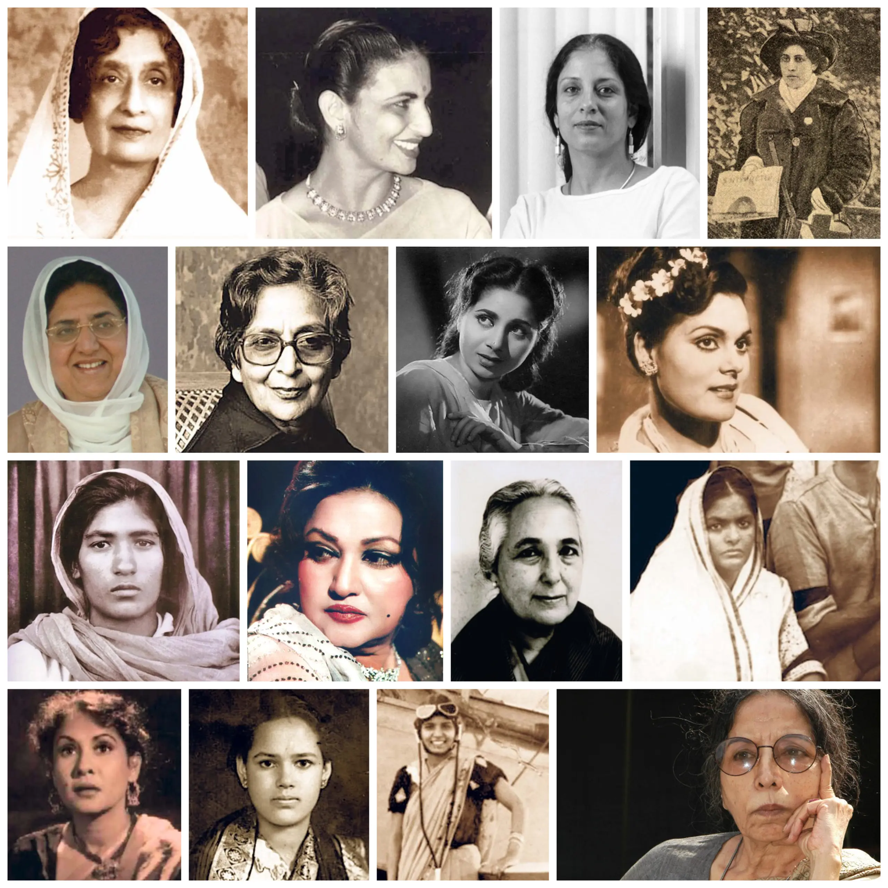
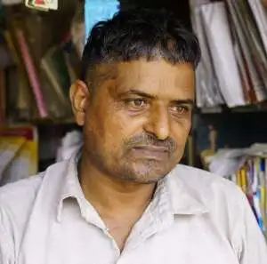

**ਔਰਤਾਂ ਪੰਜਾਬ ਕੀਆਂ ਬੱਲੇ ਬੱਲੇ ਆਂ**

ਹਰਿੱਕ ਖੇਤਰਾਂ ਮਾ ਪਾਏ ਤਰਥੱਲੇ ਆਂ । ਔਰਤਾਂ ਪੰਜਾਬ ਕੀਆਂ ਬੱਲੇ ਬੱਲੇ ਆਂ ॥੧॥

ਅਮ੍ਰਿਤ ਕੌਰ ਬਣੀ ਥੀਗੀ ਸੇਹਤ ਮੰਤਰੀ । ਭੱਠਲ ਪੰਜਾਬ ਪਹਿਲੀ ਮੁੱਖ ਮੰਤਰੀ । ਸੋਫੀਆ ਦਲੀਪ ਲੜੀ ਬੋਟ ਹੱਕ ਲਈ । ਮੋਹਣੀ ਦਾਸ ਰੇਡੀਓ ਕੀ ਲਾਜ ਰੱਖ ਲਈ । ਗੁਲਾਬ ਕੌਰੇ ਫਿਰੰਗੀ ਦੇਸ ਤੇ ਦਬੱਲੇ ਆਂ । ਔਰਤਾਂ ਪੰਜਾਬ ਕੀਆਂ ਬੱਲੇ ਬੱਲੇ ਆਂ ॥੨॥

ਮੁਖਤਾਰ ਬੇਗਮ ਬਾਲੀਵੁੱਡ ਕੀ ਥੀ ਨਾਇਕਾ । ਖੁਰਸ਼ੀਦ ਬਾਨੋ ਪਾਲੀਵੁੱਡ ਕੀ ਥੀ ਗਾਇਕਾ । ਮੁਹੰਮਦੀ ਬੇਗਮ ਪਹਿਲੀ ਥੀ ਸੰਪਾਦਿਕਾ । ਉਮਾ ਨੇ ਥਾ ਖੇਲਿਆ ਨਾਟਕ ਲਤਿਕਾ । ਰੋਮਿਲਾ ਧਿਆਸਕਾਰੀ ਪਿੜ ਮੱਲੇ ਆਂ । ਔਰਤਾਂ ਪੰਜਾਬ ਕੀਆਂ ਬੱਲੇ ਬੱਲੇ ਆਂ ॥੩॥

ਹਰਨਾਮ ਕੌਰ ਖੋਲ੍ਹੀ ਪਾਠਸ਼ਾਲਾ ਕੰਨਿਆ । ਸ਼ੀਲਾ ਦੀਦੀ ਹੱਕਾਂ ਆਲਾ ਮੁੱਢ ਬੰਨ੍ਹਿਆ । ਮਹਿੰਦਰ ਨਿਰਲੇਪ ਲੋਕ ਸਭਾ ਬੜੀਆਂ । ਅੰਮ੍ਰਿਤਾ ਅਜੀਤ ਲਿਖਤਾਂ ਮਾ ਚੜ੍ਹੀਆਂ । ਸਰਲਾ ਕੇ ਪਾਇਲਟੀ ਮਾ ਸਿੱਕੇ ਚੱਲੇ ਆਂ । ਔਰਤਾਂ ਪੰਜਾਬ ਕੀਆਂ ਬੱਲੇ ਬੱਲੇ ਆਂ ॥੪॥

ਲਾਜਵੰਤੀ ਪਹਿਲੇ ਕਰੀ ਪੀ ਐਚ ਡੀ । ਰਘਬੀਰ ਪਹਿਲੇ ਮੱਲੀ ਥੀ ਅਸੈਂਬਲੀ । ਗਰੇਵਾਲ ਪਹਿਲੀ ਬਣੀ ਰਾਜਪਾਲ ਜੀ । ਵੀ ਸੀ ਇੰਦਰਜੀਤ ਕਰਗੀ ਕਮਾਲ ਜੀ । ਚੌਹਾਨ ਮਿਸ ਇੰਡੀਆ ਮਾ ਲਾਏ ਟੱਲੇ ਆਂ । ਔਰਤਾਂ ਪੰਜਾਬ ਕੀਆਂ ਬੱਲੇ ਬੱਲੇ ਆਂ ॥੫॥

ਲੂੰਬਾ ਨੇ ਬਸਤੀ ਪਾ ਖੋਜਾਂ ਕਰੀਆਂ । ਗੀਤਾ ਕੁਲਦੀਪ ਅਦਾਕਾਰਾਂ ਖਰੀਆਂ । ਨੂਰਜਹਾਂ ਪੈਹਲਾ ਰੈੜੀਓ ਪਾ ਗੌਣ ਤਾ । ਕੈਲਾਸ਼ਪੁਰੀ ਜੈਸਾ ਬੁੱਝੋ ਬੈਦ ਕੌਣ ਤਾ । ਕਿਰਨ ਬੇਦੀ ਦੇਖ ਚੋਰ ਜੜੋਂ ਹੱਲੇ ਆਂ । ਔਰਤਾਂ ਪੰਜਾਬ ਕੀਆਂ ਬੱਲੇ ਬੱਲੇ ਆਂ । ਔਰਤਾਂ ਪੰਜਾਬ ਕੀਆਂ ਬੱਲੇ ਬੱਲੇ ਆਂ ॥੬॥

\* _ਚਰਨ ਪੁਆਧੀ_

ਚਰਨ ਪੁਆਧੀ ਪੁਆਧ ਬੁੱਕ ਡੀਪੂ ਪਿੰਡ ਅਰ ਡਾਕਖਾਨਾ ਅਰਨੌਲੀ ਭਾਈ ਜੀ ਕੀ ਵਾਇਆ ਚੀਕਾ ਜਿਲ੍ਹਾ ਕੈਥਲ ਹਰਿਆਣਾ ਪਿੰਨ ਕੋਡ ਲੰਬਰ ੧੩੬੦੩੪ ਸੰਪਰਕ ਲੰਬਰ ੯੯੯੬੪ / ੨੫੯੮੮

Charan Poadhi is a writer, artist and Poadhi language activist from village Arnauli, Dist. Kaithal, Haryana. He writes in Poadhi dialect of Punjabi, he collects and archives its folk songs. We profiled his work at Kirrt: [Charan Poadhi - Shopkeeper & Artist](https://www.kirrt.org/story/charan-poadhi-shopkeeper-and-artist-arnoli-haryana)

On International working women's day, Punjabi Tribune published the list of Punjabi women in the modern age compiled by Amarjit Chandan: [ਆਧੁਨਿਕ ਯੁਗ ਤੇ ਪੰਜਾਬੀ ਔਰਤਾਂ](https://www.punjabitribuneonline.com/2020/03/%e0%a8%86%e0%a8%a7%e0%a9%81%e0%a8%a8%e0%a8%bf%e0%a8%95-%e0%a8%af%e0%a9%81%e0%a8%97-%e0%a8%a4%e0%a9%87-%e0%a8%aa%e0%a9%b0%e0%a8%9c%e0%a8%be%e0%a8%ac%e0%a9%80-%e0%a8%94%e0%a8%b0%e0%a8%a4%e0%a8%be/)

**Collage** 1st Row: Amrit Kaur (First Health Minister India), Kailash Puri (Sexologist), Ania Loomba (Scholar) , Sophia Duleep Singh (Suffragette) 2nd Row: Rajinder Kaur Bhathal (First Chief Minister East Punjab), Amrita Pritam (Poet), Geeta Bali (Actor), Kuldeep Kaur (Actor) 3rd Row: Gulab Kaur (Ghadar Revolutionary), Noor Jahan (Singer),  Romila Thapar (Historian), Raghbir Kaur (Lawmaker) 4th Row: Khurshid Bano (Actor), Sheila Didi (Activist), Sarla Thukral(Pilot), Ajeet Cour (Writer)

_Crossposted from [https://parchanve.wordpress.com/2020/03/10/aurtan-punjab-keeyan/](https://parchanve.wordpress.com/2020/03/10/aurtan-punjab-keeyan/)_