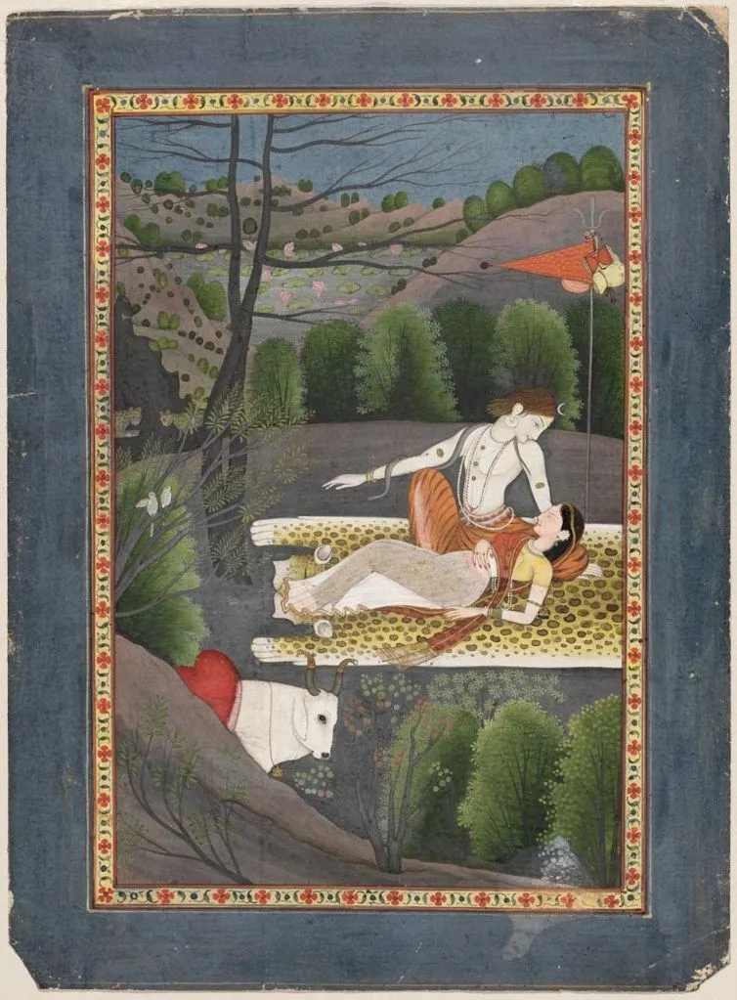

* * *

1           **ਥੋਹੜੀ ਰਹਿ ਗਈਓ ਰਾਤੜੀ**, **ਸਹੁ ਰਾਵਿਓ ਨਾਹੀਂ ।**

2          **ਧੰਨ ਸੋਈ ਸੁਹਾਗਣੀ**, **ਜਿਨ ਪੀਆ ਗਲਿ ਬਾਹੀਂ ।ਰਹਾਉ।**

3          **ਇਕ ਅੰਨ੍ਹੇਰੀ ਕੋਠੜੀ**, **ਦੂਜਾ ਦੀਵਾ ਨ ਬਾਤੀ ।**

4          **ਬਾਂਹੁ ਪਕੜਿ ਜਮੁ ਲੈ ਚਲੇ**, **ਕੋਈ ਸੰਗਿ ਨ ਸਾਥੀ ।**1**।**

5          **ਸੁਤੀ ਰਹੀ ਕੁਲਖਣੀ**, **ਜਾਗੀ ਵਡਿ ਭਾਗੀ ।**

6          **ਜਾਗਨਿ ਕੀ ਬਿਧਿ ਸੋ ਲਹੈ**, **ਜਿਸ ਅੰਤਰ ਲਾਗੀ ।**2**।**

7          **ਕਹੈ ਹੁਸੈਨ ਸਹੇਲੀਓ**, **ਸਹੁ ਕਿਤ ਬਿਧਿ ਪਈਐ ।**

8          **ਕਰ ਸਾਹਿਬ ਦੀ ਬੰਦਗੀ**, **ਰੈਣ ਜਾਗ੍ਰਤਿ ਰਹੀਐ ।**3**।**

* * *

1           **تھوہڑی رہِ گئیؤ راتڑی، سہُ راویو ناہیں ۔**

2          **دھنّ سوئی سوہاگنی، جن پیا گلِ باہیں ۔رہاؤ۔**

3          **اک انھیری کوٹھڑی، دوجا دیوا ن باتی ۔**

4          **بانہُ پکڑِ جمُ لے چلے، کوئی سنگِ ن ساتھی ۔1۔**

5          **ستی رہی کلکھنی، جاگی وڈِ بھاگی ۔**

6          **جاگنِ کی بدھ سو لہے، جس انتر لاگی ۔2۔**

7          **کہےَ حسین سہیلیؤ، سہُ کت بدھ پئیئ ۔**

8          **کر صاحب دی بندگی، رین جاگرتِ رہیئے ۔3۔**

* * *

### **Glossary:**

**1           Thoharee reh gaeeo raatri, sahu raavio naaheeN**

**Raatri**  1) raat, raat wela 2) dita hoya, daat 3)rang,  raat,  rachaa, umang, pe-shaan umaa 4) raatein phiran vali

**Sahu**   1) mehboob, pritam 2) wichaar, wichaal, andarla  3) dhongiya, gehraa, gehraee

**Raavio**  1) rajhaee-on 2) bhogiyo (rawna: rana: rijhana, mayal karna, bhogana, milap-na, maan-na)

**2          Dhann soee suhaagini, jin peeaa gali baaheen  (Rahaau)**

**Dhann  ** 1) aurat 2) mubarak, afreen (wad yawan, salahan)

**Soee**   oho aye, aap aye

**Suhagini  ** 1)suhagan,  pyaray naal vasdi 2) khush-naseeb 3) sukhi, khush, anand vich,

**Jis**   Preetam, Mehboob, Piya

**Baaheen**  Baahan

**3          Ik annheree kot'haree, doojaa deevaa na baatee**

**Kothri**  1) Kamra, Andar 2) Adda, Dera 3) Store, Bank, Firm, Vechan lai sauda tayyar karan di than, factory 4) Jism,  sareer

  
**baati**  batti, deeve da roon, Bijli

**4          Baanho pakar jam lai chale, koee sangi na saathee |1|**

**Jamm**  Patal da raja \[Yamdev\], maut devta

**5          Sutee rahee kulakhanee, jaagee vad'i bhaagee .**

**Koolakhani**  jihde lacchan (asaar, nishaan, kamm, tareeqe, chaale) change nahin

**Vadhbhagi** Changi kismat waali

**Parbhaati** Saveral, Chaanan wali, roshan, sawer da raag, ant naal, kul naal milli hoi

**6          Jaagan kee bidhi so lahai, jis antar laagee |2|**

**Jaagan**  1) Neend Chhaddan 2) Jaag laavan 3) Dhyan vich rehn

**Bidh**  Tareeqa, Dhabb, reet, Dastoor, rasam, qanoon, qaida, hukam, likheya Dastoor, jeeun, dhang, chalan, taur, action, kamm

**Antar**  1) Andar, Dil, Dimagh, Rooh 2) Farq, Vakh

**Laagi**  Laggi, vajji, jurri, laggan lag gai

**7          Kahai husain saheleeo, sahu kit bidh payiye**

**Kit** – kiven, kehri

**Bidh** – Braham, kudrat, Teecha

**8          Kar saahib dee bandagee, rain jaagrati raheeai |3|**

**Saahab** 1) Malik, 2) Saathi 3) Sajjan nerey hai jo, Naal da

**Bandagi** banda howan di haalat, sewa, bhagti

**Rain** raat

**Jaagrat**  saawdhan, hoshiyar, jaage hoay, samajh saar vaalay

**Rahiye** 1) rehn ton 2) raahan ton, rahiye, wahiye

Glossary by Najm Hussain Syed  
Shared in Farsi script by Abbas Ali  
Typed into Roman by Aisha Ghani and Amit Julka

* * *

Translation by Naveed Alam in _Verses of a Lowly Fakir_. Madho Lal Hussain, Penguin Books India, 2016. p. 72

### Picture Courtesy:

Shiva watches Parvati Sleep  
Indian, Pahari, about 1780–90  
Garhwal or Kangra, Punjab Hills, Northern India  
Museum of Fine Arts Boston

[Eye Burfi](https://eyeburfi2.tumblr.com/post/14055982993/centuriespast-shiva-watches-parvati-sleep)

* * *

_Crossposted from [https://sayshussain.wordpress.com/2020/08/10/thohdi-reh-gayi-raatri/](https://sayshussain.wordpress.com/2020/08/10/thohdi-reh-gayi-raatri/)_