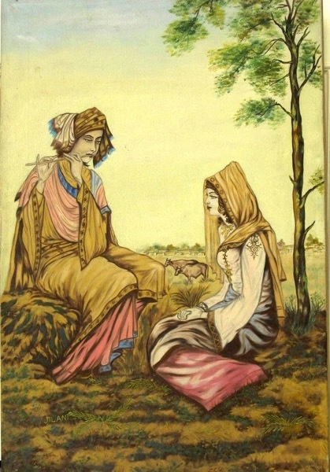
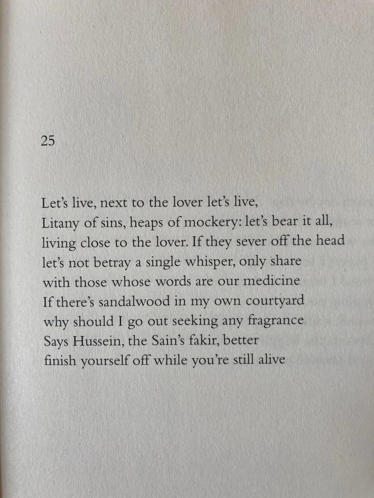

* * *

**ਰਹੀਏ ਵੋ ਨਾਲ ਸਜਨ ਦੇ, ਰਹੀਏ ਵੋ ।ਰਹਾਉ। ।1।**

**ਲੱਖ ਲੱਖ ਬਦੀਆਂ ਤੇ ਸਉ ਤਾਹਨੇ, ਸਭੋ ਸਿਰ ਤੇ ਸਹੀਏ ਵੋ ।2।**

**ਤੋੜੇ ਸਿਰ ਵੰਞੇ ਧੜ ਨਾਲੋਂ, ਤਾਂ ਭੀ ਹਾਲ ਨ ਕਹੀਏ ਵੋ ।3।**

**ਸੁਖ਼ਨ ਜਿਨ੍ਹਾਂ ਦਾ ਹੋਵੈ ਦਾਰੂ, ਹਾਲ ਉਥਾਈਂ ਕਹੀਏ ਵੋ ।4।**

**ਚੰਦਨ ਰੁਖ ਲਗਾ ਵਿਚ ਵੇਹੜੇ, ਜੋਰ ਧਿਙਾਣੇ ਖਹੀਏ ਵੋ ।5।**

**ਕਹੈ ਹੁਸੈਨ ਫ਼ਕੀਰ ਸਾਈਂ ਦਾ, ਜੀਵੰਦਿਆਂ ਮਰ ਰਹੀਏ ਵੋ ।6।**

* * *

**\-1رہیئے وو نال سجن دے، رہیئے وو ۔رہاؤ۔**

**لکھ لکھ بدیاں تے سؤ طعنے، سبھو سر تے سہیئے وو ۔2۔**

**توڑے سر وننجے دھڑ نالوں، تاں بھی حالَ ن کہیئے وو ۔3۔**

**سخن جنہاں دا ہووے دارو، حالَ اتھائیں کہیئے وو ۔4۔**

**چندن رخ لگا وچ ویہڑے، زور دھنانے کھہیئے وو ۔5۔**

**کہےَ حسین فقیر سائیں دا، جیوندیاں مر رہیئے وو ۔6۔**

* * *

### Glossary:

**1 Rahiye wo naal sajjan de rahiye wo**  
  
Rahiye: Aseen Rahiye (Rehn: Tikkan, Rihaish, Rakhan, Qaim rehn, thehrn, qayaam karan: naal khlovan, hovan, Jeevan, jaran) Wav \[?\]: Oh! Sad  
  
Sajan: 1: dost, Mehboob 2: change ji, gai  
  
**2 Lakh Lakh Badiyan te sau taane, sabho sir te sahiye wo  
**  
Badiyan: kharaabian, buraiyan, bhair, badnamian, mehnay, ilzaam – badi, takleef, nuqsaan, satt  
  
Taane: tokan, chherr, malaamtan  
  
**3 Torhe sir wanje dharh naalon. taan bhi haal na kahiye wo  
**  
Toray: Bhaven  
  
Sir: Munh, mathaa, Aagu, choti, Manba’,  sar chashma, mudh, izzat, hond, hasti  
  
Wanje: Jaave,

Dharr: 1) jism 2) pasa, dhir

Haal: Sir warti, ahwal, 2) haalat, jo hai, 3) hunn, ajok, haal vela, present

**4 Sukhan Jinna da hovai daaur, haal uthayin kahiye wo**  
  
Sukhan: 1) Gall, Aakhni, Bolan, Gall Kath 2) Shairi, Sher 3) Zabaan 4) Mo’amla (Maamla), Masla

Daru: 1) Ilaaj, chaara, dawa 2) Nasha, sharaab 3) Barood

Uthain: othay ee

Kahiye: aseen kahiye (gehn: pharrna, qabu karna, haasil karna, pora phir ke vekhna)

**5 Chandan rukh laga vich vihde, jor dhagane khaiye wo  
**  
Chandan: 1) Sandal 2) Chand 3) Chaanan

Rukh: Darakht

Lagaa: laa ke, gadd ke, beej ke  
  
Lagga: lagga hoya, laaya hoya, beejeya joya, aagya hoya  
  
Vehre: vehre vich (Vehra: aangan, sehan, dalgan \[?\], makaan da andar khuli than) Ghar, rehn di than, tikana, ral behn di khuli than)  
dhagaane: zabardasti, dhakke naal, sakhti naal  
  
kahiye: ragariye, takraye  
  
  
**6 Kahe Hussain faqir sain da, jeevandiya mar rahiye** **wo**

faqeer: jidde kol kujh nahin, be milakh, be mal

Sain: maalik, Mehboob, murshid

Glossary by Najm Hussain Syed  
Shared in Farsi script by Abbas Ali  
Typed into Roman by Amit Julka

* * *

### Translation:

Translation by Naveed Alam in _Verses of a Lowly Fakir_. Madho Lal Hussain, Penguin Books India, 2016. p. 29

### Composition:

https://soundcloud.com/saminahasansyed/shah-hussain-rahiyay-vo-nal-sajan-day-rahiyay-by-risham-syed-at-49-jail-road?in=saminahasansyed/sets/shah-hussain

#### Picture Courtesy:

_Heer Ranjha_, Shafqat Jilani. Source: [The Marriage of Heer and Ranjha: A Punjabi Love Story](https://multoghost.wordpress.com/2016/06/06/the-marriage-of-heer-and-ranjha-a-punjabi-love-story/) and [_Folk Punjab_ on Twitter](https://twitter.com/FolkPunjab/status/286497597282217984)

_Crossposted from [https://sayshussain.wordpress.com/2020/08/18/rahiye-naal-sajjan-de-rahiye/](https://sayshussain.wordpress.com/2020/08/18/rahiye-naal-sajjan-de-rahiye/)_