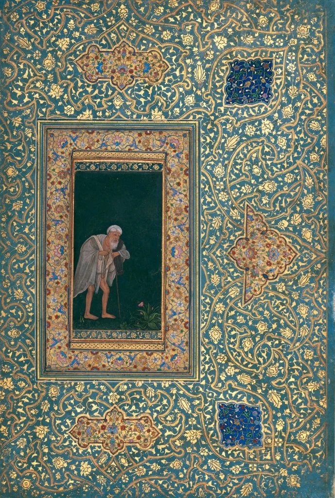

* * *

**ਕੈ ਬਾਗੈ ਦੀ ਮੂਲੀ ਹੁਸੈਨ, ਤੂੰ ਕੈ ਬਾਗੈ ਦੀ ਮੂਲੀ ।ਰਹਾਉ। ।1।**

**ਬਾਗਾਂ ਦੇ ਵਿਚਿ ਫੁਲਿ ਅਜਾਇਬ, ।2।  
ਤੂੰ ਬੀ ਇਕ ਗੰਧੂਲੀ ।3।**

**ਆਪਣਾ ਆਪਿ ਪਛਾਣੇ ਨਾਹੀਂ, ।4।  
ਅਵਰਾ ਦੇਖਿ ਕਿਉਂ ਭੂਲੀ ।5।**

**ਇਸ਼ਕੇ ਦੇ ਦਰਿਆਉ ਕਰਾਹੀ, ।6।  
ਮਨਸੂਰ ਕਬੂਲੀ ਸੂਲੀ ।7।**

**ਸ਼ਾਹ ਹੁਸੈਨ ਪਇਆ ਦਰ ਉਤੇ, ।8।  
ਜੇ ਕਰਿ ਪਵੈ ਕਬੂਲੀ ।9।**

* * *

**کے باگے دی مولی حسین، توں کے باگے دی مولی ۔رہاؤ ۔1۔۔**

**باغاں دے وچِ پھلِ اجائب، ۔2۔  
توں بی اک گندھولی ۔3**۔

**اپنا آپِ پچھانے ناہیں، ۔4۔  
اورا دیکھِ کیوں بھولی ۔5۔**

**عشقے دے دریاؤ کراہی، ۔6۔  
منصور قبولی سولی ۔7۔**

**شاہ حسین پیا در اتے، ۔8۔  
جے کرِ پوے قبولی ۔9۔**

* * *

### Glossary

**_\[1\] kiyeiN baaghe di mooli Hussain, tuN kiyeiN baaghe di mooli_**

**kiyeiN**\- kis, kauN

**ke**\- keh, keDi, kaaya (body, constitution, physique, appearance, durability, age), jism, shareer, wajud (existence, being, perceptible, body, physique, structure), deh (body, physique, mortal frame).

**moolee**\- jaRh, zameen de andar ugeya

\>_phil._ mul: asal (root, origin, essence), muDh (stump, root, ancient, origin, primitive), buniyaad (basis, origin, store), tat (prompt, pithy, immediate, essence)

**_\[2\] bagha de vich phull ajaib_**

**ajaayib**\- ajeeb, anokhe, acharaj (strange)

_\>phil._

1) frooT

2) faida, nafaah (profit, gain, return, dividend)

3) jhaaR, fasal

**phul**\-

1) flower, phul

2) phulaayi, phulan di haalat

**_\[3\] tun bhi ik gandhuli_**

**gandholi**\- khushboo vali bootee (fasalaaN vich aap ug-aawan vaali)

_**\[4\] apna aap pachane nahin**_

**_\[5\] avra dekh kion bhooli_**

**avraaN**\- huraaN, hur hoyiaaN

**bhulee**\- bhulee, dhokhe vich ayee, galtee kha gayee, raah bhul gayee

**_\[6\] ishqe da dariao karahi_**

**kiraahee**\- ikko jeha karan vaala, padhra karan vaala (the one who makes level, plane)

**karaah ke karaahan layi** (karaahan: ikko jeha karan, padhra karan)

**kurahee** - kuraahe paawan vaala

_**\[7\] mansoor kabooli sooli**_

**kabuli**\-

1) kabul keeti, man layi

2) manzuri, parwaangi (acceptance, approval, sanction)

**_\[8\] shah hussain payiya dar utte_**

**dar**\- darwaazah, sardal (bottom piece of a door frame, threshold, doorstep), dahleez

(vestibule, portico, threshold)

**_\[9\] je kari pave kabooli_**

**jo**\-

1) je, agar

2) jo vi

3) taa(N)ke

**kar**\-

1) iraadha, maqsad, marzee, khwaahish

2) taakat, tiraan (to cause to float, cause the salvation of)

3) sahulat (facility, privilege, ease, concession, convenience)

4) shaan, shaukat

5) hath (hands, approach, cards held in hand)

6) shuaa (ray or beam of light)

7) lagaan, tax, maa'mula (fixed amount, gratuity)

8) mahsul - to be produced, to be attained

Glossary by Najm Hosain Syed  
Typed into Roman by Megha Sharma Sehdev

* * *

### Translation

_Why such self-importance, Hussein?_

_Who do you think you are? You are_

_a weed among the magnolia and marva_

_Never did you know thyself and yet_

_you compare yourself to others_

_Deep is the ocean of love that made_

_Mansoor embrace his cross_

_Shah Hussein lies at the doorstep_

_hoping to be lifted and embraced_

Translated by Naveed Alam  
['At the shrine of Shah Hussain: Four Punjabi English kafis'  
](https://iwp.uiowa.edu/91st/vol8-num1/at-the-shrine-of-shah-hussein-four-punjabi-english-kafis)Published in 91st Meridian Vol 8 No. 1

* * *

https://youtu.be/WTm6Vis15Qc?t=732

Abida Parveen sings a part of the verse .

* * *

**Painting:** Abu'l Hasan. An Aged Pilgrim, c. 1618-20, Aga Khan Museum

_Crossposted from [https://sayshussain.wordpress.com/2020/09/20/kai-bagh-di-mooli-husaina/](https://sayshussain.wordpress.com/2020/09/20/kai-bagh-di-mooli-husaina/)_