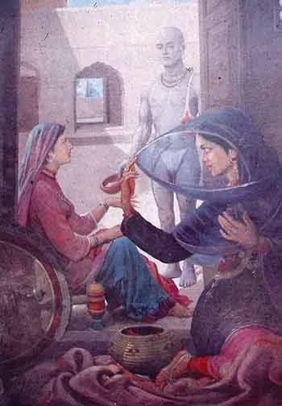

* * *

**ਇਸ਼ਕ ਫ਼ਕੀਰਾਂ ਦਾ ਕਾਇਮ ਦਾਇਮ, ਕਬਹੂੰ ਨ ਥੀਵੈ ਬੇਹਾ ।1|**

**ਤੈਨੂੰ ਰੱਬ ਨਾ ਭੁੱਲੀ ਦੁਆਇ ਫ਼ਕੀਰਾਂ ਦੀ ਏਹਾ ।2।ਰਹਾਉ।**

**ਹੋਰਨਾਂ ਨਾਲ ਹਸੰਦੀ ਖਿਡੰਦੀ, ਸਾਹਾਂ ਥੋਂ ਘੁੰਗਟ ਕੇਹਾ ।3।**

**ਸ਼ਹੁ ਨਾਲ ਤੂੰ ਮੂਲ ਨ ਬੋਲੈਂ, ਏਹ ਗੁਮਾਨ ਕਿਵੇਹਾ ।4।**

**ਚਾਰੇ ਨੈਣ ਗਡਾਵਡ ਹੋਏ, ਵਿੱਚ ਵਿਚੋਲਾ ਕੇਹਾ ।5।**

**ਉੱਛਲ ਨਦੀਆਂ ਤਾਰੂ ਹੋਈਆਂ, ਵਿਚ ਬਰੇਤਾ ਕੇਹਾ ।6।**

**ਆਪ ਖਾਨੀਂ ਹੈਂ ਦੁੱਧ ਮਲੀਦਾ, ਸ਼ਾਹਾਂ ਨੂੰ ਟੁੱਕਰ ਬੇਹਾ ।7।**

**ਕਹੈ ਹੁਸੈਨ ਫ਼ਕੀਰ ਸਾਂਈਂ ਦਾ, ਮਰ ਜਾਣਾ ਤੇ ਮਾਣਾ ਕੇਹਾ ।8।**

* * *

**عشقَ فقیراں دا قایم دائم، کبہوں ن تھیوے بیہا ۔۔1۔**

**تینوں ربّ نہ بھلی دعائِ فقیراں دی ایہا ۔2۔رہاؤ۔**

**ہورناں نال ہسندی کھڈندی، ساہاں تھوں گھنگٹ کیہا ۔3۔**

**شہہ نال توں مول ن بولیں، ایہہ گمان کویہا ۔4۔**

**چارے نین گڈاوڈ ہوئے، وچّ وچولا کیہا ۔5۔**

**اچھل ندیاں تارو ہوئیاں، وچ بریتا کیہا ۔6۔**

**آپ کھانیں ہیں دودھ ملیدا، شاہاں نوں ٹکر بیہا ۔7۔**

**کہےَ حسین فقیر سانئیں دا، مر جانا تے مانا کیہا ۔8۔**

* * *

### Glossary

**1) ni tainuN rabb na bhuli dua fakeeraaN aiyaa (rahau)**

**2) sona roopa sabh chhal ves ishq da na lagda leha**

**3) chaare naiN gaDovaD hoye, vich vichola keha**

**4) jis joban da maan karendi jal bal Thes keha**

**5) ishq chubare pao jhaati hun gham tainuN kohiya**

**6) horna naal hasandi khiRandi shau naal ghunghaT keha**

**7) uchhal nadiyaaN taaru hoyiaaN vich bareta keha**

**8) keh hussain fakir sayeeN da marna taaN maana keha**

**\[1\] ni tainuN rabb na bhuli dua fakeeraaN aiyaa**

rabb- paalanhaar

bhulee- tainuN na bhule

dua- pukaar, khwaahish, maang

fakeer- jihde kol koyee mul nahiN

**\[2\] sona roopa sabh chhal ves ishq da na lagda leha**

roopa- chaandi

ves- \[garment, piece of clothing\]/\[\*\]

leha- un deyaaN kapReyaaN nuN garmi vich lagan vala keeDa

(lehan: (i) a) chaTTan; b) lakkaN; c) laiN, vasoolaN; d) rajjan;

            (ii) anaaj nuN laggan vala keeDa, saree

            (iii) ikk kanDeyaali booTi)

**\[3\] chaare naiN gaDovaD hoye, vich vichola keha**

naiN- akhaaN

ghaDovaD- ikk mikk, ral mil ke ikk

vichola- (i) mel karauN vala, (ii) sauda karaun vaala, (iii) dalaal, (iv) vich khalovan vala, vakeel

keha- kaisa, keh, kihRa, keho jeha

joban- jawani; bharpur hovan; chaRhat vich hovan; ubharan, teesi te hovan, \[\*\]; phulan, zor vich auN

maan-  i) ghamanD, fakhr, ii) bharosa, Tek

**\[5\] ishq chubare pao jhaati hun gham tainuN kohiya**

chubaaraa, chubarah- ikhaTe hovan layi ral ke banayi saanjhi thaaN

jhaati- jhaat, nazar, tak

kohiyaa- keho jeha, keha, kaisa

gham- dukh, \[\*illegible\], fikar, pawaaRa, mushkil, museebat, takleef

**\[6\]** **horna naal hasandi khiRandi shau naal ghunghat keha**

hornaa- horaaN, dujeyaaN, dui vaalaaN, vijog kaaraan, opriyaaN, ghairaaN, kumelaaN

hasandi- hasdi, josh naal vartdi, flirt kardi

khiRandi- khiRdi

shau- i) andarla, vichkaarla; ii) ghan dongha; iii) tat sat, iv) mehbub

ghunghat- ghunD, avhala, pardaah

uchhal: ubharke, kanDha bahar hoke

**\[7\] uchhalna nadiya taaru hoyiaaN vich bareta keha**

taaru- i) bharpur, \*'fur', makhmal; ii) jehRa tarke paar keha ja sake, jo taran jaane, tar sake, jo tar deve, pura kar deve, bharpur kar deve

bareta- retlee thaaN, dariya vich sukee jagaah, dariye de andar ret da Tib

**8) keh hussain fakir sayeeN da marna taaN maana keha**

maana, maan- (i) ghamand, gharur; (ii) maap, mecha, meiman\[\*\], nakhra, naaz, dekhava

marna- dehaari hond chhad dena

_Glossary by Najm Hosain Syed  
Typed into Roman by Megha Sharma Sehdev_

* * *

### Translation

Don't ever forget God, o Woman,  
that's the prayer of mendicants  
You may forget all, but God is not worth forgetting  
Gold and beauty-short living. Love never decays  
You laugh and play with the rest then why act so formal with the lover?  
Two pairs of eyes met and acquiesced  
then what's the need of a go-between?  
Love settled in your courtyard,  
how could you have any worry?  
I swear by my mother, I swear by my father:  
Love, the best devotion.  
The youth you're so proud of will be reduced to ashes.  
Says Hussein, the Master's fakir,  
if you accept your mortality then why the pride?

_Translated by Naveed Alam_  
in _Verses of a Lowly Fakir. Madho Lal Hussain_,  
Penguin Books India, 2016.

### Composition

https://soundcloud.com/saminahasansyed/dua-faqiran-di-aiha-shah-hussain-by-samina-hasan-syed?in=saminahasansyed/sets/shah-hussain

_Dua Faqiran Di Aiha (Shah Hussain) by Samina Hasan Syed, Composition: Najm Hosain Syed at 49 Jail Road, Lahore  
Violin: Mukhtar Qadri  
Tabla: Riaz Ahmed_

**Painting:** Heer Ranjha by Sobha Singh

_Crossposted from [https://sayshussain.wordpress.com/2020/09/29/dua-faqiran-di-aiha/](https://sayshussain.wordpress.com/2020/09/29/dua-faqiran-di-aiha/)_