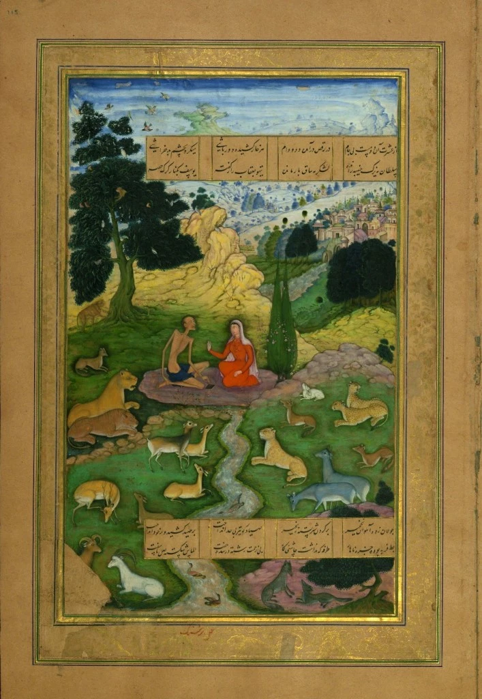
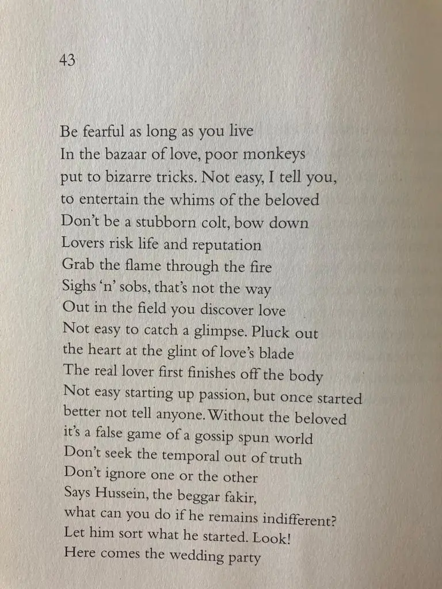

* * *

ਜਾਂ ਜੀਵੈਂ ਤਾਂ ਡਰਦਾ ਰਹੁ ਵੋ ।ਰਹਾਉ।

ਬਾਂਦਰ ਬਾਜੀ ਕਰੈ ਬਜਾਰੀ, ਸਹਿਲ ਨਹੀਂ ਉਥੈ ਲਾਵਨ ਯਾਰੀ,  
ਰਹੁ ਵੋ ਅਡਕ ਵਛੇੜ ਅਨਾੜੀ, ਕਢਿ ਨ ਗਰਦਨ ਸਿਧਾ ਵਹੁ ਵੋ ।1।

ਨੇਹੀ ਸਿਰ ਤੇ ਨਾਉਂ ਧਰਾਵਨ, ਬਲਦੀ ਆਤਸ਼ ਨੂੰ ਹਥਿ ਪਾਵਨ,  
ਆਹੀਂ ਕੱਢਣ ਤੇ ਕੂਕ ਸੁਣਾਵਨ, ਗਲਿ ਨ ਤੈਨੂੰ ਬਣਦੀ ਓਹੁ ਵੋ ।2।

ਦਰ ਮੈਦਾਨ ਮੁਹੱਬਤ ਜਾਤੀ, ਸਹਿਲ ਨਹੀਂ ਉਥੇ ਪਾਵਨ ਝਾਤੀ,  
ਜੈਂ ਤੇ ਬਿਰਹੁ ਵਗਾਵੈ ਕਾਤੀ, ਮੁਢਿ ਕਲੇਜੇ ਦੇ ਅੰਦਰ ਡਹੁ ਵੋ ।3।

ਅਸਲੀ ਇਸ਼ਕ ਮਿੱਤਰਾਂ ਦਾ ਏਹਾ, ਪਹਲੇ ਮਾਰ ਸੁਕਾਵਨ ਦੇਹਾ,  
ਸਹਲ ਨਹੀਂ ਉਥੈ ਲਾਵਨ ਨੇਹਾ, ਜੇ ਲਾਇਓ ਤਾਂ ਕਿਸੇ ਨ ਕਹੁ ਵੋ ।4।

ਤਉ ਬਾਝੂ ਸਭ ਝੂਠੀ ਬਾਜੀ, ਕੂੜੀ ਦੁਨੀਆਂ ਫਿਰੈ ਗਮਾਜ਼ੀ,  
ਨਹੂੰ ਹਕੀਕਤ ਘਿੰਨ ਮਿਜਾਜ਼ੀ, ਦੋਵੇਂ ਗੱਲਾਂ ਸੁਟਿ ਨ ਬਹੁ ਵੋ ।5।

ਕਹੈ ਹੁਸੈਨ ਫ਼ਕੀਰ ਗਦਾਈ, ਦਮ ਨ ਮਾਰੇ ਬੇ ਪਰਵਾਹੀ,  
ਸੋ ਜਾਣੈ ਜਿਨਿ ਆਪੇ ਲਾਈ, ਅਹੁ ਵੇਖ ਜਾਂਞੀ ਆਏ ਅਹੁ ਵੋ ।6।

* * *

جاں جیویں تاں ڈردا رہُ وو ۔رہاؤ۔

باندر باجی کرے بازاری، سہل نہیں اتھے لاون یاری،  
رہُ وو اڈک وچھیڑ اناڑی، کڈھ ن گردن سدھا وہُ وو ۔1۔

نیہی سر تے ناؤں دھراون، بلدی آتش نوں ہتھِ پاون،  
آہیں کڈھن تے کوک سناون، گلِ ن تینوں بندی اوہُ وو ۔2۔

در میدان محبت جاتی، سہل نہیں اتھے پاون جھاتی،  
جیں تے برہُ وگاوے کاتی، مڈھِ کلیجے دے اندر ڈہُ وو ۔3۔

اصلی عشقَ متراں دا ایہا، پہلے مار سکاون دیہا،  
سہل نہیں اتھے لاون نیہا، جے لائیو تاں کسے ن کہُ وو ۔4۔

تؤ باجھو سبھ جھوٹھی باجی، کوڑی دنیاں پھرے گمازی،  
نہوں حقیقت گھنّ مجازی، دوویں گلاں سٹِ ن بہو وو ۔5۔

کہےَ حسین فقیر گدائی، دم ن مارے بے پرواہی،  
سو جانے جنِ آپے لائی، اہُ ویکھ جاننجی آئے اہُ وو ۔6۔

* * *

जां जीवैं तां ड्रदा रहु वो ।रहाउ।

बांदर बाजी करै बजारी, सहल नहीं उथै लावन यारी,  
रहु वो अडक वछेड़ अनाड़ी, कढि न गरदन सिधा वहु वो ।1।

नेही सिर ते नाउं धरावन, बलदी आतश नूं हथि पावन,  
आहीं कढ्ढन ते कूक सुणावन, गलि न तैनूं बणदी ओहु वो ।2।

दर मैदान मुहब्बत जाती, सहल नहीं उथे पावन झाती,  
जैं ते बिरहु वगावै काती, मुढि कलेजे दे अन्दर डहु वो ।3।

असली इशक मित्तरां दा एहा, पहले मार सुकावन देहा,  
सहल नहीं उथै लावन नेहा, जे लाययो तां किसे न कहु वो ।4।

तउ बाझू सभ झूठी बाजी, कूड़ी दुनियां फिरै गमाज़ी,  
नहूं हकीकत घिन्न मिजाज़ी, दोवें गल्लां सुटि न बहु वो ।5।

कहै हुसैन फ़कीर गदाई, दम न मारे बे परवाही,  
सो जानै जिनि आपे लाई, अहु वेख जांञी आए अहु वो ।6।

* * *

### Translation

Translated by Naveed Alam  
 _Verses of a Lowly Fakir_. Madho Lal Hussain,  
Penguin Books India, 2016. p. 48

* * *

### Painting

Layla visits Majnun in the wilderness. From the "Khamsah", Five Poems (Quintet) of Amir Khusro. Other images from the manuscript are on the Walters Museum flickr album:  
Date: 14th century AD  
Source: [https://www.flickr.com/photos/medmss/4535914626/in/set-72157623891285410/](https://www.flickr.com/photos/medmss/4535914626/in/set-72157623891285410/)  
Author: Amir Khusro Dihlavi (d. 1325 CE). Calligrapher: Muḥammad Ḥusayn Zarrīn Qalam al-Kashmiri; illustrations are signed by eleven painters: Laʿl (Lāl), Manūhar, Sānwalah, Farrukh, Alīqulī, Dharamdās, Narsing, Jagannāth, Miskīnā, Mukund, and Sūrdās Gujarati.

_Crossposted from [https://sayshussain.wordpress.com/2020/10/06/jeevain-taan-darda-raho-vo/](https://sayshussain.wordpress.com/2020/10/06/jeevain-taan-darda-raho-vo/)_