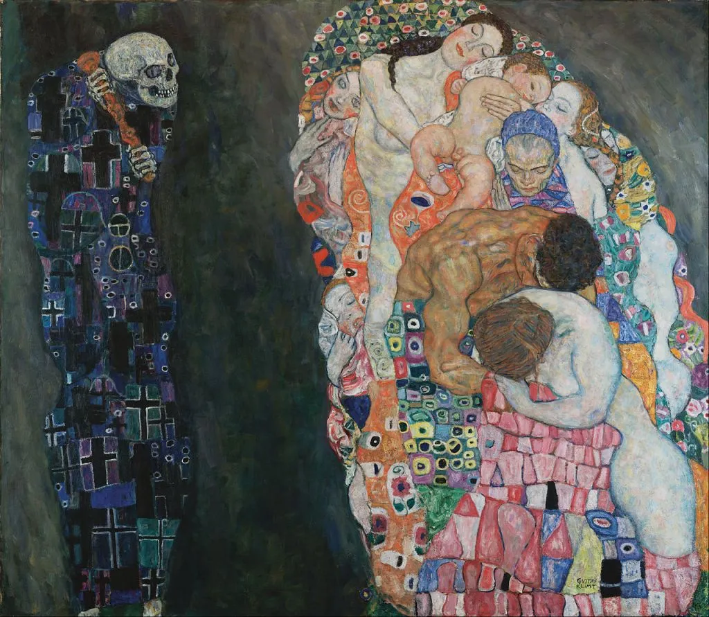
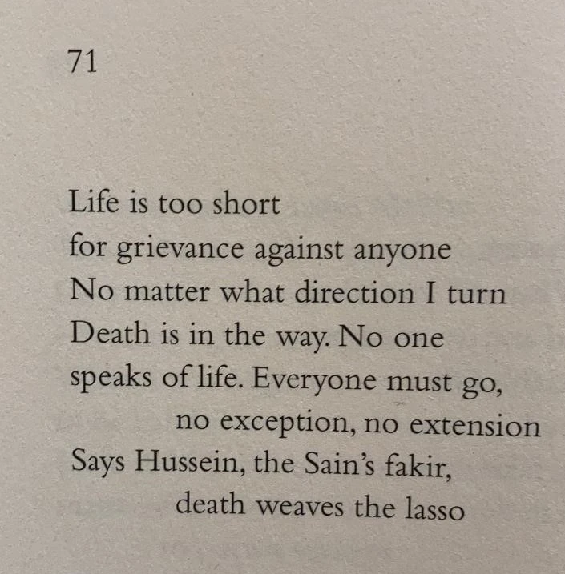

* * *

ਦੁਨੀਆਂ ਜੀਵਣ ਚਾਰ ਦਿਹਾੜੇ, ਕਉਣ ਕਿਸ ਨਾਲ ਰੁੱਸੇ ।ਰਹਾਉ।

ਜਿਹ ਵੱਲ ਵੰਜਾਂ ਮਉਤ ਤਿਤੇ ਵੱਲ, ਜੀਵਨ ਕੋਈ ਨ ਦੱਸੇ ।1।

ਸਰ ਪਰ ਲੱਦਣਾ ਏਸ ਜਹਾਨੋਂ, ਰਹਿਣਾ ਨਾਹੀਂ ਕਿੱਸੇ ।2।

ਕਹੈ ਹੁਸੈਨ ਫ਼ਕੀਰ ਸਾਈਂ ਦਾ, ਮਉਤ ਵਟੈਂਦੜੀ ਰੱਸੇ ।3।

* * *

دنیاں جیون چار دہاڑے، کؤن کس نال رسے ۔رہاؤ۔

جہ ولّ ونجاں مؤت تتے ولّ، جیون کوئی ن دسے ۔1۔

سر پر لدنا ایس جہانوں، رہنا ناہیں قصے ۔2۔

کہےَ حسین فقیر سائیں دا، مؤت وٹیندڑی رسے ۔3۔

* * *

दुनियां जीवन चार देहाड़े, कउन किस नाल रुस्से ।रहाउ।

जेह वल्ल वंजां मउत तिते वल्ल, जीवन कोई न दस्से ।1।

सर पर लद्दना एस जहानों, रहना नाहीं किस्से ।2।

कहै हुसैन फ़कीर साईं दा, मउत वटैंदड़ी रस्से ।3।

* * *

### Glossary

**Duniya jeevan char dihade, kaun kis naal russe** |Rahao|

Duniya: 1) Maujooda haalat, haazir vela, vehaar 2) duniyadari – deenya\[?\]: buddha, handeya hoya, buddha danger;  
Jeevan – 1) Zindagi 2) Guzraan, guzara 3) Rozgar, kasb, profession  
Chaar – 4, ginne hoye, mukkan waale, Aarzi, Chaaran, Walaavan, Tarkaawan – rasse, rachaa, banaawe, andar di judat (jurrat), banaawe, ralay, ahsaas, jazba sanjha kare

**Jih wall wanjha maut tite wall, jeevan koee na dasse** |1|

Jeen – Jis  
Wal – tarf, paasa, rukh, direction 2) watt, Walevaan, twist, maror, pech 3) changa, theek, behtar, sehatmand, tandurust 4) pher, murk e, dobara, gharri murri  
Maut – khatma, Maran, Mukka, Tabahi, ujara  
Moot – Mootar, peshab, gand  
Tine – os, osay  
Dasse – dikhawe, bataawe, ishara kare, samjhawe

**Sar par laddna es jahano, rehna naahin kisse** |2|

Ladna – Tur Jana, Rawana hona 2) Bhar bharna, bhaar chukana, bhar heth aaona, bhar paa lena, chukkeya jaana, dhoya jaana  
Jahaanun – jahaan ton (jahaan: duniya, haasir vehaad, maujood vartara)  
Rehna – tikna, qaayam hona, 2) bas ho jaana, khaali ho jaana, hattan, picche reh jaawan, haar jaawan, nakara howan, thakk jawan, be sakt ho jaawan  
Naheen – Nahin  
Kasse – kisse bi 2) taaqat himmat sakt ne, changiyai ne, 3) Maror wat ne, khich ne 4) imtihaan ne, test ne, imtihaan vich, test vich 5) shakhs ne, bande ne, fard ne

**Kahe Hussain faqir sayeen da, maut vatendri rasse** |3|

Faqeer – be mal, khaali  
Saeen – malik, murshid, dilbar, Mehboob  
Watendri – 1) Wandi, marordi, tayyar kardi 2) watti jaandi, badhi\[?\] jaandi, phasdi 3) Wataandi, badaldi 4) sale kardi, vechdi, vech ke dendi – vatendri – phirdi, ghumdi, bhoondi \[?\] — rasse: 1) vaddeyan rissyan \[?\], banhan da saaman, 2) ras, goorhe rass, sawaaad, jazbe, nashi

Glossary by Najm Hosain Syed

Transliterated into Roman by Amit Julka

* * *

### Translation

* * *

### Painting

Gustav Klimt (1862–1918), _"Tod und Leben" Death and Life_, oil on canvas, 1910/15, Leopold Museum, Vienna

_Crossposted from [https://sayshussain.wordpress.com/2020/10/12/kaun-kise-naal-russe/](https://sayshussain.wordpress.com/2020/10/12/kaun-kise-naal-russe/)_