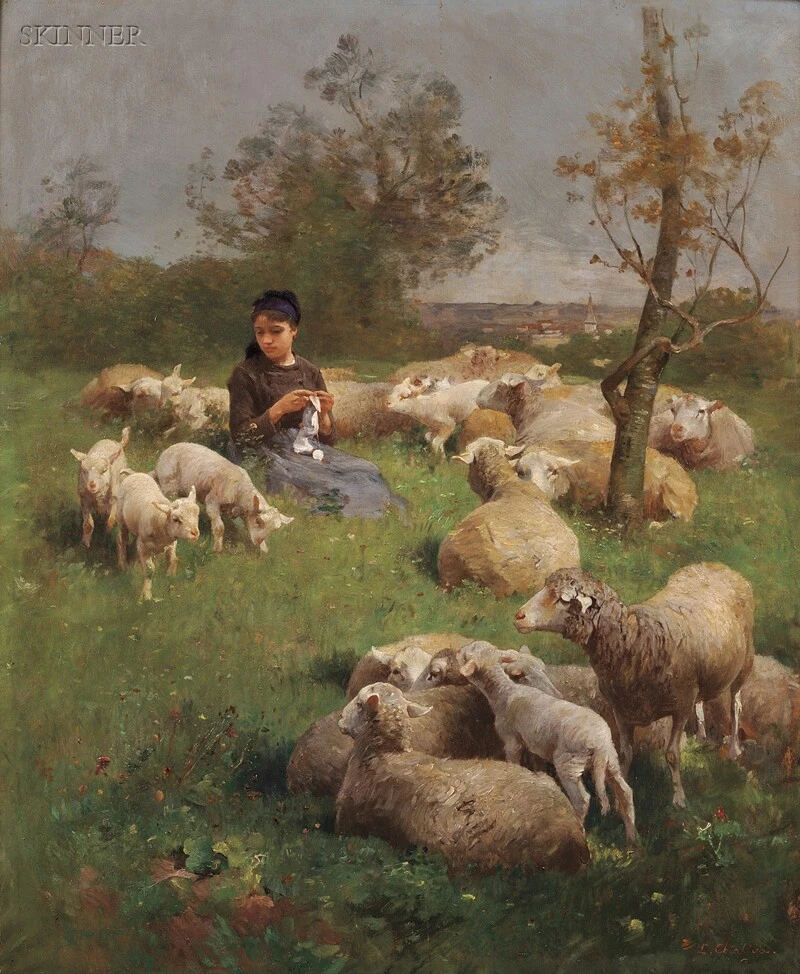
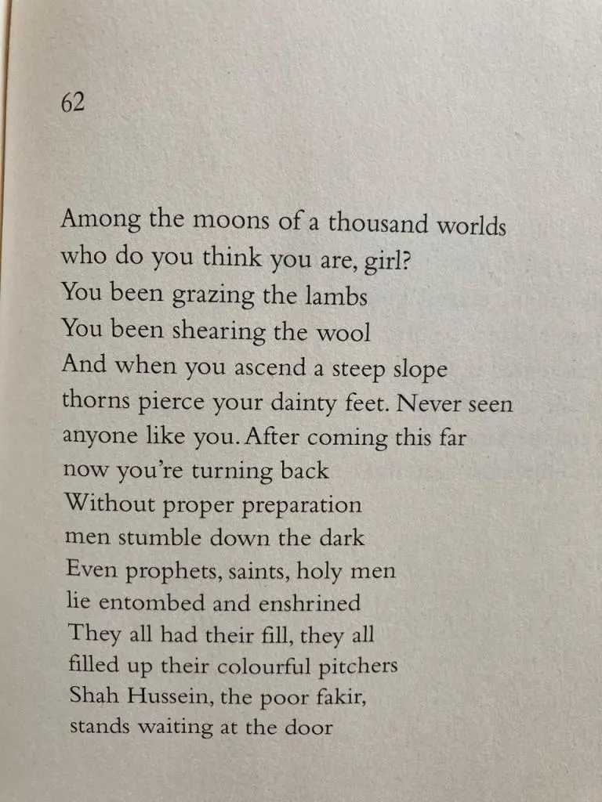

* * *

ਚੰਦੀਂ ਹਜਾਰ ਆਲਮੁ ਤੂੰ ਕੇਹੜੀਆਂ ਕੁੜੇ ।  
ਚਰੇਂਦੀ ਆਈ ਲੇਲੜੇ, ਤੁਮੇਂਦੀ ਉੱਨ ਕੁੜੇ ।ਰਹਾਉ।

ਉੱਚੀ ਘਾਟੀ ਚੜ੍ਹਦਿਆਂ, ਤੇਰੇ ਕੰਡੇ ਪੈਰ ਪੁੜੇ ।  
ਤੈਂ ਜੇਹਾ ਮੈਂ ਕੋਈ ਨ ਡਿੱਠਾ, ਅੱਗੇ ਹੋਇ ਮੁੜੇ ।1।

ਬਿਨਾਂ ਅਮਲਾਂ ਆਦਮੀ, ਵੈਂਦੇ ਕੱਖੁ ਲੁੜੇ ।  
ਪੀਰ ਪੈਕੰਬਰ ਅਉਲੀਏ, ਦਰਗਹ ਜਾਇ ਵੜੇ ।2।

ਸਭੇ ਪਾਣੀ ਹਾਰੀਆਂ, ਰੰਗਾ ਰੰਗ ਘੜੇ ।  
ਸ਼ਾਹ ਹੁਸੈਨ ਫ਼ਕੀਰ ਸਾਈਂ ਦਾ, ਦਰਗਹ ਵੰਜ ਖੜੇ ।3।

* * *

چندیں ہزار عالمُ توں کیہڑیاں کڑے ۔  
چریندی آئی لیلڑے، تمیندی انّ کڑے ۔رہاؤ۔

اچی گھاٹی چڑھدیاں، تیرے کنڈے پیر پڑے ۔  
تیں جیہا میں کوئی ن ڈٹھا، اگے ہوئِ مڑے ۔1۔

بناں عملاں آدمی، ویندے ککھُ لڑے ۔  
پیر پیکمبر اؤلیئے، درگہ جائ وڑے ۔2۔

سبھے پانی ہاریاں، رنگا رنگ گھڑے ۔  
شاہ حسین فقیر سائیں دا، درگہ ونج کھڑے ۔3۔

* * *

चन्दीं हजार आलमु तूं केहड़ियां कुड़े ।  
चरेंदी आई लेलड़े, तुमेंदी उन्न कुड़े ।रहाउ।

उच्ची घाटी चढ़द्यां, तेरे कंडे पैर पुड़े ।  
तैं जेहा मैं कोई न डिट्ठा, अग्गे होइ मुड़े ।1।

बिनां अमलां आदमी, वैंदे कक्खु लुड़े ।  
पीर पैकम्बर अउलीए, दरगह जाय वड़े ।2।

सभे पानी हारियां, रंगा रंग घड़े ।  
शाह हुसैन फ़कीर साईं दा, दरगह वंज खड़े ।3।

* * *

### Translation

Translated by Naveed Alam  
 _Verses of a Lowly Fakir_. Madho Lal Hussain,  
Penguin Books India, 2016.

* * *

### Composition

https://soundcloud.com/saminahasansyed/shah-hussain-alam-chande-hazaar-kurhe-tun-kehrhi-en-risham-syed-composition-najm-hosain-syed

Vocals: Risham Syed  
Composition: Najm Hosain Syed  
Tabla: Riaz Ahmed  
Violin: Mukhtar Qadri

* * *

### Painting

Luigi Chialiva (Swiss, 1842–1914), Shepherdess with her flock, oil on panel

_Crossposted from [https://sayshussain.wordpress.com/2020/10/21/chande-hazaar-aalam/](https://sayshussain.wordpress.com/2020/10/21/chande-hazaar-aalam/)_