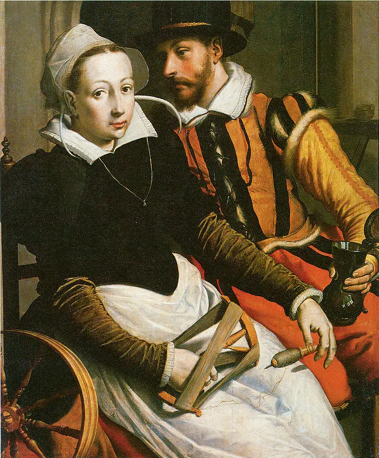

* * *

ਵੋ ਯਾਰੁ ਜਿਨ੍ਹਾਂ ਨੂੰ ਇਸ਼ਕ ਤਿਨਾਂ ਕੱਤਣ ਕੇਹਾ, ਅਲਬੇਲੀ ਕਿਉਂ ਕੱਤੇ ।ਰਹਾਉ।

ਲੱਗਾ ਇਸ਼ਕ ਚੁੱਕੀ ਮਸਲਾਹਤ, ਬਿਸਰੀਆਂ ਪੰਜੇ ਸੱਤੇ ।1।

ਵੋ ਯਾਰੁ ਜਿਨ੍ਹਾਂ ਨੂੰ ਇਸ਼ਕ ਤਿਨਾਂ ਕੱਤਣ ਕੇਹਾ, ਅਲਬੇਲੀ ਕਿਉਂ ਕੱਤੇ

ਘਾਇਲੁ ਮਾਇਲੁ ਫਿਰੈ ਦਿਵਾਨੀ, ਚਰਖੇ ਤੰਦ ਨ ਘੱਤੇ ।2।

ਵੋ ਯਾਰੁ ਜਿਨ੍ਹਾਂ ਨੂੰ ਇਸ਼ਕ ਤਿਨਾਂ ਕੱਤਣ ਕੇਹਾ, ਅਲਬੇਲੀ ਕਿਉਂ ਕੱਤੇ

ਮੇਰੀ ਤੇ ਮਾਹੀ ਦੀ ਪਰੀਤਿ ਚਰੋਕੀ, ਜਾਂ ਸਿਰੀ ਆਹੇ ਨ ਛੱਤੇ ।3।

ਵੋ ਯਾਰੁ ਜਿਨ੍ਹਾਂ ਨੂੰ ਇਸ਼ਕ ਤਿਨਾਂ ਕੱਤਣ ਕੇਹਾ, ਅਲਬੇਲੀ ਕਿਉਂ ਕੱਤੇ

ਕਹੈ ਹੁਸੈਨ ਫ਼ਕੀਰ ਨਿਮਾਣਾ, ਨੈਨ ਸਾਈਂ ਨਾਲਿ ਰੱਤੇ ।4।

ਵੋ ਯਾਰੁ ਜਿਨ੍ਹਾਂ ਨੂੰ ਇਸ਼ਕ ਤਿਨਾਂ ਕੱਤਣ ਕੇਹਾ, ਅਲਬੇਲੀ ਕਿਉਂ ਕੱਤੇ

* * *

وو یارُ جنہاں نوں عشقَ تناں کتن کیہا، البیلی کیوں کتے ۔رہاؤ۔

لگا عشقَ چکی مسلاہت، بسریاں پنجے ستے ۔1۔

وو یارُ جنہاں نوں عشقَ تناں کتن کیہا، البیلی کیوں کتے ۔رہاؤ۔

گھائلُ مائلُ پھرے دوانی، چرخے تند ن گھتے ۔2۔

وو یارُ جنہاں نوں عشقَ تناں کتن کیہا، البیلی کیوں کتے ۔رہاؤ۔

میری تے ماہی دی پریتِ چروکی، جاں سری آہے ن چھتے ۔3۔

وو یارُ جنہاں نوں عشقَ تناں کتن کیہا، البیلی کیوں کتے ۔رہاؤ۔

کہےَ حسین فقیر نمانا، نین سائیں نالِ رتے ۔4۔

وو یارُ جنہاں نوں عشقَ تناں کتن کیہا، البیلی کیوں کتے ۔رہاؤ۔

* * *

वो यारु जिन्हां नूं इशक तिनां कत्तन केहा, अलबेली क्युं कत्ते ।रहाउ।

लग्गा इशक चुक्की मसलाहत, बिसरियां पंजे सत्ते ।1।

वो यारु जिन्हां नूं इशक तिनां कत्तन केहा, अलबेली क्युं कत्ते

घायलु मायलु फिरै दिवानी, चरखे तन्द न घत्ते ।2।

वो यारु जिन्हां नूं इशक तिनां कत्तन केहा, अलबेली क्युं कत्ते

मेरी ते माही दी परीति चरोकी, जां सिरी आहे न छत्ते ।3।

वो यारु जिन्हां नूं इशक तिनां कत्तन केहा, अलबेली क्युं कत्ते

कहै हुसैन फ़कीर निमाणा, नैन साईं नालि रत्ते ।4।

वो यारु जिन्हां नूं इशक तिनां कत्तन केहा, अलबेली क्युं कत्ते

* * *

### Composition

https://www.facebook.com/rsoodnayak/posts/3887097727971669

Composition by Radhika Sood Nayak

### Painting

Man and Woman at a Spinning Wheel, c. 1570  
Pieter Pietersz (c. 1540-1603)  
Oil on panel[  
Fine Art America](https://fineartamerica.com/featured/man-and-woman-at-a-spinning-wheel-pieter-pietersz.html)

_Crossposted from [https://sayshussain.wordpress.com/2020/10/25/albeli-kion-katte/](https://sayshussain.wordpress.com/2020/10/25/albeli-kion-katte/)_