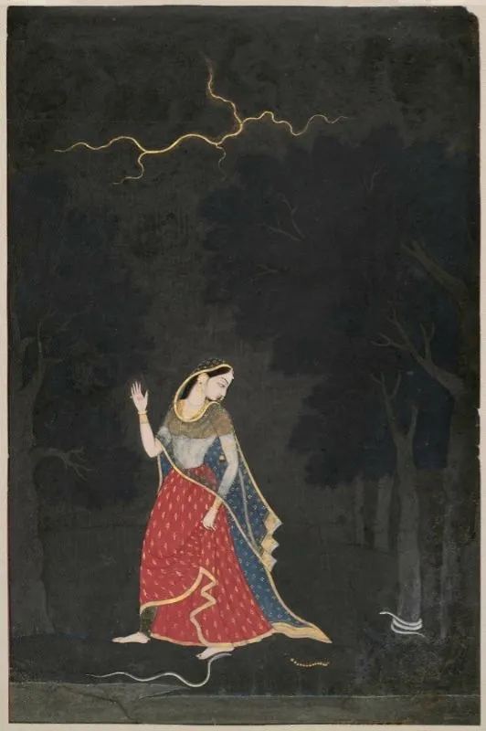

* * *

ਜਹਾਂ ਦੇਖੋ ਤਹਾਂ ਕਪਟ ਹੈ,  
ਕਹੂੰ ਨ ਪਇਓ ਚੈਨ।

ਦਗ਼ਾਬਾਜ਼ ਸੰਸਾਰ ਤੇ,  
ਗੋਸ਼ਾ ਪਕੜਿ ਹੁਸੈਨ ।ਰਹਾਉ।

ਮਨ ਚਾਹੇ ਮਹਿਬੂਬ ਕੋ,  
ਤਨ ਚਾਹੇ ਸੁਖ ਚੈਨ ।1।

ਦੋਇ ਰਾਜੇ ਕੀ ਸੀਂਧ ਮੈਂ,  
ਕੈਸੇ ਬਣੇ ਹੁਸੈਨ ।2।

* * *

جہاں دیکھو تہاں کپٹ ہے،  
کہوں ن پئیو چین ۔

دغاباز سنسار تے،  
گوشہ پکڑِ حسین ۔رہاؤ۔

من چاہے محبوب کو،  
تن چاہے سکھ چین ۔1۔

دوئ راجے کی سیندھ میں  
کیسے بنے حسین ۔2۔

* * *

जहां देखो तहां कपट है,  
कहूं न पइयो चैन ।

दग़ाबाज़ संसार ते,  
गोशा पकड़ि हुसैन ।रहाउ।

मन चाहे महबूब को,  
तन चाहे सुख चैन ।1।

दोइ राजे की सींध मैं  
कैसे बने हुसैन ।2।

* * *

### Painting

Abhisarika Nayika ("The Heroine Going to Meet Her Lover at an Appointed Place"). Opaque watercolour and gold on paper.  
Attribution to Mola Ram of Garhwal was made by a descendant of the artist, Balak Ram Sah. circa 1800.  
Museaum Of Fine Arts, Boston

_Crossposted from [https://sayshussain.wordpress.com/2020/11/03/jahan-dekho-tahan-kapat-hai/](https://sayshussain.wordpress.com/2020/11/03/jahan-dekho-tahan-kapat-hai/)_