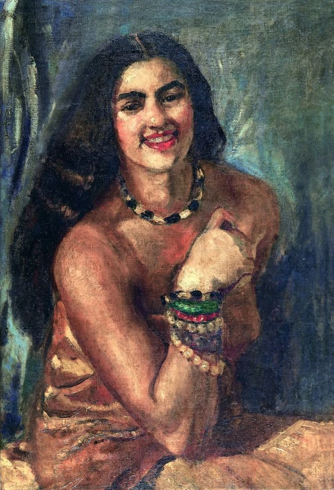
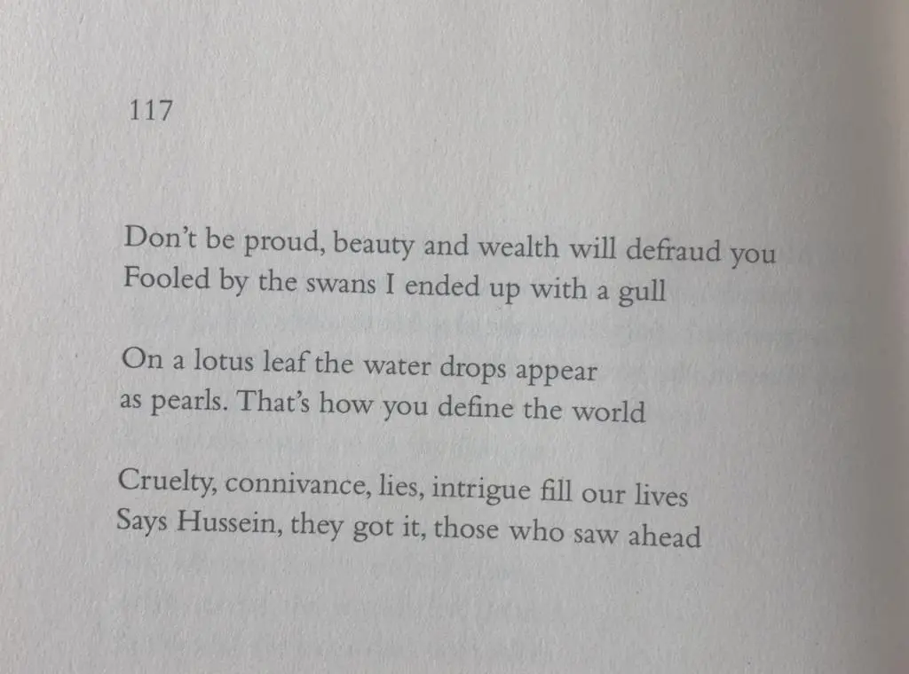

* * *

ਤੁਸੀਂ ਮਤਿ ਕੋਈ ਕਰੋ ਗੁਮਾਨ,  
ਜੋਬਨ ਧਨ ਠੱਗੁ ਹੈ ।1।ਰਹਾਉ।

ਹੰਸਾਂ ਦੇ ਭੁਲਾਵੇ ਭੁਲੀ,  
ਝੋਲੀ ਲੀਤਾ ਬੱਗ ਹੈ ।1।

ਪੱਬਣ ਪੱਤ੍ਰ ਉਪਰਿ ਮੌਤ,  
ਤਿਵਹੀਂ ਸਾਰਾ ਜੱਗ ਹੈ ।2।

ਨਿੰਦਿਆ ਧ੍ਰੋਹ ਬਖੀਲੀ ਚੁਗਲੀ,  
ਨਿੱਤ ਕਰਦਾ ਫਿਰਦਾ ਠੱਗ ਹੈ ।3।

ਕਹੈ ਹੁਸੈਨ ਸੇਈ ਜੱਗ ਆਏ,  
ਜਿਨ੍ਹਾਂ ਪਛਾਤਾ ਰੱਬ ਹੈ ।4।

* * *

تسیں متِ کوئی کرو گمان،  
جوبن دھن ٹھگُ ہے ۔1۔رہاؤ۔

ہنساں دے بھلاوے بھلی،  
جھولی لیتا بگّ ہے ۔1۔

پبن پتر اپرِ موت،  
توہیں سارا جگّ ہے ۔2۔

نندیا دھروہ بخیلی چغلی،  
نت کردا پھردا ٹھگّ ہے ۔3۔

کہےَ حسین سیئی جگّ آئے،  
جنہاں پچھاتا ربّ ہے ۔4۔

* * *

तुसीं मति कोई करो गुमान,  
जोबन धन ठग्गु है ।1।रहाउ।

हंसां दे भुलावे भुली,  
झोली लीता बग्ग है ।1।

पब्बन पत्त्र उपरि मौत,  
तिवहीं सारा जग्ग है ।2।

निन्द्या ध्रोह बखीली चुगली,  
नित्त करदा फिरदा ठग्ग है ।3।

कहै हुसैन सेई जग्ग आए,  
जिन्हां पछाता रब्ब है ।4।

* * *

### Glossary

**Tusi mat karo gumaan**  
  
_mat_  
1) matey, shayad 2) na 3) dharam, aqeeda 4) soch, khayal 5) salah, mashwara 6) marzi, niyyat 7) maqsad 8) tareeqa 9) rah, opinion 10) aqeedat, izzat, reverence 11) cheta-mat: minya hoya, minya ginya, determined. mat is also: nashe wich dhut, pagal, saudai  
  
_gumaan_  
1) shak, waham 2) teva, khayal, tasawwur, fancy 3) bharam, fakhar, guroor, wadap

**Joban dhan thag hai**  
  
_joban_  
1) jawani, sikhar 2) maza 3) khuhali, rail pail 4) khoobsurati  
   
_dhan_  
1) daulat 2) jaidad, property, malki   
  
_thag_  
1) lutera 2) qatal kar dein wala, assassin 3) dhokay naal lutan, maar devan wala    
  
**HansaaN de bhulavay bhuli**  
  
_hans_  
batakh Taabri da pakhi (khayal Turda aya hai, jo hans jyondi shay nahiN khanda- moti aihdi khorak hai), qudrat da tat sat, brahma, vishnu, shiv da nah, kamdev da nah, suraj, sadh, faqeer  
  
_bhulava_  
bhulekha, jhaaka, galatfahmi, bhul  
  
**Jholi lita bag hai**  
  
_jholi_  
kurte da agla palla (koi shay bhar kharan lai), theli  
  
_lita_  
liya, ghida  
  
_bag_  
1) bagla 2) sarwar, baig   
  
**Paban patar uppar moti**  
  
_paban_  
nilofer, neel kanwal  
  
_patar_  
1) patta, patti  
  
u_ppar_  
utte  
  
**Tu hi sara jag hai**  
  
_tu_  
tuN, tera  
  
_jag_  
1) jagat, jahaaN, dunia, universe, kainaat 2) jo kuch jag wich hai    

**Nindiya dharoh bakheli chugli**  
  
_nindiya_  
burai, aib kadhan, blame, ilzaam laavan, gun wichon avgun kadhan  
  
_dharoh_  
dhoka, fareb, chakma, zyadti, waadha, zulm  
  
_bakheli_  
kanjusi, thuRdili, hirs, lalach, hasad  
  
_chugli_  
kanD ohlay ik di gal dujay naal, jhoot sach kise baray luk kay dujay nuN dasna, kise baaray jasusi karni  
  
**Kar Da phar da tag hai**  
_kar_  
tax, lagaan, mehsool, mamla, revenue, hath  
  
_Daphar_  
1) Dapharan da kam, 2) Dapharan di haalat, Dapharan wala 3) macchi (Dapharan: Daphan: Daphhan: btahasha khaana peena, lagataar habaR ke khai peevi jaavan)_tag_1) janyu, pinDe te walya mazhabi dhaaga 2) DoRa 3) Tikaa, qaim rehan, kise kam wich lagge rehan, hanDan 4) aasra, sahara. targ: chilka, khal, cover  
**Kahe husain saie jug aaiye**  
  
_saie_oho ee, so ee  
  
**JehnaN pichata sag hai**  
  
_sag_  
1) sang, saath, naal chalan walay 2) laag, sarbandh, rishta, taluk, 3) saanjh, barabari, apnaiyat 4) kuta 5) asal, ain o ho, sagvaN 

* * *

### Translation

Translated by Naveed Alam  
 _Verses of a Lowly Fakir_. Madho Lal Hussain,  
Penguin Books India, 2016.

* * *

### Painting

Self Portrait (7), Amrita Sher-Gil, 1930

_Crossposted from [https://sayshussain.wordpress.com/2020/11/11/joban-dhan-thagg-hai/](https://sayshussain.wordpress.com/2020/11/11/joban-dhan-thagg-hai/)_