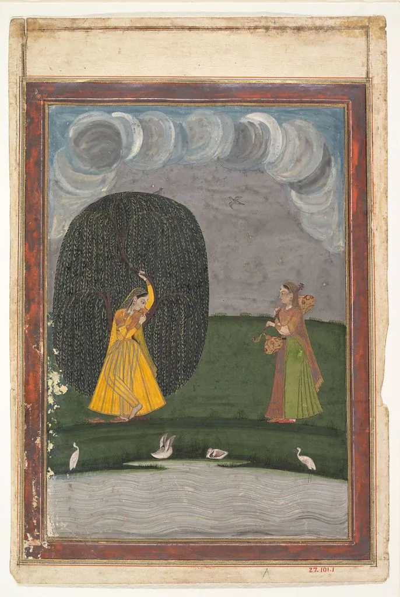
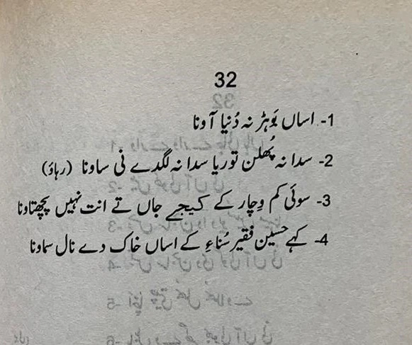
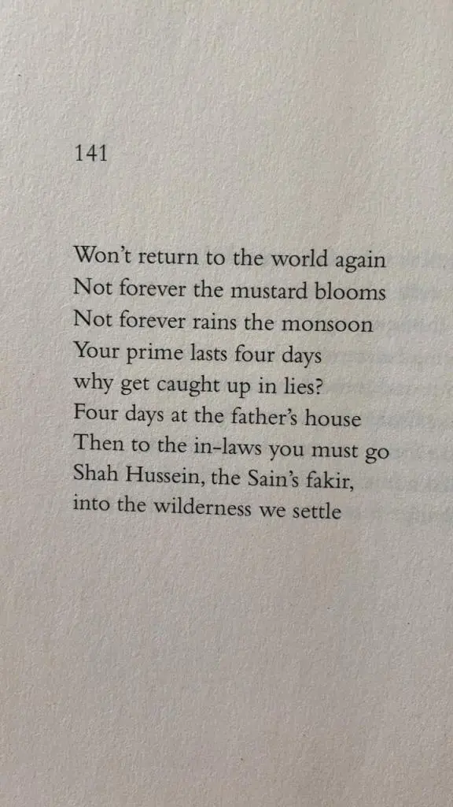

* * *

ਵੱਤ ਨ ਦੁਨੀਆਂ ਆਵਣ ।  
ਸਦਾ ਨ ਫੁਲੇ ਤੋਰੀਆ,  
ਸਦਾ ਨ ਲੱਗੇ ਸਾਵਣ ।ਰਹਾਉ।

ਏਹ ਜੋਬਨ ਤੇਰਾ ਚਾਰ ਦਿਹਾੜੇ,  
ਕਾਹੇ ਕੂੰ ਝੂਠ ਕਮਾਵਣ ।

ਪੇਵਕੜੈ ਦਿਨ ਚਾਰ ਦਿਹਾੜੇ,  
ਅਲਬਤ ਸਹੁਰੇ ਜਾਵਣ ।

ਸ਼ਾਹ ਹੁਸੈਨ ਫ਼ਕੀਰ ਸਾਂਈਂ ਦਾ,  
ਜੰਗਲ ਜਾਇ ਸਮਾਵਣ ।

* * *

وتّ ن دنیاں آون ۔  
سدا ن پھلے توریا،  
سدا ن لگے ساون ۔رہاؤ۔

ایہہ جوبن تیرا چار دہاڑے،  
کاہے کوں جھوٹھ کماون ۔

پیوکڑے دن چار دہاڑے،  
البت سہرے جاون ۔

شاہ حسین فقیر سانئیں دا،  
جنگل جائ سماون ۔

* * *

वत्त न दुनियां आवन ।  
सदा न फुले तोरिया,  
सदा न लग्गे सावन ।रहाउ।

एह जोबन तेरा चार देहाड़े,  
काहे कूं झूठ कमावन ।

पेवकड़ै दिन चार देहाड़े,  
अलबत सहुरे जावन ।

शाह हुसैन फ़कीर सांईं दा,  
जंगल जाय समावन ।

* * *

### Another version

* * *

### Glossary

**AsaaN bohar na dunya aavna**  
  
_bohar_  
parat ke, piccha neh mur ke; bohar, bohara, bohri: pind da sahokar, sood te udhar devan wala  
  
_dunya_  
dunyadari, aapo apnay matlab di paal karan wala wasaib, chaalo-vehaar  
  
**Sadaa na phulan torya sadaa na lagde ni sauna (rehao)**  
  
_phulan_  
phulan da amal, phulan da vela, mausam. phulan: phul kadhan, khiRan. phul ke choora hovan, phul jaavan, ghamand karan, garoor karan, rowb dikhawan daulat hakoomat taqat da _torya_  
basanti phullaanwala sarhon warga boota, phullaan da teil banta ai. (torya naal ralde lafaz: a) tora: hukm, dastoor, authority, qanoon, aain b) gosht de khania da khancha, viyah ya hor dawatan te rakhe amiraaN de khanyaN de khanche, c) tora: wada ameer ya vazeer d) tora: ghamand, aakaR, magroori (tora lagana, tora lag jaana, magroor hovan nuN akhde neN) e) toran: mehraab ya darwaza jehde utte phul haar latkaiy jande neiN khushi manavan ya wadyaai karan lai  
  
_sauna_  
saavan, meNh di rut, barsaat, meNh, jhaRi. sauna: siuna a) hazri, khidmat guzari, naukri, ata-at, pooja, siffat sanaa b) aandiyaaN te baithna  
  
**So-i kam vichaar ke kijay jaaN te ant nahiN pachtava**  
  
_so-i_  
ohoo ee  
  
_vichaaran_  
goh karan, gehan, sochan, discuss karan, phulan, percholan, parkhan, nakheRa karan  
  
_ant_  
a) akheer b) hadd, akherli hadd, faisla, nateeja, anjaam c) mukan, khatam hovan, tabahi d) kise cheez baray pukka ilm ya pukki itallah e) andarla hissa, dil, ruh, mizaaj, marzi, tat   

**Kahe Hussain faqeer sunae ke asaaN khak de naal samauna**  
  
_faqeer_  
jehde kol koi milkh nahin  
  
_sunae ke_  
ailaan karke (sunavan: a) ailaan karan, kise gal nuN aam karan b) samjhaavan, zor de ke aakhan c) laazmi dassan, shart naal, d) jhaaRan, tok karan  
  
_khak_  
mitti, dharti  
  
_samauna_  
barabar hovan, ral jaavan, ikko jeha hovan, ik mik hovan, ohde warga hovan

Glossary by Najam Hussain Syed  
Transliterated into Roman by Nosheen Ali

* * *

### Translation

Translated by Naveed Alam  
 _Verses of a Lowly Fakir_. Madho Lal Hussain,  
Penguin Books India, 2016.  

* * *

### Composition

https://soundcloud.com/saminahasansyed/shah-hussain-asaan-bohar-na-dunya-avna-risham-syed-composition-najm-hosain-syed-at-49-jail-road?in=saminahasansyed/sets/shah-hussain

Shah Hussain (Asaan Bohar Na Dunya Avna) Risham Syed, composition Najm Hosain Syed at 49 Jail Road  
Flute Akmal Qadri  
Violin Mukhtar Qadri  
Tabla Riaz Ahmed

* * *

### Painting

Illustration from a Ragamala Series (Garland of Musical Modes)  
late 18th century  
India (Punjab Hills)  
[Met Museum, New York  
](https://www.metmuseum.org/art/collection/search/60004962?rpp=20&pg=3&ao=on&ft=garland&pos=42)

_Crossposted from [https://sayshussain.wordpress.com/2020/11/18/wat-na-dunia-aawan/](https://sayshussain.wordpress.com/2020/11/18/wat-na-dunia-aawan/)_