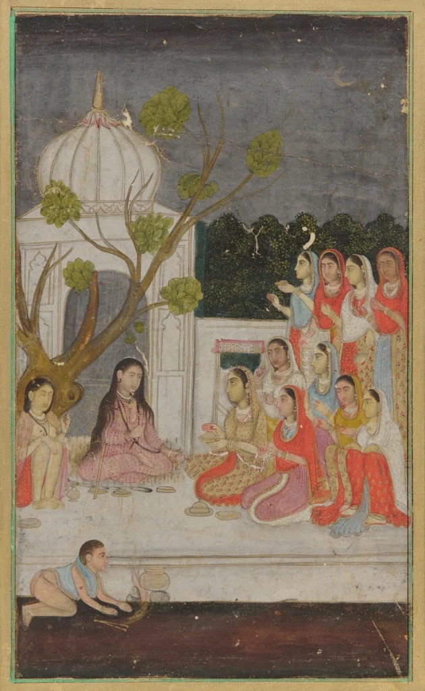
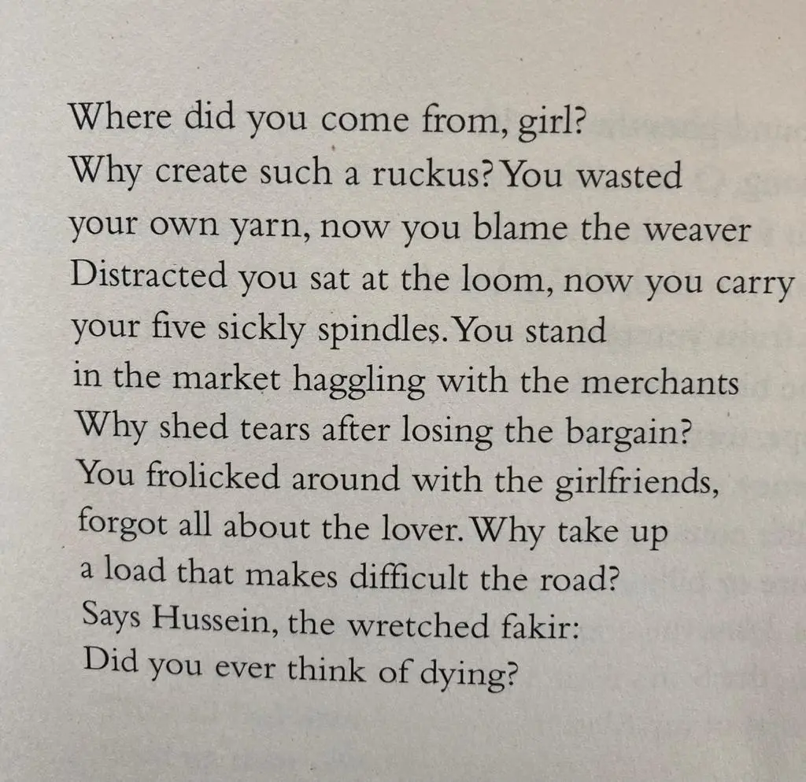

* * *

ਕੇੜ੍ਹੇ ਦੇਸੋਂ ਆਈਓਂ ਨੀਂ ਕੁੜੀਏ,  
ਤੈਂ ਕੇਹਾ ਕੇਹਾ ਸ਼ੋਰ ਮਚਾਇਓ ਕਿਉਂ ।

ਅਪੁਨਾ ਸੂਤ ਤੈਂ ਆਪੁ ਵੰਝਾਇਆ,  
ਦੋਸੁ ਜੁਲਾਹੇ ਨੂੰ ਲਾਇਓ ਕਿਉਂ ।ਰਹਾਉ।

ਤੇਰੇ ਅੱਗੇ ਅੱਗੇ ਚਰਖਾ,  
ਪਿੱਛੇ ਪਿੱਛੇ ਪੀਹੜਾ,  
ਕਤਨੀ ਹੈਂ ਹਾਲੁ ਭਲੇਰੇ ਕਿਉਂ ।1।

ਛੱਲੜੀਆਂ ਪੰਜ ਪਾਇ ਪਛੋਟੇ,  
ਜਾਇ ਬਜਾਰ ਖਲੋਵੇਂ ਕਿਉਂ ।2।

ਨਾਲਿ ਸਰਾਫ਼ਾਂ ਦੇ ਝੇੜਾ ਤੇਰਾ,  
ਲੇਖਾ ਦੇਂਦੀ ਤੂੰ ਰੋਵੇਂ ਕਿਉਂ ।3।

ਸਈਆਂ ਨਾਲ਼ ਖਿਡੰਦੀਏ ਕੁੜੀਏ,  
ਸਹੁ ਮਨਹੁ ਭੁਲਾਇਓ ਕਿਉਂ ।4।

ਰਾਹਾਂ ਦੇ ਵਿਚਿ ਅਉਖੀ ਹੋਸੇਂ,  
ਇਤਨਾ ਭਾਰ ਉਠਾਇਓ ਕਿਉਂ ।5।

ਕਹੈ ਹੁਸੈਨ ਫ਼ਕੀਰ ਨਿਮਾਣਾ,  
ਮਰਨਾ ਚਿਤਿ ਨ ਆਇਓ ਕਿਉਂ ।6।

* * *

کیڑھے دیسوں آئیؤں نیں کڑیئے،  
تیں کیہا کیہا شور مچائیو کیوں ۔

اپنا سوت تیں آپُ ونجھایا،  
دوسُ جلاہے نوں لائیو کیوں ۔رہاؤ۔

تیرے اگے اگے چرکھا،  
پچھے پچھے پیہڑا،  
کتنی ہیں حالُ بھلیرے کیوں ۔1۔

چھلڑیاں پنج پائے بھروٹے / پچھوٹے،  
جائ بازار کھلوویں کیوں ۔2۔

نالِ صرافاں دے جھیڑا تیرا،  
لیکھا دیندی توں روویں کیوں ۔3۔

سیاں نال کھڈندیئے کڑیئے،  
شوہ منوں بھلائیو کیوں ۔4۔

راہاں دے وچِ اؤکھی ہوسیں،  
اتنا بھار اٹھائؤ کیوں ۔5۔

کہےَ حسین فقیر نمانا،  
مرنا چت نہ آئیو کیوں ۔6۔

* * *

केढ़े देसों आईयों नीं कुड़ीए,  
तैं केहा केहा शोर मचाययो क्युं ।

अपुना सूत तैं आपु वंझायआ,  
दोसु जुलाहे नूं लाययो क्युं ।रहाउ।

तेरे अग्गे अग्गे चरखा,  
पिच्छे पिच्छे पीहड़ा,  
कतनी हैं हालु भलेरे क्युं ।1।

छल्लड़ियां पंज पाय पछोटे,  
जाय बजार खलोवें क्युं ।2।

नालि सराफ़ां दे झेड़ा तेरा,  
लेखा देंदी तूं रोवें क्युं ।3।

सईआं नाल खिडन्दीए कुड़ीए,  
सहु मनहु भुलाययो क्युं ।4।

राहां दे विचि अउखी होसें,  
इतना भार उठाययो क्युं ।5।

कहै हुसैन फ़कीर निमाणा,  
मरना चिति न आइयो क्युं ।6।

* * *

### Glossary

**kyun, kehray deson aiyon ni kuriye  
**_des_ juh, than, mulk, watan, paasa, ilaqa, shahr, giran

**keha shor machaiyo  
**_shor_ 1) pukar, raula, khap, fasaad, shurat, naaN, dhoom 2) jhalla, dimagon haliya hua 3) luna, khaara, kooRa, badqismat

**apna soot tein aap vanjaaya  
**_soot_ 1) sootar, dhaaga (ise thook da), taar, yaran 2) qataar, sidha rasta, seedh, sidh, pauhanch, range, with 3) suraj, paara 4) rath baan, driver  
_tein_tun  
_vanjaaya_gavaya

**dos julahe laiyo **_  
dos_ 1) galti, aib, nuqs, ilzaam, jurm, Tok, nuqsaan 2) rog 3)midhan, ragRan, lataRan

**agge agge charkha piche piche pihRa**  
_charkha_ 1) katan wala rach 2) pahiya, phiran wali cheez, bhuni, aasman, kismat, aukhi bani, bheeR 3) kamzor, thakiya, bas hoiya, maaRa, ghareeb  
_pihRa (piRha) _1) mooRha, seat, baithan di thaan, kursi, chonki 2) peRhi: jad pusht, nasal, nasb 

**kattan haal bhulaiyo  
**_haal_ 1) haalat, kaifiyat, sichueshan, pozishan 2) hun da vela, ajok, langhda waqt, prezent 3) wajd di haalat 

**challaRiyaan panj paaiy bharoTay  
**_challi_ kate dhaage da pinna (challaRiyaan: challiyaan)_panj_ 1) 5 five 2) panj hawaas 3) panj darya, panjaab 4) panj aib 5) panj namaazan    
_bharoTay (paroTay)_bharoTay wich (bharoTa: challiyaan rakhan wali Tokri)  
**jaiy bazaar khulaiyo  
**_bazaar_ mandi, markiT, vapaar, nirkh, bha, mul, vikri, sale  
_khulaiyo_ tuN khulaaya (kholan: vakhaala karan, zahir karan, mashhoori karna)    
**saiyaan naal phireeN laTkendi  
**_saiyaan_ dostaan, sangiyaan, saheliyan_l aTkendi_ laTakdi (laTkan: 1) aoh vichkar Tangiya rehna, udeek wich phasia rehna 2) banki Tor Turan, nakhreli Tor Turan 3) nasheeli Tor Turan 4) bho vich hovan 5) be dhiyaani, aib, badruh da saaya

**shoh tuN palla paiyo  
**_shoh_ mehboob, vichla, gehra paani, vichkaar, manjhdaar, murshid  
_palla_ ohla, vith, faasla, takRi da ik paasa, qainchi da ik paasa  
**rahaan de vich okhi hausaiN  
itna bhaaR uThaiyo  
kahe hussain faqeer nimana  
marna chit na aiyo    
**_chit_ dil, dimaag, aqal, mat, samajh, hosh, surt, cheta, dhiyaan

* * *

### Translation

Translated by Naveed Alam  
 _Verses of a Lowly Fakir_. Madho Lal Hussain,  
Penguin Books India, 2016.

* * *

### Painting

Fortune-telling; a group of women on a terrace at night, Freer Gallery of Art  
https://asia.si.edu/object/F1907.262/  
(accessed 12/2/2020, 2:26:24 PM).

_Crossposted from [https://sayshussain.wordpress.com/2020/12/02/kehde-deson-aayion-ni/](https://sayshussain.wordpress.com/2020/12/02/kehde-deson-aayion-ni/)_