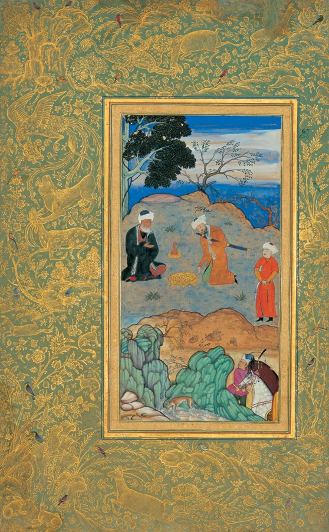
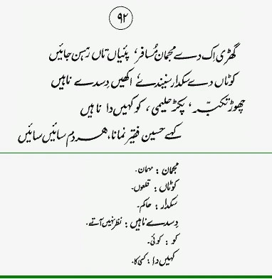
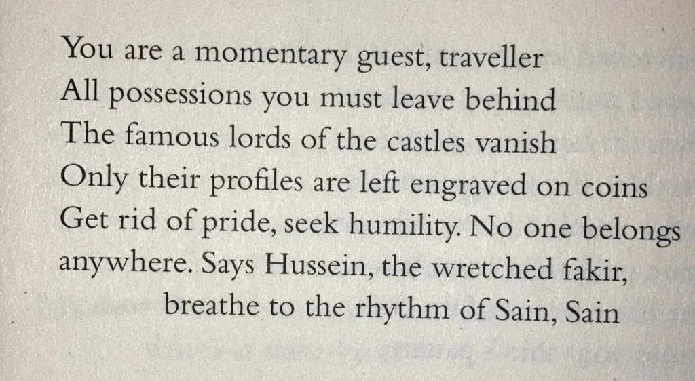

ਘੜੀ ਇਕੁ ਦੇ ਮਿਜਮਾਨੁ ਮੁਸਾਫਰ,  
ਪਈਆਂ ਤਾਂ ਰਹਿਣ ਸਰਾਈਂ ।

ਕੋਟਾਂ ਦੇ ਸਿਕਦਾਰ ਸੁਣੀਦੇ,  
ਅੱਖੀ ਦਿਸਦੇ ਨਾਹੀਂ ।ਰਹਾਉ।

ਛੋਡਿ ਤਕੱਬਰੀ ਪਕੜਿ ਹਲੀਮੀ,  
ਕੋਈ ਕਹੀਂ ਦਾ ਨਾਹੀਂ ।1।

ਕਹੈ ਹੁਸੈਨ ਫ਼ਕੀਰ ਨਿਮਾਣਾ,  
ਹਰਿ ਦਮ ਸਾਈਂ ਸਾਈਂ ।2।

* * *

* * *

घड़ी इकु दे मिजमानु मुसाफर,  
पईआं तां रहन सराईं ।

कोटां दे सिकदार सुणीदे,  
अक्खी दिसदे नाहीं ।रहाउ।

छोडि तकब्बरी पकड़ि हलीमी,  
कोई कहीं दा नाहीं ।1।

कहै हुसैन फ़कीर निमाणा,  
हरि दम साईं साईं ।2।

* * *

### Glossary

**Ghari ik de majmaan musafir, paiyaaN taaN rehsan jaayeeN**  
_majmaan_  
mehmaan  
  
**KotaN de sakdaar sunainde, akheeN disde naahiN**  
_kotaN_  
qiloN  
_sakdaar_  
hakim  
_disde naahiN_  
nazar nahin aate  
  
**Chor takabbur, pakar haleemi, ko kaheeN da naahiN**  
_ko_  
koi  
_kaheen da_  
kisi ka  
  
**Kahe Hussain faqeer nimana, har dam saeeiN saeeiN **

### Translation

Translated by Naveed Alam  
 _Verses of a Lowly Fakir_. Madho Lal Hussain,  
Penguin Books India, 2016.

* * *

### Composition

https://soundcloud.com/saminahasansyed/ghari-ik-de-mijman-musafir-sangat-gavan-new-compositionshah-hussain

Ghari Ik De Mijman Musafir Sangat Gavan (NEW composition)Shah Hussain  
Risham Syed at Sangat 49 Jail Road, Lahore  
Composition: Najm Hosain Syed

https://soundcloud.com/saminahasansyed/ghari-ik-de-mijman-musafir-sangat-gavan-old-composition

Ghari Ik De Mijman Musafir Sangat Gavan (old composition)Shah Hussain  
Risham Syed at Sangat 49 Jail Road, Lahore  
Composition: Najm Hosain Syed

* * *

### Painting

Behzad's Advice of the Ascetic (c. 1500-1550).  
Kamāl ud-Dīn Behzād - Tehran Museum of contemporary art  
Moraqqa’-e Golshan, conserved in Golestan Palace, Tehran, Iran

_Crossposted from [https://sayshussain.wordpress.com/2020/12/09/ghari-ik-de-mijman-musafir/](https://sayshussain.wordpress.com/2020/12/09/ghari-ik-de-mijman-musafir/)_