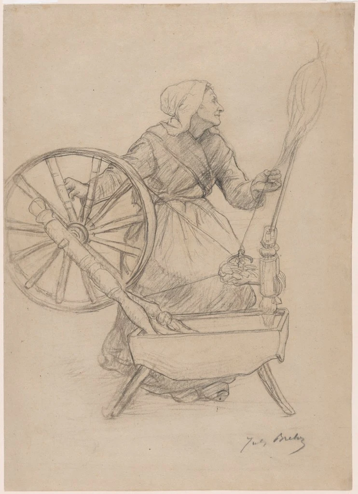
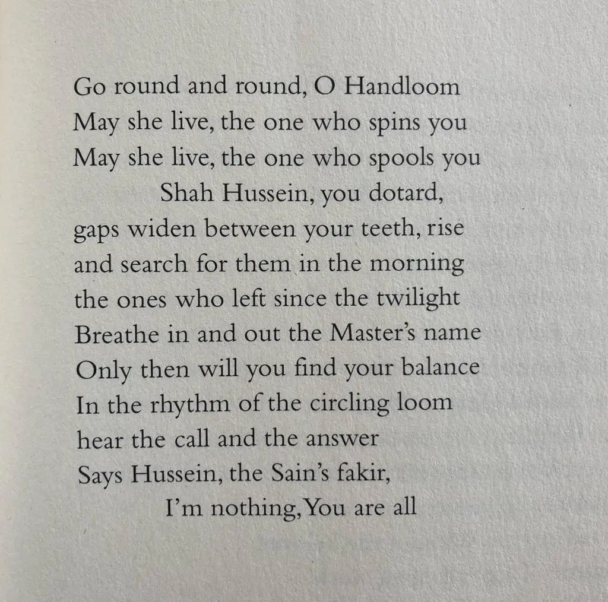

**ਘੁੰਮ ਚਰਖੜਿਆ ਘੁੰਮ (ਵੇ)****,**

**ਤੇਰੀ ਕੱਤਣ ਵਾਲੀ ਜੀਵੇ****,**

**ਨਲੀਆਂ ਵੱਟਣਿ ਵਾਲੀ ਜੀਵੇ ।ਰਹਾਉ।**

**ਬੁੱਢਾ ਹੋਇਓਂ ਸ਼ਾਹ ਹੁਸੈਨਾ****,**

**ਦੰਦੀਂ ਝੇਰਾਂ ਪਈਆਂ****,**

**ਉਠਿ ਸਵੇਰੇ ਢੂੰਡਣਿ ਲਗੋਂ****,**

**ਸੰਝਿ ਦੀਆਂ ਜੋ ਗਈਆਂ ।****1****।**

**ਹਰ ਦਮ ਨਾਮ ਸਮਾਲ ਸਾਈਂ ਦਾ****,**

**ਤਾਂ ਤੂੰ ਇਸਥਿਰ ਥੀਵੇਂ****,**

**ਪੰਜਾਂ ਨਦੀਆਂ ਦੇ ਮੂੰਹ ਆਇਆ****,**

**ਕਿਤ ਗੁਣ ਚਾਇਆ ਜੀਵੇਂ ।****2****।**

**ਚਰਖਾ ਬੋਲੇ ਸਾਈਂ ਸਾਈਂ****,**

**ਬਾਇੜ ਬੋਲੇ ਤੂੰ****,**

**ਕਹੈ ਹੁਸੈਨ ਫ਼ਕੀਰ ਸਾਈਂ ਦਾ****,**

**ਮੈਂ ਨਾਹੀਂ ਸਭ ਤੂੰ ।3।**

* * *

**گھم چرخڑیا! تیری کتن والی جیوے' نلیاں وٹن والی جیوے**

**بُڈھا ہویوں شاہ حسینا' دندیں جھیراں پیاں**

**اُٹھ سویرے ڈھونڈن لگوں، سنجھ دیاں جوگیاں**

**ہر دم نام سنبھال سائیں دا' تاں توں استھرتھیویں**

**چرخہ بولے،سائیں سائیں ،بائیڑ بولے تُوں**

**کہے فقیر سائیں دا، میں ناہیں سبھ توں**

**اوکھے لفظاں دے معنے**

**چرخڑیا: اے چرخے**

**جھیراں: فرق،فاصلے**

**سنجھ: شام**

**استھر: پکا ثابت قدم**

**بائڑ: چرخے دا اوہ دھاگا جیہڑے تکلے وچ چلدا ہے**

* * *

**घुंम चरखड़्या घुंम (वे)****,**

**तेरी कत्तन वाली जीवे****,**

**नलियां वट्टनि वाली जीवे ।रहाउ।**

**बुढ्ढा होइयों शाह हुसैना****,**

**दन्दीं झेरां पईआं****,**

**उठि सवेरे ढूंडनि लगों****,**

**संझि दियां जो गईआं ।****1****।**

**हर दम नाम समाल साईं दा****,**

**तां तूं इसथिर थीवें****,**

**पंजां नदियां दे मूंह आया****,**

**कित गुन चायआ जीवें ।****2****।**

**चरखा बोले साईं साईं****,**

**बायड़ बोले तूं****,**

**कहै हुसैन फ़कीर साईं दा****,**

**मैं नाहीं सभ तूं ।****3****।**

* * *

### Glossary

**Ghoom charakhRia teri kattan wali jeevay (rehao)**

_charakhRia _

ai charakhray (charkhe)

_kattan_

ruN da (ya kise hor cheez da) dhaaga banavan

**Buddha hoyuN Shah Hussaina dandiN jheeraN paiyaaN**

_dandiN_

dandaN vich

_jheer_

virl, with, mori, phaT, paaR, jheet, Tuk, tareeR

**UTh saveray dhoondan lagoN sanjh diyaN jo gaiyaN**

_sanjh_

shaam

**NilyaaN waTan wali jeevay**

_nilyaaN_

parai raqam vichoN maray huay paisay. nali: ChoTi Tube ya reel jehdey utay dhaaga valheiT ke shushTal wich rakhia jaanda hai (naliyaN vaTan: nali utte dhaaga valhaiTan). vaTan: 1) valhaiTan 2) kamavan

_jeevay_

1) zinda rahe 2) dhan! shabaashay!

**Har dam naam sambhaal saeeN da theevaiN isithar tuN**

_dam_

sah, pal

_naam_

kul naam, kul di sanjh da naN, kul da tat, 

_sambhaal_

1) dhiyaan vich rakhan, ikaTha kar ke kol rakhan, paalan, qaim rakhan, rakhi karan 2) hosh, dhiyan, surt, suchet, iko velay kul dhiyaan, 

_saeeN_

murshid, qudrat, dilbar, mehboob

_theevaiN_

hovaiN

_isithar_

sithar, qaim, Tiki hui, na hilan wali, pakki, kare di pakki, aDol, be-thiRak

**Charkha bole saeeN saeeN bole ba-iR tuN**

_ba-iR_

oh rassi ya Dori jehRi charkhe de do paihiyaaN utte aar paar tani hondi ai ohde utte maalh chaldi te maalh naal tikla phirda ai te poni da dhaaga bananda ai 

**NilyaaN waTan wali jeevay**

* * *

### Translation

Translated by Naveed Alam  
 _Verses of a Lowly Fakir_. Madho Lal Hussain,  
Penguin Books India, 2016

* * *

### Composition

https://www.youtube.com/watch?v=seJVhXH7OQg

Pathanay Khan

https://www.youtube.com/watch?v=N8kQY33T7uY

Abida Parveen

* * *

### Painting

Title: Woman at the Spinning Wheel  
Artist: Jules Breton (French, Courrières 1827–1906 Paris)  
Date: 1884  
Medium: Fabricated black crayon  
Dimensions: Sheet: 18 1/2 × 13 3/8 in. (47 × 34 cm)  
[Met Museum](https://www.metmuseum.org/art/collection/search/772866)

_Crossposted from [https://sayshussain.wordpress.com/2020/12/16/ghum-charkhrha-ghum/](https://sayshussain.wordpress.com/2020/12/16/ghum-charkhrha-ghum/)_