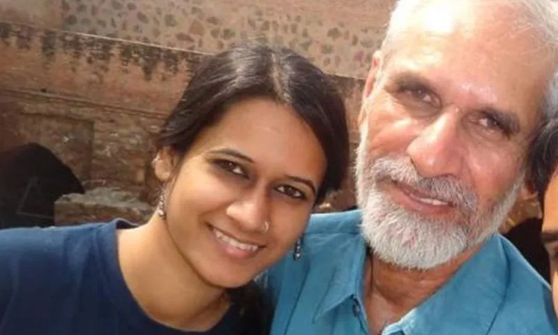

_ਨਤਾਸ਼ਾ ਨਰਵਾਲ ਆਪਣੇ ਪਿਤਾ ਮਹਾਵੀਰ ਨਰਵਾਲ ਨਾਲ਼_

  
**_ਮਿਹਰਬਾਨ ਜੱਜ ਸਾਹਿਬ_**

_ਸਵਰਾਜਬੀਰ_

  
ਮਿਹਰਬਾਨ ਜੱਜ ਸਾਹਿਬ  
ਮਹਾਵੀਰ ਨਰਵਾਲ ਮਰ ਗਿਐ  
ਹਾਂ, ਜੱਜ ਸਾਹਿਬ  
ਨਤਾਸ਼ਾ ਦਾ ਪਿਉ  
ਇਸ ਜੱਗ 'ਚ ਨਹੀਂ ਰਿਹਾ।

ਮਿਹਰਬਾਨ ਜੱਜ ਸਾਹਿਬ  
ਉਹ ਧੀ ਧਿਆਣੀ  
ਪਿਛਲੇ ਦਿਨੀਂ  
ਤੁਹਾਡੇ ਦਰਬਾਰ 'ਚ ਆਈ ਸੀ  
ਉਸ ਨੇ ਇਹ ਨਹੀਂ ਸੀ ਕਿਹਾ  
ਕਿ ਮੇਰੇ 'ਤੇ ਮੁਕੱਦਮਾ ਨਾ ਚਲਾਓ  
ਉਸ ਨੇ ਇਹ ਨਹੀਂ ਸੀ ਕਿਹਾ  
ਕਿ ਮੈਨੂੰ ਦੋਸ਼ ਮੁਕਤ ਕਰ ਦਿਓ  
ਉਸ ਦੇ ਵਕੀਲ ਨੇ ਮਿੰਨਤ ਕੀਤੀ ਸੀ  
ਕਿ ਉਸ ਨੂੰ ਦੇ ਦਿਓ ਦੋ ਪਲ  
ਉਸ ਨੇ ਆਪਣੇ ਪਿਓ ਦਾ ਮੂੰਹ ਵੇਖਣੈ  
ਉਸ ਦੇ ਨਾਲ ਦੋ ਗੱਲਾਂ ਕਰਨੀਆਂ ਨੇ  
ਉਹ ਬਿਮਾਰ ਹੈ

ਉਹ ਤੇਰ੍ਹਾਂ ਵਰ੍ਹਿਆਂ ਦੀ ਸੀ  
ਜਦ ਉਹਦੀ ਮਾਂ ਮਰ ਗਈ  
ਉਹਦਾ ਪਿਉ ਹੀ ਉਹਦੀ ਮਾਂ ਸੀ  
ਡੂੰਘੀ ਛਾਂ ਸੀ ਉਹ।

ਤੁਸੀਂ ਜਾਣਦੇ ਓ ਜੱਜ ਸਾਹਿਬ  
ਤੁਹਾਨੂੰ ਬਹੁਤ ਚੰਗੀ ਤਰ੍ਹਾਂ ਪਤਾ ਐ  
ਇਸ ਕੁੜੀ ਨੇ  
ਦਿੱਲੀ ਦੇ ਦੰਗੇ ਨਹੀਂ ਸੀ ਕਰਾਏ  
ਉਹ ਨਿਰਦੋਸ਼ ਐ  
ਉਹ ਸਮਾਜ ਦੇ ਪਿੰਜਰੇ ਤੋੜਨਾ ਚਾਹੁੰਦੀ ਸੀ  
ਤੁਸੀਂ ਉਸ ਨੂੰ ਤਾਕਤ ਦੇ ਪਿੰਜਰੇ 'ਚ ਕੈਦ ਕਰ ਦਿੱਤੈ

ਤੁਸੀਂ ਬਹੁਤ ਤਾਕਤਵਰ ਓ, ਜੱਜ ਸਾਹਿਬ  
ਤੁਸੀਂ ਮੁਨਸਿਫ਼ ਓ  
ਤੁਸੀਂ ਉਸਨੂੰ  
ਉਹ ਦੋ ਪਲ ਦੇ ਸਕਦੇ ਸੀ  
ਕਿ ਉਹ ਆਪਣੇ ਪਿਉ ਦਾ ਮੂੰਹ ਵੇਖ ਸਕਦੀ

ਤੁਸੀਂ ਉਸ ਨੂੰ ਹੋਰ ਕੈਦ ਵਿੱਚ ਰੱਖ ਸਕਦੇ ਓ ਜੱਜ ਸਾਹਿਬ  
ਤੁਸੀਂ ਉਸ ਨੂੰ ਉਮਰ ਕੈਦ ਦੀ ਸਜ਼ਾ ਦੇ ਸਕਦੇ ਓ  
ਤੁਹਾਡੇ ਕੋਲ ਹਰ ਤਾਕਤ ਐ, ਜੱਜ ਸਾਹਿਬ  
ਤੁਸੀਂ ਇਨਸਾਫ ਕਰ ਸਕਦੇ ਓ

ਉੱਪਰ ਲਿਖਿਐ ਗਲਤ ਐ  
ਤੁਸੀਂ ਸਭ ਕੁਝ ਕਰ ਸਕਦੇ ਓ ਜੱਜ ਸਾਹਿਬ  
ਪਰ ਤੁਸੀਂ  
ਉਸ ਨੂੰ ਆਪਣੇ ਪਿਉ ਨਾਲ ਗੱਲਾਂ ਕਰਨ ਲਈ  
ਦੋ ਪਲ ਨਹੀਂ ਸੀ ਦੇ ਸਕਦੇ

ਤੁਸੀਂ ਉਹ ਦੋ ਪਲ ਨਹੀਂ ਸੀ ਦੇ ਸਕਦੇ ਜੱਜ ਸਾਹਿਬ  
ਤੁਹਾਡੇ ਕੋਲ  
ਉਹ ਦੋ ਪਲ ਦੇਣ ਵਾਲਾ ਦਿਲ ਨਹੀਂ ਹੈ, ਜੱਜ ਸਾਹਿਬ  
ਤੁਹਾਡੇ ਕੋਲ ਤਾਕਤ ਹੈ  
ਤੁਹਾਡੇ ਕੋਲ ਇਨਸਾਫ ਹੈ  
ਤੁਹਾਡਾ ਦਿਲ ਸਾਫ਼ ਸ਼ਫਾਫ ਹੈ

ਤੁਸੀਂ ਕਿਹਾ ਸੀ  
ਤੁਸੀਂ ਉਸਦੀ ਫਰਿਆਦ  
ਸੋਮਵਾਰ ਸੁਣੋਗੇ  
ਜੱਜ ਸਾਹਿਬ  
ਉਹ ਸੋਮਵਾਰ ਹੁਣ ਨਹੀਂ ਆਵੇਗਾ  
ਉਹ ਸੋਮਵਾਰ  
ਹੁਣ ਕੈਲੰਡਰ 'ਚੋਂ ਗਾਇਬ ਹੋ ਗਿਐ।

ਜੱਜ ਸਾਹਿਬ  
ਤੁਸੀਂ ਸਾਰੀ ਉਮਰ  
ਇਸ ਸੋਮਵਾਰ ਦੀ ਤਲਾਸ਼ ਕਰਦੇ ਰਹੋਗੇ।  
•

_**Dear Kind Judge Sahib**_

_**Swarajbir**_

Kind Judge Sahib,  
Mahavir Narwal is dead.  
Yes Judge Sahib,  
Natasha’s father  
is no more in this world.

Kind Judge Sahib,  
A day ago, this daughter  
had come to your Court.  
She had not said  
“Don’t prosecute me”  
She had not said  
“Declare me innocent”

Her lawyer had prayed,  
“Give her two moments  
She is to see her father  
She wants to talk to him a bit,  
He is sick.”

She was 13 years of age  
When her mother died  
Her father was her mother  
A shade giving tree he was.

You know Judge Sahib,  
You know it too well,  
That this girl  
did not incite violence in Delhi,  
She is innocent.

She wanted to break the cages of society,  
And you put her into the cage of the State.

You are too powerful Judge Sahib  
You are munsif.  
You could have given her two moments  
to see her father.

Judge Sahib, you can keep her in prison for more days  
You can hand over her a sentence of life imprisonment  
Your black robes have all the powers Judge Sahib.  
You can do justice.

What is written above is wrong.  
You can do everything Judge Sahib,  
But you couldn’t grant her  
Two moments to talk to her father,  
You couldn’t give her  
those two moments Judge Sahib,  
because you don’t have that heart which could grant her  
those two moments.

You have power  
You have justice,  
You had said  
You will hear the prayer on Monday.

Judge Sahib, that Monday won’t come  
That Monday  
has disappeared from the calendar.

Judge Sahib,  
For your whole life,  
You will be searching for that Monday.

_**(Translated from Punjabi by Ayesha Kidwai)**_

•

  
English translation from [kafila.online](https://kafila.online/2021/05/10/that-monday-will-not-come-judge-sahib-swarajbir/)

  
_ਨਤਾਸ਼ਾ ਨਰਵਾਲ ਡੇੜ੍ਹ ਸਾਲ ਤੋਂ ਝੂਠੇ ਕੇਸਾਂ ਵਿੱਚ ਤਿਹਾੜ ਜੇਲ ਚ ਕੈਦ ਹੈ। ਉਸਦੇ ਪਿਤਾ ਜੀ ਮਹਾਵੀਰ ਨਰਵਾਲ ਕਰੋਨਾ ਮਹਾਮਾਰੀ ਦੀ ਲਾਗ ਨਾਲ਼ ਚੱਲ ਵਸੇ । ਨਤਾਸ਼ਾ ਨੂੰ ਜ਼ਮਾਨਤ ਉਹਨਾਂ ਦੇ ਪੂਰੇ ਹੋਣ ਤੋਂ ਬਾਅਦ ਦਿੱਤੀ ਗਈ।_

**ਸਵਰਾਜਬੀਰ** ਰੋਜ਼ਾਨਾ ਪੰਜਾਬੀ ਟ੍ਰਿਬਿਊਨ ਦੇ ਸੰਪਾਦਕ ਹਨ।

_Crossposted from [https://parchanve.wordpress.com/2021/05/10/that-monday-will-not-come-judge-sahib/](https://parchanve.wordpress.com/2021/05/10/that-monday-will-not-come-judge-sahib/)_

---
### Comments:
#### [Gurudutt Sharma (@guruduttsaahil)](http://twitter.com/guruduttsaahil "guruduttsaahil@twitter.example.com") - <time datetime="2021-05-13 13:29:32">May 4, 2021</time>

ਦਿਲ ਦੀ ਰੂਹ ਤੋਂ ਪ੍ਰਨਾਮ

