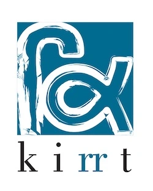

## [Kirrt](https://kirrt.org) is an online gallery, showcasing the works of Artists and Artisans of the Punjab.

---

### About

Kirrt (ਕਿਰਤ) is a Punjabi word with roots in Sanskrit word Krit or Kriti (कृत). It means manufacturing, making and creation. In Punjabi, the word kirrt carries the same meaning, but with additional connotation of kirrt as labour, toil. In Guru Nanak’s teachings hathiN kirrt karna (to work with your own hands) is considered honourable, virtuous and essential for being a gurmukh. Further, kirrt karna te wandd chhakna (to work and share the produce) is one of the core principles of not only Sikh faith but multi-religious Punjabi community.

In January 2018, we had the honour to meet with Amarjit Chandan and listened him read his poems in public. Every time he read his poem ਪੋਥੀ (The Book), he lamented the absence of celebration of the kirti and his craft in Punjabi literature and arts. Taking a cue from his concern, the Kirrt project was started by Gurdeep Singh Dhaliwal (writer, photographer) along with Navjeet Kaur (designer). Jasdeep Singh (translator, editor) and Satdeep Gill (writer, photographer) joined the collective as contributors later on.The Kirrt logo is designed by award-winning filmmaker Gurvinder Singh.We document the stories of kirrtis — artisans and kirrts — their artworks.
