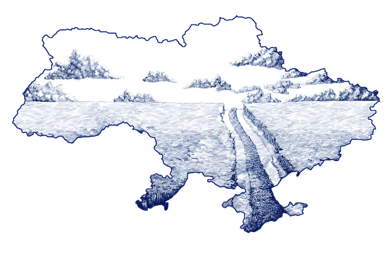


 ***ਆਂਦਰੇ ਕੁਰਕੋਵ***
>
> *ਯੂਕਰੇਨ ਯੂਰਪ ਦਾ ਦੂਜਾ ਵੱਡਾ ਮੁਲਕ ਹੈ, 6 ਲੱਖ ਕਿਲੋਮੀਟਰ ਖਿੱਤੇ ਵਿਚ 4 ਕਰੋੜ ਲੋਕ ਵਸਦੇ ਹਨ। 77 ਫੀਸਦੀ ਯੂਕਰੇਨੀ ਹਨ ਅਤੇ 17 ਫੀਸਦੀ ਰੂਸੀ ਮੂਲ ਦੇ। (ਪਹਿਲਾ ਵੱਡਾ ਮੁਲਕ ਰੂਸ ਹੈ, 1.7 ਕਰੋੜ ਕਿਲੋਮੀਟਰ ਖਿੱਤਾ,  15 ਕਰੋੜ ਵਸੋਂ)। ਬਹੁਤੇ ਲੋਕ ਦੋਵੇਂ ਰੂਸੀ ਅਤੇ ਯੂਕਰੇਨੀ ਬੋਲੀਆਂ ਬੋਲਦੇ ਹਨ। ਯੂਕਰੇਨ ਸ਼ਬਦ ਦਾ ਮਤਲਬ ਸਰਹੱਦਾਂ ਦੀ ਧਰਤੀ ਹੈ ਅਤੇ ਬਹੁਤੇ ਮੁਲਕਾਂ ਵਾਂਙ ਇਸ ਦੀਆਂ ਸਰਹੱਦਾਂ ਬਦਲਦੀਆਂ ਰਹੀਆਂ ਹਨ। ਡਨਾਇਪਰ ਦਰਿਆ ਕੰਡੇ ਵਸਿਆ ਕੀਵ ਸ਼ਹਿਰ ਇਸ ਦੀ ਰਾਜਧਾਨੀ ਹੈ। ਅਤੇ  ਡਨਾਇਪਰ ਘਾਟੀ ਵਿਚ ਹੀ  ਨੌਵੀਂ ਸਦੀ ਦਾ ਕੀਵਨ ਰੂਸ ਨਾਮ ਦਾ ਰਾਜ ਹੋਂਦ ਵਿਚ ਆਇਆ। ਬੇਲਾਰੂਸ, ਯੂਕਰੇਨ ਅਤੇ ਰੂਸ ਤਿੰਨੇ ਕੀਵਨ ਰੂਸ ਰਾਜ ਨੂੰ ਆਪਣੇ ਪੂਰਵਜ ਮੰਨਦੇ ਹਨ। ਰੂਸ ਦੀ ਮੌਜੂਦਾ ਰਾਜਧਾਨੀ ਮਾਸਕੋ ਸ਼ਹਿਰ ਵੀ ਕੀਵ ਵਾਸੀਆਂ ਨੇ ਵਸਾਇਆ ਸੀ। ਮੱਧ ਕਾਲੀ ਸਮਿਆਂ ਵਿਚ ਰੂਸ ਵਿਚ ਜ਼ਾਰਸ਼ਾਹੀ ਸੀ, ਪਰ ਯੂਕਰੇਨ ਬਹੁਤਾ ਸਮਾਂ ਕੋਜਾਕ ਫੌਜੀ ਕਮਾਂਡਰ ਤਹਿਤ ਸੀ ਜਿਸ ਨੂੰ ਹੈਤਮੇਨ ਕਹਿੰਦੇ ਸਨ। ਸੋਵੀਅਤ ਸੰਘ ਬਣਨ ਵੇਲੇ ਰੂਸ ਵਾਂਙ ਏਥੇ ਵੀ ਖਾਨਾਜੰਗੀ ਚਲਦੀ ਰਹੀ ਜਿਸ ਵਿਚ ਸ਼ਹਿਰੀ ਅਮੀਰਾਂ ਨੇ ਰਾਜਾਸ਼ਾਹੀ ਦੀ ਹਮਾਇਤ ਕੀਤੀ ਅਤੇ ਪੇਂਡੂ ਕਿਸਾਨਾਂ ਨੇ ਬਾਲਸ਼ਵਿਕਾਂ ਦੀ। ਸੋਵੀਅਤ ਯੂਨੀਅਨ ਬਣਨ ਤੋਂ ਬਾਅਦ ਤਾਤਾਰ ਕਬਾਇਲੀਆਂ ਦੀ ਰਿਆਸਤ ਕਰਾਈਮੇਆ ਵੀ ਯੂਕਰੇਨ ਦਾ ਹਿੱਸਾ ਬਣ ਗਈ। ਪੂਰਵੀ ਯੂਕਰੇਨ ਵਿਚ ਖਾਣਾਂ ਸਨ ਅਤੇ ਸੋਵੀਅਤ ਦੌਰ ਵਿਚ ਇਥੇ ਸਨਅਤ ਵੀ ਵਿਕਸਿਤ ਕੀਤੀ ਗਈ। ਰੂਸੀ ਕਾਮਿਆਂ ਦੀ ਵਸੋਂ ਪੂਰਵੀ ਯੂਕਰੇਨ ਦੇ ਡੋਨਬਾਸ ਅਤੇ ਡੋਨਿਆਸਕ ਇਲਾਕਿਆਂ ਵਿਚ ਵਧੀ।*
>
> *ਰੂਸ ਨੇ ਇਸੇ ਪੂਰਬੀ ਇਲਾਕੇ ਨੂੰ ਆਜ਼ਾਦ ਕਰਵਾਉਣ ਦੇ ਨਾਂ ‘ਤੇ ਯੂਕਰੇਨ ਉੱਪਰ ਧਾਵਾ ਬੋਲਿਆ ਹੈ।  ਸੋਵੀਅਤ ਸਮਿਆਂ ਵਿਚ ਰੂਸੀ ਭਾਸ਼ਾ ਦਾ ਬੋਲਬਾਲਾ ਸੀ ਅਤੇ ਯੂਕਰੇਨੀ ਬੋਲੀ ਦੀ ਸਰਕਾਰੇ ਦਰਬਾਰੇ ਸਕੂਲੇ ਕੋਈ ਪੁੱਛ ਗਿੱਛ ਨਹੀਂ ਸੀ। 1991 ਵਿਚ ਯੂਕਰੇਨ ਆਜ਼ਾਦ ਦੇਸ਼ ਬਣ ਗਿਆ। ਹੌਲੀ ਹੌਲੀ ਯੂਕਰੇਨੀ ਭਾਸ਼ਾ ਅਤੇ ਯੂਕਰੇਨੀ ਇਤਿਹਾਸ ਸਰਕਾਰੇ ਦਰਬਾਰੇ ਸਕੂਲੇ ਅਸਰ ਰਸੂਖ ਰੱਖਣ ਲੱਗੇ। ਰੂਸੀ ਬੋਲੀ ਦੋਇਮ ਦਰਜੇ ਤੇ ਚਲੀ ਗਈ। ਭਾਸ਼ਾ ਦਾ ਇਹ ਪਲਟਾ ਵੀ ਯੂਕਰੇਨ ਨਾਲ਼ ਰੂਸ ਦੀ ਜੰਗ ਦਾ ਇਕ ਕਾਰਨ ਹੈ।  2014 ਵਿਚ ਜਦੋਂ ਯੂਕਰੇਨੀ ਲੋਕਾਂ ਮਹੀਨਿਆਂ ਚੱਲੀ ਮੈਦਾਨ ਇਨਕਲਾਬ ਨਾਮੀ ਮੁਹਿੰਮ ਤੋਂ ਬਾਅਦ ਰੂਸ ਪੱਖੀ ਪ਼੍ਰਧਾਨ ਮੰਤਰੀ ਨੂੰ ਅਸਤੀਫਾ ਦੇਣ ਅਤੇ ਰੂਸ ਵਿਚ ਪਨਾਹ ਲੈਣ ਲਈ ਮਜ਼ਬੂਰ ਕਰ ਦਿੱਤਾ। ਇਸ ਖੁਦਮੁਖਤਿਆਰ ਅਤੇ ਪੱਛਮੀ ਯੂਰਪ/ਅਮਰੀਕਾ ਪੱਖੀ ਰਾਜ ਪਲਟੇ ਦਾ ਜਵਾਬ ਵਿਚ  ਰੂਸ ਨੇ ਯੂਕਰੇਨ ਦੇ ਚੜ੍ਹਾਈ ਕਰ ਦਿੱਤੀ ਅਤੇ  ਕਰਾਈਮੇਆ ਇਲਾਕੇ ਨੂੰ ਆਪਣੇ ਵਿਚ ਰਲਾ ਲਿਆ । ਰੂਸ ਅਤੇ ਯੂਕਰੇਨ ਵਿਚ ਲੜਾਈ ਉਦੋਂ ਤੋਂ ਹੀ ਹੈ। ਪੱਛਮੀ ਯੂਕਰੇਨ ਦੀ ਬਹੁਤੀ ਵਸੋਂ ਯੂਰਪ-ਅਮਰੀਕਾ-ਨਾਟੋ ਪੱਖੀ ਹੈ। ਪੂਰਵੀ ਯੁਕਰੇਨ ਵਿਚ ਬਹੁਤੇ  ਰੂਸ ਪੱਖੀ ਹਨ। ਨਵਾਂ ਬਣਿਆ  ਯੁਕਰੇਨੀ ਰਾਸ਼ਟਰਪਤੀ ਜ਼ੈਲਨਸਕੀ ਚਾਹੁੰਦਾ ਸੀ ਕਿ ਯੂਕਰੇਨ ਨੂੰ ਯੂਰੋਪੀਅਨ ਯੂਨੀਅਨ ਵਿਚ ਸ਼ਾਮਿਲ ਕੀਤਾ ਜਾਵੇ।  ਰੂਸੀ ਰਾਸ਼ਟਰਪਤੀ ਪੁਤਿਨ ਨੂੰ ਇਹ ਮਨਜ਼ੂਰ ਨਹੀਂ ਸੀ ਅਤੇ  24 ਫਰਵਰੀ 2022 ਨੂੰ ਰੂਸ ਨੇ ਚੜ੍ਹਾਈ ਕਰਕੇ ਜੰਗ ਸ਼ੁਰੂ ਕਰ ਦਿੱਤੀ । ਇਸ ਜੰਗ ਨੂੰ ਮਹੀਨੇ ਤੋਂ ਉੱਪਰ ਹੋ ਚੱਕਿਆ ਹੈ।*
>
>*ਅਜੋਕੇ ਯੂਕਰੇਨੀ ਲੇਖਕ ਆਂਦਰੇ ਕੁਰਕੋਵ ਜਿਹੜੇ ਪੈਨ ਯੂਕਰੇਨ ਦੇ ਮੁਖੀ ਵੀ ਹਨ। ਇਹਨਾਂ ਨੇਂ 20 ਨਾਵਲ ਅਤੇ 30 ਦੇ ਕਰੀਬ ਫਿਲਮ ਸਕਰਿਪਟਾਂ ਲਿਖੀਆਂ ਹਨ। 24 ਫਰਵਰੀ 2022 ਨੂੰ ਸ਼ੁਰੂ ਹੋਈ । 21 ਮਾਰਚ ਨੂੰ ਨਿਊ ਯੌਰਕਰ ਮੈਗਜੀਨ ਵਿਚ ਲਿਖ ਲੇਖ ਵਿਚ ਉਹ ਇਸ ਜੰਗ ਦੀ ਵਿਰਾਸਤ ਅਤੇ ਭਾਸ਼ਾ ਬਾਰੇ ਲਿਖਦੇ ਹਨ। - ਜਸਦੀਪ ਸਿੰਘ*

ਮੈਂ 1961 ਵਿਚ ਜਨਮਿਆ ਸੀ, ਦੂਜੀ ਸੰਸਾਰ ਜੰਗ ਤੋਂ ਸੋਲ਼ਾਂ ਸਾਲਾਂ ਬਾਅਦ, ਇਸ ਜੰਗ ਵਿਚ ਮੇਰਾ ਦਾਦਾ ਚੱਲ ਵਸਿਆ ਸੀ; ਨਾਨਾ ਬਚ ਰਿਹਾ। ਅਪਣੇ ਬਚਪਨ ਵਿਚ ਮੈਂ ਆਪਣੇ ਹਾਣੀਆਂ ਨਾਲ਼ ਲੜਾਈ ਲੜਾਈ ਜਾਂ ਜੰਗ ਲੜਨ ਦੀ ਖੇਡ ਖੇਡਦਾ ਰਿਹਾਂ। ਅਸੀਂ ਦੋ ਫ਼ੌਜਾਂ ਵਿਚ ਵੰਡੇ ਜਾਂਦੇ, ਸਾਡੀਆਂ ਅਤੇ “ਜਰਮਨ” ਫੌਜਾਂ ਵਿਚਕਾਰ। ਕੋਈ ਵੀ “ਜਰਮਨ” ਬਣ ਕੇ ਖੁਸ਼ ਨਾ ਹੁੰਦਾ, ਇਸ ਲਈ ਅਸੀਂ ਪੁਗਾਟਾ ਕਰਦੇ, ਅਤੇ ਕਿਸੇ ਨਾ ਕਿਸੇ ਨੂੰ ਖੇਡ ਦੇ ਦੌਰਾਨ ਮੱਲੋਂ ਜੋਰੀਂ “ਜਰਮਨ” ਬਣਨਾ ਪੈਂਦਾ। ਇਹ ਪੱਕਾ ਸੀ ਕਿ “ਜਰਮਨ” ਫੌਜ ਨੇ ਅਖੀਰ ਹਾਰਨਾ ਹੈ। ਅਸੀਂ ਲੱਕੜ ਦੀਆਂ ਕਲਾਸ਼ਨੀਕੋਵ ਬੰਦੂਕਾਂ ਫੜੀ ਭੱਜਦੇ, ਅਪਣੇ ਦੁਸ਼ਮਣਾਂ ‘ਤੇ ਅਚਨਚੇਤ ਹਮਲਾ ਕਰਦੇ ਅਤੇ ‘ਰਟ-ਟਟ-ਟਟ-ਟਟ’ ਕਰਕੇ ਮਸ਼ੀਨਗੰਨ ਦੀ ਅਵਾਜ ਕੱਢਦੇ ਹੋਏ ਉਹਨਾਂ ਤੇ “ਗੋਲੀਆਂ” ਵਰ੍ਹਾਉਂਦੇ।

ਚੌਥੀ ਜਮਾਤ ਵਿਚ ਜਦੋਂ ਸਾਨੂੰ ਸਕੂਲ ਵਿਚ ਕੋਈ ਚੋਣਵੀਂ ਵਿਦੇਸ਼ੀ ਭਾਸ਼ਾ ਚੁਣਨ ਲਈ ਕਿਹਾ ਗਿਆ, ਮੈਂ ਜਰਮਨ ਭਾਸ਼ਾ ਨੂੰ ਸਾਫ਼ ਮਨਾਂ ਕਰ ਦਿੱਤਾ। “ਉਹਨਾਂ ਨੇ ਮੇਰੇ ਦਾਦੇ ਅਲੈਕਸੇਈ ਨੂੰ ਮਾਰ ਦਿੱਤਾ ਸੀ!” ਮੈਂ ਕਿਹਾ, ਅਤੇ ਕੋਈ ਵੀ ਮੇਰਾ ਮਨ ਬਦਲ ਨਾ ਸਕਿਆ। ਮੈਂ ਅੰਗਰੇਜੀ ਪੜ੍ਹੀ। ਜੰਗ ਵਿਚ ਬਰਤਾਨਵੀ ਸਾਡੇ ਭਾਈਵਾਲ ਸਨ। ਬਰਤਾਨਵੀ ਸਾਡੇ ਹਾਲੇ ਵੀ ਭਾਈਵਾਲ ਹਨ, ਪਰ “ਸਾਡੇ” ਦਾ ਭਾਵ ਬਦਲ ਗਿਆ ਹੈ: ਉਦੋਂ ਇਸ ਦਾ ਮਤਲਬ ਸੋਵੀਅਤ ਸੀ, ਹੁਣ ਇਹ ਯੂਕਰੇਨੀ ਹੈ।

ਮੈਂ ਇਹ ਸੋਚ ਕੇ ਉਦਾਸ ਹੁੰਦਾ ਹਾਂ ਕਿ ਇਸ ਜੰਗ ਤੋਂ ਬਾਅਦ, ਜਦੋਂ ਬੱਚਿਆਂ ਨੂੰ ਸਕੂਲ ਵਿਚ ਰੂਸੀ ਭਾਸ਼ਾ ਚੁਣਨ ਲਈ ਕਿਹਾ ਜਾਵੇਗਾ, ਤਾਂ ਉਹ ਸਾਫ਼ ਮਨਾਂ ਕਰ ਦੇਣ ਗੇ ਅਤੇ ਕਹਿਣਗੇ, “ਰੂਸੀਆਂ ਨੇ ਮੇਰੇ ਦਾਦੇ ਨੂੰ ਮਾਰ ਦਿੱਤਾ ਸੀ!” ਜਾਂ “ਰੂਸੀਆਂ ਨੇ ਮੇਰੀ ਛੋਟੀ ਭੈਣ ਨੂੰ ਮਾਰ ਦਿੱਤਾ ਸੀ!” ਇਹ ਪੱਕਾ ਹੋਵੇਗਾ। ਅਤੇ ਇਹ ਅਜਿਹੇ ਮੁਲਕ ਵਿਚ ਹੋਵੇਗਾ ਜਿੱਥੇ ਵਸੋਂ ਦਾ ਤੀਜਾ ਹਿੱਸਾ ਘਰ ਵਿਚ ਰੂਸੀ ਬੋਲਦਾ ਹੈ, ਜਿੱਥੇ ਮੇਰੇ ਵਰਗੇ ਕਈ ਲੱਖ ਰੂਸੀ ਵਸਦੇ ਹਨ।

ਪੁਤਿਨ ਸਿਰਫ਼ ਯੂਕਰੇਨ ਨੂੰ ਹੀ ਨਹੀਂ, ਰੂਸ ਨੂੰ ਵੀ ਤਬਾਹ ਕਰ ਰਿਹਾ ਹੈ। ਉਹ ਰੂਸੀ ਭਾਸ਼ਾ ਨੂੰ ਵੀ ਤਬਾਹ ਕਰ ਰਿਹਾ ਹੈ। ਪਰ ਇਸ ਭਿਆਨਕ ਜੰਗ ਵਿਚ, ਜਦੋਂ ਰੂਸੀ ਫ਼ੌਜ ਸਕੂਲਾਂ, ਯੂਨੀਵਰਸਿਟੀਆਂ ਅਤੇ ਹਸਪਤਾਲਾਂ ‘ਤੇ ਬੰਬਾਰੀ ਕਰ ਰਹੀ ਹੈ, ਰੂਸੀ ਭਾਸ਼ਾ ਤਾਂ ਨਿਮਾਣਾ ਜਿਹਾ ਪੀੜਤ ਹੈ। ਬਹੁਤ ਵਾਰ ਮੈਨੂੰ ਅਪਣੇ ਰੂਸੀ ਹੋਣ 'ਤੇ ਸ਼ਰਮ ਆਈ ਹੈ, ਜਾਂ ਇਸ ਗੱਲ ਤੇ ਕਿ ਮੇਰੀ ਮੁਢਲੀ ਬੋਲੀ ਰੂਸੀ ਹੈ। ਮੈਂ ਇਹ ਦੱਸਣ ਲਈ ਕਿ ਇਸ ਵਿਚ ਭਾਸ਼ਾ ਦਾ ਕੋਈ ਦੋਸ਼ ਨਹੀਂ ਹੈ, ਕਈ ਰਾਹ ਲੱਭੇ ਹਨ। ਕਿ ਰੂਸੀ ਭਾਸ਼ਾ ਪੁਤਿਨ ਦੀ ਜ਼ਾਗੀਰ ਨਹੀਂ ਹੈ। ਕਿ ਯੂਕਰੇਨ ਦੇ ਬਹੁਤ ਸਾਰੇ ਰਾਖੇ ਰੂਸੀ ਬੋਲਣ ਵਾਲੇ ਲੋਕ ਹਨ, ਕਿ ਪੂਰਬੀ ਅਤੇ ਦੱਖਣੀ ਯੂਕਰੇਨ ਵਿਚ ਜੰਗ ਦੇ ਬਹੁਤ ਸਾਰੇ ਪੀੜਤ ਵੀ ਰੂਸੀ ਬੋਲਦੇ ਰੂਸੀ ਕੌਮ ਦੇ ਬਾਸ਼ਿੰਦੇ ਹਨ। ਪਰ ਹੁਣ ਮੈਂ ਚੁੱਪ ਹੀ ਰਹਿਨਾਂ ਹਾਂ। ਮੈਂ ਯੂਕਰੇਨੀ ਭਾਸ਼ਾ ਚੰਗੀ ਤਰਾਂ ਬੋਲ ਲੈਂਦਾ ਹਾਂ। ਮੇਰੇ ਵਾਸਤੇ ਬਹੁਤ ਸੌਖਾ ਹੈ ਕਿ ਮੈਂ ਗੱਲ ਇਕ ਭਾਸ਼ਾ ਚ ਸ਼ੁਰੂ ਕਰਾਂ ਅਤੇ ਖਤਮ ਦੂਜੀ ਭਾਸ਼ਾ ਵਿਚ।

ਯੂਕਰੇਨ ਵਿਚ ਰੂਸੀ ਭਾਸ਼ਾ ਦਾ ਭਵਿੱਖ ਮੈਨੂੰ ਦਿਸ ਰਿਹਾ ਹੈ। ਜਿਵੇਂ ਕੁਝ ਰੂਸੀ ਸ਼ਹਿਰੀ ਆਪਣੇ ਪਾਸਪੋਰਟ ਪਾੜ ਕੇ ਅਪਣੇ ਆਪ ਨੂੰ ਰੂਸੀ ਮੰਨਣੋ ਮੁਨਕਰ ਹਨ। ਬਹੁਤ ਸਾਰੇ ਯੂਕਰੇਨੀ ਹਰੇਕ ਰੂਸੀ ਚੀਜ਼ ਤੋਂ ਕਿਨਾਰਾ ਕਰ ਰਹੇ ਹਨ, ਭਾਵੇਂ ਉਹ ਭਾਸ਼ਾ ਹੋਵੇ, ਕਲਚਰ ਹੋਵੇ, ਜਾਂ ਰੂਸ ਬਾਰੇ ਉਹਨਾਂ ਦੇ ਵਿਚਾਰ ਹੋਣ। ਮੇਰੀ ਪਤਨੀ ਇੰਗਲੈਂਡ ਦੀ ਹੈ, ਅਤੇ ਮੇਰੇ ਬੱਚਿਆਂ ਦੀਆਂ ਦੋ ਮੁਢਲੀਆਂ ਬੋਲੀਆਂ ਹਨ: ਰੂਸੀ ਅਤੇ ਅੰਗਰੇਜੀ। ਜਦੋਂ ਉਹ ਆਪਸ ਵਿਚ ਗੱਲ ਕਰਦੇ ਹਨ ਤਾਂ ਉਹ ਸਿਰਫ਼ ਅੰਗਰੇਜੀ ਬੋਲਦੇ ਹਨ। ਉਹ ਮੇਰੇ ਨਾਲ਼ ਰੂਸੀ ਵਿਚ ਗੱਲ ਕਰਦੇ ਹਨ, ਪਰ ਉਹਨਾਂ ਦੀ ਰੂਸੀ ਕਲਚਰ ਵਿਚ ਕੋਈ ਦਿਲਚਸਪੀ ਨਹੀਂ ਹੈ। ਪਰ ਕਦੇ ਕਦੇ ਮੇਰੀ ਧੀ ਗੈਬਰੀਐਲਾ ਰੂਸੀ ਰੈਪ ਜਾਂ ਰੌਕ ਸੰਗੀਤ ਦੀਆਂ ਹਸਤੀਆਂ ਦੇ ਬਿਆਨ ਭੇਜਦੀ ਰਹਿੰਦੀ ਹੈ ਜਿਨ੍ਹਾਂ ਨੇ ਪੁਤਿਨ ਦਾ ਵਿਰੋਧ ਕੀਤਾ ਹੈ। ਸ਼ਾਇਦ ਇਹ ਕਰਕੇ ਉਹ ਮੇਰੀ ਹਮਾਇਤ ਕਰਨਾ ਚਾਹੁੰਦੀ ਹੈ, ਮੈਨੂੰ ਇਹ ਦਿਖਾ ਕੇ ਕਿ ਸਾਰੇ ਰੂਸੀ ਪੁਤਿਨ ਦੇ ਮੁਰੀਦ ਅਤੇ ਯੂਕਰੇਨੀ ਹਮਲੇ ਦੇ ਹਮਾਇਤੀ ਨਹੀਂ ਹਨ।

ਇਹ ਮੈਨੂੰ ਵੀ ਪਤਾ ਹੈ। ਮੇਰੇ ਰੂਸੀ ਲੇਖਕ ਦੋਸਤਾਂ ਅਤੇ ਜਾਣਕਾਰਾਂ ਵਿਚ, ਇਕ ਹਿੱਸਾ ਹੈ ਜਿਹੜਾ ਨਿਡਰ ਹੋ ਕੇ ਯੂਕਰੇਨ ਦੀ ਹਮਾਇਤ ਕਰ ਰਿਹਾ ਹੈ। ਵਲਾਦੀਮੀਰ ਸੋਰੋਕਿਨ, ਬੋਰਿਸ ਆਕੂਨਿਨ, ਅਤੇ ਮਿਖਾਈਲ ਸ਼ਿਸ਼ਕਿਨ, ਜਿਹੜੇ  ਲੰਮੇ ਸਮੇਂ ਤੋਂ ਜਲਾਵਤਨੀ ਹੰਢਾ ਰਹੇ ਹਨ ਅਤੇ ਕ੍ਰੈਮਲਿਨ ਦੇ ਵਿਰੋਧੀ ਹਨ। ਕੁਝ ਕੁ ਜਾਣੇ ਅਜਿਹੇ ਵੀ ਹਨ ਜਿਹੜੇ ਰੂਸ ਵਿਚ ਰਹਿੰਦੇ ਹਨ, ਪਰ ਉਹਨਾਂ ਨੂੰ ਜਲਦੀ ਹੀ ਹਿਜਰਤ ਕਰਨੀ ਪਵੇਗੀ। ਮੈਂ ਉਹਨਾਂ ਦਾ ਸ਼ੁਕਰਗੁਜਾਰ ਹਾਂ ਅਤੇ ਉਹ ਮੇਰੀ ਇਮਾਨਦਾਰ ਅਤੇ ਸੁਹਰਿਦ ਇਨਸਾਨਾਂ ਦੀ ਫਹਿਰਿਸਤ ਦਾ ਹਿੱਸਾ ਹਨ। ਮੈਂ ਚਾਹੁੰਦਾ ਹਾਂ ਕਿ ਉਹ ਇਤਿਹਾਸ ਦਾ ਅਤੇ ਸੰਸਾਰ ਕਲਚਰ ਦਾ ਹਿੱਸਾ ਰਹਿਣ, ਉਹਨਾਂ ਨੂੰ ਪੜ੍ਹਿਆ ਜਾਵੇ, ਸੁਣਿਆ ਜਾਵੇ। ਸਾਰਾ ਰੂਸ ਪੁਤਿਨ ਨਹੀਂ ਹੈ। ਪਰ ਬਦਕਿਸਮਤੀ ਨਾਲ਼ ਰੂਸ ਵਿਚ ਕੋਈ ਵੀ ਪੁਤਿਨ ਵਿਰੋਧੀ ਮੁਹਾਜ਼ ਨਹੀਂ ਹੈ। ਅਲੈਕਸੇੇਈ ਨਵੈਲਨੀ ਵੀ ਕਰਾਈਮੇਆ ਉੱਤੇ ਹੋਏ ਗ਼ੈਰਕਾਨੂੰਨੀ ਕਬਜ਼ੇ ਦਾ ਵਿਰੋਧ ਨਹੀਂ ਦਰਜ ਕਰਵਾ ਸਕਿਆ ਸੀ।

ਇਹ ਸਾਰੇ ਵਿਚਾਰ ਮੈਨੂੰ ਬਚਪਣ ਦੀਆਂ ਯਾਦਾਂ ਵਿਚ ਸ਼ਰਨ ਲੈਣ ਵੱਲ ਤੋਰ ਦਿੰਦੇ ਹਨ।

ਛੋਟੇ ਹੁੰਦਿਆਂ, ਮੈਂਨੂੰ ਕੀਵ (ਯੂਕਰੇਨ ਦੀ ਰਾਜਧਾਨੀ) ਨੇੜਲੇ ਪਿੰਡ ਤਾਰਾਸਵਿਕਾ ਜਾਣਾ ਪਸੰਦ ਸੀ, ਉੱਥੇ ਦੂਜੀ ਸੰਸਾਰ ਜੰਗ ਦੇ ਮੈਦਾਨ ਸਨ। ਮੈਂ ਅਤੇ ਮੇਰਾ ਪੱਕਾ ਮਿੱਤਰ ਸ਼ਾਸ਼ਾ ਸੋਲਵਿਓਵ, ਅਸੀਂ ਰੇਲਗੱਡੀ ਰਾਹੀਂ ਜਾਂਦੇ।  ਅਸੀਂ ਅਪਣੇ ਨਾਲ਼ ਫੌਜੀ ਵੇਲਚੇ ਲੈ ਕੇ ਜਾਂਦੇ ਤਾਂ ਕੇ ਪਿੰਡ ਦੇ ਨੇੜਲੀਆਂ ਪਹਾੜੀਆਂ ਵਿਚ ਖੁਦਾਈ ਕਰ ਸਕੀਏ। ਉਥੇ ਸਾਨੂੰ ਬੰਦੂਕਾਂ ਜਾਂ ਮਸ਼ੀਨਗੰਨਾਂ ਦੀਆਂ ਗੋਲੀਆਂ ਜਾਂ ਖੋਲ ਲੱਭ ਜਾਂਦੇ। ਕਦੇ ਗਰਨੇਡਾਂ ਦੇ ਹਿੱਸੇ ਜਾਂ ਵਰਦੀਆਂ ਦੇ ਬਟਨ ਵੀ ਮਿਲ ਜਾਂਦੇ। ਦੂਜੀ ਸੰਸਾਰ ਜੰਗ ਵੇਲੇ ਦਾ ਲੋਹਾ-ਸਿੱਕਾ ਹਲੇ ਵੀ ਕੀਵ ਦੇ ਆਲੇ ਦੁਆਲੇ ਦੱਬਿਆ ਪਿਆ ਹੈ, ਅਤੇ ਸਿਰਫ਼ ਕੀਵ ਵਿਚ ਹੀ ਨਹੀਂ ਸਾਰੇ ਯੂਕਰੇਨ ਵਿਚ। ਜ਼ਿਯਤੋਮਿਰ ਇਲਾਕੇ ਦੇ ਲਜ਼ਾਰਿਵਕਾ ਪਿੰਡ ਵਿਚ ਸਾਡੀ ਗਰਮੀਆਂ ਵਿਚ ਰਿਹਾਇਸ਼ ਹੈ, ਇਸ ਇਲਾਕੇ ਦੇ ਲੋਕੀਂ ਬੜੇ ਲੰਮੇ ਸਮੇਂ ਤੋਂ ਜੰਗ ਵੇਲੇ ਦੇ ਦੱਬੇ ਖਜ਼ਾਨੇ ਲੱਭਣ ਵਿਚ ਲੱਗੇ ਹੋਏ ਹਨ। ਉਹਨਾਂ ਕੋਲ ਮਹਿੰਗੇ ਧਾਤ ਖੋਜੂ ਯੰਤਰ ਹਨ, ਜਿਹੜੇ ਜ਼ਮੀਨ ਦੇ ਮੀਟਰ ਮੀਟਰ ਹੇਠਾਂ ਤੱਕ ਧਾਤ ਖੋਜ ਸਕਦੇ ਹਨ। ਉਹ ਅਪਣੇ ਵਾਧੂ ਸਮੇਂ ਵਿਚ ਇਹਨਾਂ ਯੰਤਰਾਂ ਨਾਲ਼ ਖੇਤਾਂ ਅਤੇ ਜੰਗਲ ਖੋਜਦੇ ਰਹਿੰਦੇ ਹਨ। ਦੋ ਸਾਲ ਪਹਿਲਾਂ, ਟਰੈਕਟਰ ਚਾਲਕ ਸਲਾਵਾ, ਜਿਹੜਾ ਸਾਡੇ ਉਥੋਂ ਵਾਲ਼ੇ ਘਰ ਦੇ ਨੇੜੇ ਹੀ ਰਹਿੰਦਾ ਹੈ, ਨੂੰ ਇਕ ਜਰਮਨ ਟੈਂਕ ਦਾ ਬੈਰਲ ਲੱਭਿਆ। ਕਾਫ਼ੀ ਚਿਰ ਉਸ ਤੋਂ ਫੈਸਲਾ ਨਾਂ ਹੋਇਆ ਕਿ ਉਹ ਇਸਦਾ ਕਰੇ ਕੀ। ਉਹ ਆਪਣੀ ਨਿੱਕੀਆਂ ਮੋਟੀਆਂ ਲੱਭਤਾਂ ਤਾਂ ਇੰਟਰਨੈੱਟ ਤੇ ਵੇਚ ਦਿੰਦਾ ਸੀ। ਪਰ ਦੋ ਮੀਟਰ ਲੰਮਾ ਅਤੇ ਪੰਜਾਹ ਕਿੱਲੋ ਭਾਰਾ ਬੈਰਲ ਦਾ ਟੋਟਾ, ਫੌਜੀ ਯਾਦਾਂ ਇਕੱਠੀਆਂ ਕਰਨ ਵਾਲਿਆਂ ਲਈ ਵੀ ਕੋਈ ਬਹੁਤੀ ਖਿੱਚ ਵਾਲ਼ੀ ਚੀਜ ਨਹੀਂ ਸੀ। ਮੈਨੂੰ ਨਹੀਂ ਪਤਾ ਉਹਨੇਂ ਉਸ ਬੈਰਲ ਦਾ ਆਖਿਰ ਵਿਚ ਕੀਤਾ ਕੀ। ਜਿਆਦਾ ਤੋਂ ਜਿਆਦਾ ਕਬਾੜ ਵਿਚ ਵੇਚ ਦਿੱਤਾ ਹੋਵੇਗਾ। ਉਹਦੇ ਘਰ ਵਿਚ ਇਹ ਬੈਰਲ ਕਈ ਮਹੀਨੇ ਪਿਆ ਰਿਹਾ ਅਤੇ ਮੈਨੂੰ ਲਗਦੈ ਕਿ ਉਸ ਨੂੰ ਇਸ ਬਾਬਤ ਆਪਣੀ ਘਰਵਾਲੀ ਤੋਂ ਵੀ ਸੁਣਨੀਆਂ ਪਈਆਂ ਸਨ। ਫਿਰ ਉਹ ਬੈਰਲ ਗਾਇਬ ਹੋ ਗਿਆ ਅਤੇ ਮੈਂ ਨਹੀਂ ਪੁੱਛਿਆ ਕਿੱਥੇ ਗਿਆ। ਪਰ, ਇਸ ਜੰਗ ਤੋਂ ਬਾਅਦ, ਉਹ ਫੇਰ ਖੇਤਾਂ ਵਿਚ ਧਾਤ ਖੋਜੂ ਯੰਤਰ ਲੈ ਕੇ ਜਾਵੇਗਾ। ਮੈਨੂੰ ਪਤਾ ਹੈ ਕਿ ਇਸ ਵਾਰ ਉਸਨੂੰ ਨਵੀਆਂ ਚੀਜਾਂ ਲੱਭਣਗੀਆਂ।  

ਹੁਣ ਰੂਸੀ ਫੌਜ ਦੀ ਕਈ ਹਜ਼ਾਰ ਟਨ ਧਾਤ ਯੂਕਰੇਨੀ ਮਿੱਟੀ 'ਤੇ ਅਤੇ ਜ਼ਮੀਨ ਦੇ ਹੇਠਾਂ ਮੋਜੂਦ ਹੈ। ਜੰਗ ਤੋਂ ਬਾਅਦ, ਯੂਕਰੇਨ ਇਸ ਸਾਰੀ ਦੀ ਸਾਰੀ ਧਾਤ ਨੂੰ ਚੀਨ ਜਾਂ ਕਿਸੇ ਹੋਰ ਮੁਲਕ ਨੂੰ ਵੇਚ ਦੇਵੇਗਾ। ਪਰ ਇਸ ਵੇਲੇ, ਟੁੱਟੇ ਭੱਜੇ ਟੈਂਕ ਅਤੇ ਸੜੀਆਂ ਬਲ਼ੀਆਂ ਬਖਤਰਬੰਦ ਗੱਡੀਆਂ ਸਾਡੀਆਂ ਸੜਕਾਂ ਅਤੇ ਖੇਤਾਂ ਵਿਚ ਜਮਾਂ ਹੋ ਰਹੇ ਹਨ। ਉਹ ਸ਼ਹਿਰ ਜਿਹੜੇ ਰੂਸੀ ਫੌਜ ਦੀ ਮਾਰ ਤੋਂ ਬਚੇ ਹਨ, ਮੋਰਚੇ ਪੁੱਟ ਰਹੇ ਹਨ ਅਤੇ ਕੱਚੀਆਂ ਗੜ੍ਹੀਆਂ ਬਣਾ ਰਹੇ ਹਨ। ਉਹਨਾਂ ਨੂੰ ਪਤਾ ਲੱਗ ਗਿਆ ਹੈ ਕਿ "ਰੱਖਿਆ ਦੀ ਪਹਿਲੀ ਹੱਦ", "ਦੂਜੀ ਹੱਦ" ਅਤੇ "ਤੀਜੀ ਹੱਦ" ਕਿਹੜੀ ਹੈ। ਰੂਸੀ ਟੈਂਕਾਂ ਅਤੇ ਫੌਜ ਦੇ ਹਮਲੇ ਨੂੰ ਉਡੀਕ ਵਿਚ ਉਹ ਰਾਤ ਦਿਨ ਮੋਰਚੇ ਪੱਟ ਰਹੇ ਹਨ। ਜਦੋਂ ਉਹ ਇਹ ਮੋਰਚੇ ਪੁੱਟ ਰਹੇ ਹੁੰਦੇ ਹਨ, ਅਚਰਜ ਲੱਭਤਾਂ ਮਿਲਦੀਆਂ ਹਨ - ਫੌਜੀ ਚੀਜਾਂ ਨਹੀਂ, ਥੇਹਾਂ ਵਿਚਲੀਆਂ ਲੱਭਤਾਂ। ਤਾਂਬਾ ਯੁਗ ਵੇਲ਼ੇ ਦੀਆਂ ਕਦੀਮ ਸ਼ੈਆਂ ਮਿਲ ਚੁੱਕੀਆਂ ਹਨ। ਯੂਕਰੇਨ ਦੇ ਥੇਹਖੋਜੀਆਂ ਦੀ ਯੂਨੀਅਨ ਨੇ ਕਾਇਦੇ ਜਾਰੀ ਕੀਤੇ ਹਨ, ਜਿਸ ਵਿਚ ਹਰ ਕਿਸੇ ਨੂੰ ਸਲਾਹ ਹੈ ਕਿ ਜੇ ਕੁਝ ਪੁਰਾਣੇ ਸਮਿਆਂ ਦਾ ਲੱਭੇ ਤਾਂ ਉਸ ਦੀ ਥਾਂ ਯਾਦ ਕਰਕੇ, ਨਕਸ਼ੇ ਤੇ ਨਿਸ਼ਾਨੀ ਲਾ ਲਈ ਜਾਵੇ, ਅਤੇ ਇਸ ਥਾਂ ਨੂੰ ਜੰਗ ਤੋਂ ਬਾਅਦ ਥੇਹਖੋਜ ਲਈ ਛੱਡ ਦਿੱਤਾ ਜਾਵੇ।

ਜੰਗ ਮਗਰੋਂ, ਕਦੀਮੀ ਕਲਚਰ ਦੀ ਤਹਿ, ਅਜੋਕੇ ਕਲਚਰ ਨਾਲ਼ ਮਿਲ ਜਾਵੇਗੀ, ਜਾਂ ਕਹਿ ਲਓ, "ਰੂਸੀ ਕਲਚਰ" ਦੀ ਅਜੋਕੀ ਤਹਿ ਨਾਲ਼। ਪਰ ਥੇਹਖੋਜੀਆਂ ਨੂੰ ਵਸਤਾਂ ਦੀ ਦਰਜਾਬੰਦੀ ਕਰਨੀ ਸੌਖੀ ਹੋਵੇਗੀ। ਕੀਮਤੀ ਵਸਤਾਂ ਉਹ ਹੋਣਗੀਆਂ ਜਿੰਨ੍ਹਾ ‘ਤੇ "ਮੇਡ ਇਨ ਰਸ਼ੀਅਨ ਫੈਡਰੇਸ਼ਨ" ਦੀ ਮੋਹਰ ਨਹੀਂ ਹੋਵੇਗੀ

ਜੰਗ ਮਗਰੋਂ, ਦਰਜਨਾਂ ਸ਼ਹਿਰ ਅਤੇ ਹਜ਼ਾਰਾਂ ਪਿੰਡ ਦੇ ਖੰਡਰ ਬਣ ਜਾਣ ਗੇ। ਲੱਖਾਂ ਯੂਕਰੇਨੀ ਬੇਘਰ ਹੋ ਜਾਣਗੇ। ਕੁੜੱਤਣ ਹੋਵੇਗੀ ਅਤੇ ਨਫਰਤ ਹੋਵੇਗੀ। ਅਤੇ ਜਦੋਂ ਬੱਚੇ ਲੜਾਈ ਲੜਾਈ ਖੇਡਣਗੇ ਤਾਂ ਇਸ ਜੰਗ ਬਾਰੇ ਖੇਡਣ ਗੇ। ਉਹ ਜ਼ਮੀਨ ਵਿਚੋਂ ਗੋਲੀਆਂ ਅਤੇ ਗਰਨੇਡ ਖੋਦਣ ਗੇ। ਸੜਕਾਂ ਨੇੜਲੀਆਂ ਬਾਰੂਦੀ ਸੁਰੰਗਾਂ ਕਰਕੇ ਕਾਰਾਂ ਤਬਾਹ ਹੁੰਦੀਆਂ ਰਹਿਣਗੀਆਂ। ਜੰਗ ਕਦੇ ਵੀ ਮਿਥੇ ਸਾਲ ਦੀ ਮਿਥੀ ਤਰੀਕ ਨੂੰ ਨਹੀਂ ਖਤਮ ਹੁੰਦੀ। ਜੰਗ ਜਾਰੀ ਰਹਿੰਦੀ ਹੈ ਅਤੇ ਲੋਕ ਇਸਦੇ ਜਖਮਾਂ ਕਰਕੇ, ਇਸ ਦੀ ਰਹਿੰਦ ਖੂੰਹਦ ਕਰਕੇ ਮਰਦੇ ਰਹਿੰਦੇ ਹਨ। ਮਾਨਸਿਕ ਤੌਰ ‘ਤੇ ਸਾਬਕਾ ਸੋਵੀਅਤ ਯੂਨੀਅਨ ਵਿਚ ਦੂਜੀ ਸੰਸਾਰ ਜੰਗ ਸੱਤਰਵਿਆਂ ਵਿਚ ਖਤਮ ਹੋ ਗਈ ਸੀ, ਪਰ ਸੋਵੀਅਤ ਸਿਸਟਮ ਨੇ ਇਸ ਦੀ ਯਾਦ ਅਤੇ ਦੁਸ਼ਮਣੀ ਨੂੰ ਕਿਤਾਬਾਂ, ਫ਼ਿਲਮਾਂ, ਸਕੂਲੀ ਕਿਤਾਬਾਂ ਰਾਹੀਂ ਜਿਉਂਦਿਆਂ ਰੱਖਿਆ। ਵੱਖਰਾ ਹੋਣਾ ਮੰਗਦੇ "ਰਾਜਾਂ" ਦੀਆਂ ਸਕੂਲੀ ਕਿਤਾਬਾਂ ਪੜ੍ਹਾਉਂਦੀਆਂ ਹਨ ਕਿ ਯੂਕਰੇਨ ਇਕ ਫਾਸ਼ੀਵਾਦੀ ਮੁਲਕ ਹੈ। ਬੱਚਿਆਂ ਨੂੰ ਯੂਕਰੇਨ, ਯੂਰਪ, ਅਤੇ ਸੰਯੁਕਤ ਰਾਜ ਅਮਰੀਕਾ ਨਾਲ਼ ਨਫ਼ਰਤ ਕਰਨੀ ਸਿਖਾਈ ਜਾਂਦੀ ਹੈ।

ਮੈਂ ਸਿਰਫ਼ ਕਲਪਨਾ ਹੀ ਕਰ ਸਕਦਾ ਹਾਂ ਕਿ ਇਹ ਜੰਗ ਇਤਿਹਾਸ ਦੀਆਂ ਰੂਸੀ ਕਿਤਾਬਾਂ ਵਿਚ ਕਿਵੇਂ ਦਰਸਾਈ ਜਾਵੇਗੀ। ਰੂਸ ਨੂੰ ਇਤਿਹਾਸ ਆਪਣੇ ਮੁਤਾਬਕ ਮਰੋੜਨ ਦਾ ਬਹੁਤ ਤਜ਼ਰਬਾ ਹੈ।  ਇਹ ਹੋਰਨਾਂ ਮੁਲਕਾਂ ਦੇ ਇਤਿਹਾਸ ਦੀਆਂ ਕਿਤਾਬਾਂ ਵੀ ਅਪਣੇ ਅਸਰ ਹੇਠ ਕਰਨ ਦੀ ਕੋਸ਼ਿਸ਼ ਕਰੇਗਾ। ਸੋਵੀਅਤ ਯੁਗ ਦੌਰਾਨ, ਸੋਵੀਅਤ ਯੂਨੀਅਨ ਨੇ ਫ਼ਿਨਲੈਂਡ ਦੇ ਸਕੂਲਾਂ ਵਿਚ ਪੜ੍ਹਾਇਆ ਜਾਂਦਾ ਇਤਿਹਾਸ ਵੀ ਆਪਣੇ ਮੁਤਾਬਕ ਲਿਖਵਾਇਆ ਸੀ।

ਇਤਿਹਾਸ ਦੀ ਅਜ਼ਾਦੀ ਹੀ ਮੁਲਕ ਦੀ ਆਜ਼ਾਦੀ ਦੀ ਗਾਰੰਟੀ ਹੈ।

ਮੈਂ ਚਾਹੁੰਦਾ ਹਾਂ ਕਿ ਸਕੂਲ ਯੂਕਰੇਨ ਦਾ ਅਸਲ ਇਤਿਹਾਸ ਪੜ੍ਹਾਉਣ। ਪਰ ਜਦੋਂ ਇਕ ਮੁਲਕ ਸੰਕਟ ਵਿਚੋਂ ਗੁਜ਼ਰ ਰਿਹਾ ਹੁੰਦਾ ਹੈ ਤਾਂ ਵਸੋਂ ਦੇ ਕੁਝ ਹਿੱਸੇ ਵਾਸਤੇ ਇਤਿਹਾਸ ਨਾਲ਼ੋਂ ਮਿਥਿਹਾਸ ਦੀ ਪੜ੍ਹਤ ਜਿਆਦਾ ਅਹਿਮ ਬਣ ਜਾਂਦੀ ਹੈ।

ਇਸ ਜੰਗ ਨੇ ਯੂਕਰੇਨ ਦੇ ਹਾਲੇ ਨਾ ਲਿਖੇ ਗਏ ਇਤਿਹਾਸ ਵਿਚ ਕਈ ਮਿਥ ਜੋੜ ਦਿੱਤੇ ਹਨ। ਇਹਨਾਂ ਵਿਚੋਂ ਕੁਝ ਮਿਥ ਸੱਚੇ ਵੀ ਸਾਬਤ ਹੋਣਗੇ। ਬਸ ਸਾਨੂੰ ਪਤਾ ਨਹੀਂ ਹੈ ਕਿ ਕਿਹੜੇ। ਅੱਜ ਕੱਲ ਪ੍ਰਮੁੱਖ ਮਿਥ ਇਕ ਪਾਇਲਟ ਬਾਰੇ ਹੈ ਜਿਹੜਾ ਕੀਵ ਦੇ ਅਸਮਾਨਾਂ ਦੀ ਰਾਖੀ ਕਰਦਾ ਹੈ। ਉਸਨੂੰ ਕੀਵ ਦਾ ਪ੍ਰੇਤ ਕਹਿੰਦੇ ਹਨ, ਜਿਸ ਬਾਰੇ ਅਫਵਾਹਾਂ ਹਨ ਕਿ ਉਹ ਕਿੰਨੇ ਹੀ ਰੂਸੀ ਜਹਾਜ ਹੇਠਾਂ ਸੁੱਟ ਚੁੱਕਿਆ ਹੈ। ਉਹ ਭਾਵੇਂ ਅਸਲੀਅਤ ਹੈ ਜਾਂ ਸਿਰਫ਼ ਮਿਥ, ਉਸਨੇ ਇਤਿਹਾਸ ਰਚ ਲਿਆ ਹੈ। ਅਤੇ ਜੇ ਉਸ ਦਾ ਪ੍ਰੇਤ-ਜਹਾਜ ਰੂਸੀਆਂ ਨੇ ਸੁੱਟ ਲਿਆ ਅਤੇ ਉਹ ਇਸ ਵਿਚੋਂ ਬਚ ਕੇ ਕਿਤੇ ਡਿੱਗ ਪਿਆ, ਤਾਂ ਕਦੇ ਨਾ ਕਦੇ ਕਿਸੇ ਬੱਚੇ ਨੇ ਵੇਲਚੇ ਨਾਲ਼ ਜਾਂ ਕਿਸੇ ਟਰੈਕਟਰ ਚਾਲਕ ਨੇ ਕਿਸੇ ਧਾਤ ਖੋਜੂ ਯੰਤਰ ਨਾਲ਼ ਉਸ ਨੂੰ ਲੱਭ ਲੈਣਾ ਹੈ। ਅਤੇ ਉਸਦੇ ਜਹਾਜ਼ ਦੀ ਧਾਤ ਦਾ ਕੋਈ ਹਿੱਸਾ ਕਿਸੇ ਮਿਊਜੀਅਮ ਵਿਚ ਰੱਖਿਆ ਮਿਲੇਗਾ - ਯੂਕਰੇਨ ਦੇ ਇਤਿਹਾਸ ਦੇ ਮਿਊਜੀਅਮ ਵਿਚ, ਜਿੱਥੇ ਇਸ ਦੀ ਥਾਂ, ਮਾਈਕੋਲਾਈਵ ਸ਼ਹਿਰ ਦੇ ਮੋਰਚੇ ਪੁੱਟ ਰਹੇ ਲੋਕਾਂ ਨੂੰ ਲੱਭੇ ਤਾਂਬਾ ਯੁਗ ਦੀਆਂ ਲੱਭਤਾਂ ਨਾਲ਼ ਹੋਵੇਗੀ।

§

ਅੰਗਰੇਜੀ ਤੋਂ ਪੰਜਾਬੀ ਅਨੁਵਾਦ: ਜਸਦੀਪ ਸਿੰਘ

ਐਲਿਜ਼ਾਬੇਥ ਸ਼ਾਰਪ-ਕੁਰਕੋਵ ਦਾ ਮੂਲ ਰੂਸੀ ਤੋਂ ਅੰਗਰੇਜੀ ਅਨੁਵਾਦ 21 ਮਾਰਚ 2022 ਨੂੰ ਨਿਉ ਯੌਰਕਰ ਮੈਗਜ਼ੀਨ ਵਿਚ ਛਪਿਆ।

ਆਂਦਰੇ ਕੁਰਕੋਵ ਯੂਕਰੇਨੀ ਲਿਖਾਰੀ ਹੈ। ਜਿਸਨੇਂ 20 ਨਾਵਲ ਅਤੇ 30 ਦੇ ਕਰੀਬ ਫਿਲਮ ਸਕਰਿਪਟਾਂ ਲਿਖੀਆਂ ਹਨ। ਅੰਗਰੇਜੀ ਅਨੁਵਾਦ ਵਿਚ ਛਪੇ ਉਸਦੇ ਨਾਵਲ "ਡੈਥ ਐਂਡ ਦਿ ਪੈਂਗੁਇਨ" ਅਤੇ "ਗਰੇ ਬੀਅਜ" ਮਕਬੂਲ ਹਨ।
