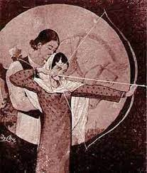

ਮਿਰਜ਼ੇ ਤੇ ਸਾਹਿਬਾਂ ਦੇ ਇਸ਼ਕ਼ ਦਾ ਕਿ਼ੱਸਾ ਸਦੀਆਂ ਤੋਂ ਪੰਜਾਬੀ ਰਹਿਤਲ ਦਾ ਹਿੱਸਾ ਹੈ। ਪੰਜਾਬੀ ਵਿਰਾਸਤ ਲਿਖਤ ਦੇ ਨਾਲ਼-ਨਾਲ਼ ਮੂੰਹ-ਜ਼ਬਾਨੀ ਵੀ ਨਵੀਆਂ ਪੀੜ੍ਹੀਆਂ ਤਕ ਪਹੁੰਚੀ ਹੈ। ਲਿਖਤ ਦਾ ਕੰਮ ਸਾਂਭਣਾ ਤੇ ਸਹੇਜਣਾ ਹੁੰਦਾ ਹੈ, ਤਾਂ ਕਿ ਸਨਦ ਰਹੇ। ਪਰ ਮੂੰਹ-ਜ਼ਬਾਨੀ ਕਹਿਣ ਵਾਲ਼ੇ ਮਾਹੌਲ, ਵਕ਼ਤ, ਸਰੋਤਿਆਂ ਮੁਤਾਬਿਕ਼ ਕਹਾਣੀ ਫੈਲਾ ਕੇ ਕਹਿੰਦੇ ਹਨ। ਇਸ ਕਿ਼ੱਸੇ ਨੂੰ ਅਣਗਿਣਤ ਗਾਉਣ ਵਾਲ਼ਿਆਂ ਨੇ ਅੱਡੋ-ਅੱਡ ਤਰੀਕਿਆਂ ਨਾਲ਼ ਗਾਇਆ ਹੋਵੇਗਾ। ਕਿ਼ੱਸਾ ਮਿਰਜ਼ਾ ਸਾਹਿਬਾਂ ਸਭ ਤੋਂ ਪਹਿਲਾਂ ਪੀਲੂ ਨੇ ਸਤਾਰਵੀਂ ਸਦੀ ਦੇ ਪਹਿਲੇ ਅੱਧ ਚ ਲਿਖਤ ਚ ਬੰਨ੍ਹਿਆ। ਪਰ ਸਾਰੇ ਦਾ ਸਾਰਾ ਕਿ਼ੱਸਾ ਹਾਲੇ ਤਕ ਸਾਡੇ ਕੋਲ਼ ਨਹੀਂ ਪਹੁੰਚਿਆ। ਅਠਾਰਵੀਂ ਸਦੀ ਚ ਹਾਫ਼ਿਜ਼ ਬਰਖ਼ੁਰਦਾਰ ਨੇ ਇਹ ਕਿੱਸਾ ਵਸੀਹ ਕਰ ਕੇ ਲਿਖਿਆ।

ਪੀਲੂ ਤੇ ਹਾਫ਼ਿਜ਼ ਬਰਖ਼ੁਰਦਾਰ ਦੋਹਵਾਂ ਦਾ ਕਿ਼ੱਸਾ ਮੁਖ਼ਤਸਰ ਇਹ ਹੈ: ਮਿਰਜ਼ਾ ਸਾਂਦਲਬਾਰ ਦੇ ਖਰਲ ਕਬੀਲੇ ਦੇ ਜੱਟ ਵੰਝਲ ਦਾ ਪੁੱਤਰ ਸੀ। ਨਿੱਕੀ ਉਮਰੇ ਸਿਆਲ ਕ਼ਬੀਲੇ ਦੇ ਖੀਵੇ ਖ਼ਾਨ ਜਿਹੜਾ ਉਹਦਾ ਮਾਮਾ ਵੀ ਸੀ ਦੇ ਪਿੰਡ ਰਹਿ ਕੇ ਮਸੀਤੇ ਪੜ੍ਹਨ ਜਾਂਦਾ ਹੈ। ਓਥੇ ਉਸਨੂੰ ਅਪਣੀ ਹਾਨਣ ਤੇ ਮਾਮੇ ਦੀ ਬੇਟੀ ਸਾਹਿਬਾਂ ਨਾਲ਼ ਇਸ਼ਕ਼ ਹੋ ਜਾਂਦਾ ਹੈ। ਦੋਨੇਂ ਇਕ ਦੂਜੇ ਨਾਲ਼ ਨਿਕਾਹ ਕਰਵਾਉਣਾ ਚਾਹੁੰਦੇ ਨੇ। ਪਰ ਸਾਹਿਬਾਂ ਪਹਿਲਾਂ ਮਾਪਿਆਂ ਦੀ ਚੰਦੜ ਕਬੀਲੇ ਦੇ ਮੁੰਡੇ ਨਾਲ਼ ਮੰਗੀ ਹੋਈ ਸੀ। ਜਿਸ ਦਿਨ ਚੰਦੜਾਂ ਦੀ ਬਰਾਤ ਢੁੱਕੀ ਹੁੰਦੀ ਹੈ, ਤਾਂ ਮਿਰਜ਼ਾ ਅਪਣੀ ਬੱਕੀ ’ਤੇ ਅਸਵਾਰ ਹੋ ਕੇ ਸਾਹਿਬਾਂ ਨੂੰ ਉਧਾਲ਼ ਕੇ ਲੈ ਜਾਂਦਾ ਹੈ; ਅਪਣੇ ਪਿੰਡ ਦਾਨਾਬਾਦ ਪਹੁੰਚਣ ਤੋਂ ਪਹਿਲਾਂ ਉਹ ਜੰਡ ਥੱਲੇ ਆਰਾਮ ਕਰਨ ਵਾਸਤੇ ਰੁਕਦਾ ਹੈ। ਜਿੱਥੇ ਸਾਹਿਬਾਂ ਅਪਣੇ ਭਾਈਆਂ ਨਾਲ਼ ਲੜਾਈ ਦੇ ਡਰੋਂ ਮਿਰਜ਼ੇ ਦੇ ਤੀਰ ਤੋੜ ਦਿੰਦੀ ਹੈ। ਚੰਦੜ ਤੇ ਸਿਆਲ ਓਸ ਜੰਡ ਥੱਲੇ ਪਹੁੰਚ ਕੇ ਉਨ੍ਹਾਂ ਨੂੰ ਮਾਰ ਮੁਕਾਉਂਦੇ ਨੇ।

ਇਸ ਕਿ਼ੱਸੇ ਵਿਚ ਮਿਰਜ਼ੇ ਦੇ ਗ਼ਰੂਰ ਨੂੰ ਤੇ ਸਾਹਿਬਾਂ ਦੇ ਧੋਖੇ ਨੂੰ ਦੋਨਾਂ ਦੀ ਮੌਤ ਦਾ ਜ਼ਿੰਮੇਵਾਰ ਦੱਸਿਆ ਗਿਆ ਹੈ। ਕਿ਼ੱਸੇ ਦੇ ਮੁੱਖ ਕਿਰਦਾਰ ਦੋ ਮੁਸਲਮਾਨ ਪਰਿਵਾਰਾਂ ਚੋਂ ਨੇ। ਇਸ ਵਿਚ ਵਾਰ-ਵਾਰ ਸੂਫੀ ਤੇ ਸ਼ੀਆ ਇਸਲਾਮ ਦੇ ਹਵਾਲੇ ਮਿਲ਼ਦੇ ਨੇ। ਪੀਲੂ ਦੇ ਤੇ ਹਾਫ਼ਿਜ਼ ਬਰਖ਼ੁਰਦਾਰ ਦੇ ਲਿਖੇ ਕਿ਼ੱਸੇ ਵਿਚ ਸਾਹਿਬਾਂ ਜੰਡ ਹੇਠ ਖੜੇ੍ਹ ਮਿਰਜ਼ੇ ਨੂੰ ਅਰਜ਼ ਕਰਦੀ ਹੋਈ ਕਰਬਲਾ ਵਿਚ ਹਸਨ ਹੁਸੈਨ ਦੀ ਸ਼ਹੀਦੀ ਦੀ ਯਾਦ ਦਵਾਉਂਦੀ ਹੈ:

ਅੱਗੋਂ ਸਾਹਿਬਾਂ ਬੋਲਦੀ: ਮਿਰਜ਼ਿਆ! ਮੰਨ ਮੇਰੀ ਅਰਜ਼ਾ।  
ਹੋਣੀ ਵਰਤੀ ਪੈਗ਼ੰਬਰਾਂ, ਹੋਣੀ ਮਿਰਜ਼ੇ ਤੇ ਗਈ ਆ।  
ਬੇਟੇ ਸ਼ਾਹ ਅਲੀ ਦੇ, ਹਸਨ ਹੁਸੈਨ ਭਰਾ।  
ਲੜਦੇ ਨਾਲ ਯਜੀਦੀਆਂ, ਦਿੱਤੇ ਪੂਰ ਖਪਾ ।  
ਦਰ ਵਿਚ ਰੋਂਦੀ ਬੀਬੀ ਫ਼ਾਤਿਮਾ, ਮੁੜ ਕੇ ਨਾ ਆਏ ਮੇਰੇ ਪਾਹ।  
ਮਿਰਜ਼ਿਆ ਐਡ ਪੈਗ਼ੰਬਰ ਮਰ ਗਏ, ਤੂੰ ਕੀਹਦਾ ਪਾਣੀਹਾਰ।  
ਇਕ ਅਰਜ਼ ਮੇਰੀ ਮੰਨ ਲੈ, ਮੈਨੂੰ ਸਾਹਿਬਾਂ, ਲੈ ਚੱਲ ਨਾਲ਼।  

(ਪੀਲੂ)  

 ਕਲਾਮ ਸਾਹਿਬਾਂ

 ਮਿਰਜ਼ੇ ਨੂੰ ਨਾ ਮਾਰਿਉ ਪਗੜ ਲੋ ਤੁਸੀਂ ਮੇਰੀ ਬਾਂਹ।  
ਮੈਂ ਹੱਕ ਪਛਾਤਾ ਅਪਣਾ ਤੁਹਾਡਾ ਕੀਤਾ ਕੀ ਗਨਾਹ।  
ਕਚਹਿਰੀ ਝਗੜਾਂ ਪਾਕ ਰਸੂਲ ਦੀ ਮੇਰਾ ਕਾਦਰ ਕਰੇ ਨਿਆਂ।  
ਲੈ ਚੱਲ ਦਾਨਾਬਾਦ ਨੂੰ ਹਾਫ਼ਜ਼ਾ ਤੇਰਾ ਦੋਹੀਂ ਜਹਾਨੀਂ ਨਾਂ।  

 ਕਲਾਮ ਮਿਰਜ਼ਾ

 ਮਿਰਜ਼ਾ ਆਖਦਾ ਬੇਟੇ ਸ਼ਾਹ ਅਲੀ ਦੇ ਹਸਨ ਹੁਸੈਨ ਭਰਾ।  
ਉਹ ਲੜਦੇ ਨਾਲ਼ ਯਜੀਦੀਆਂ ਵਿੱਤ ਕਰ ਦੇ ਜੰਗ ਭਲਾ।  
ਚੁੱਪ ਕਰ ਗਈਆਂ ਬੀਬੀਆਂ ਹਸਨ ਹੁਸੈਨ ਕਿਹਾ।  
ਮਨੀ ਰਜ਼ਾ ਪੈਗ਼ੰਬਰੋਂ ਹਾਫ਼ਜ਼ਾ ਤੋਂ ਵੀ ਮਨ ਰਜ਼ਾ।  
ਸੌ ਸ਼ਹੀਦਾਂ ਨੂੰ ਕਰਬਲਾ ਤਿਉਂ ਖੀਵਾ ਸਾਡੇ ਭਾ।  

 (ਹਾਫ਼ਿਜ਼ ਬਰਖ਼ੁਰਦਾਰ)  

{}ਸੋਭਾ ਸਿੰਘ ਦੀ ਸੰਨ 1960 ਦੇ ਨੇੜੇ ਬਣਾਈ ਮਿਰਜ਼ਾ ਸਾਹਿਬਾਂ ਦੀ ਤਸਵੀਰ{}

ਪਰ ਇਹੋ ਕਿ਼ੱਸਾ ਜਦੋਂ ਸਾਂਦਲ ਬਾਰ ਤੋਂ ਚੱਲ ਕੇ ਪੁਆਧ {}ਪੁਆਧ ਦੀ ਜੜ ਸੰਸਕ੍ਰਿਤ ਸ਼ਬਦ “ਪੂਰਵ ਅਰਧ” ਤੋਂ ਹੋ ਸਕਦੀ ਹੈ, ਜਿਸ ਦਾ ਅਰਥ ਹੈ 'ਚੜ੍ਹਦੇ ਵਾਲੇ ਪਾਸੇ ਦਾ ਅੱਧਾ ਹਿੱਸਾ' ਮਤਲਬ ਪੰਜਾਬ ਦਾ ਅੱਧ। ਪੁਆਧ ਖਿੱਤੇ ਵਿਚ ਜ਼ਿਲ੍ਹਾ ਰੋਪੜ, ਮੁਹਾਲੀ, ਪਟਿਆਲੇ ਦਾ ਪੂਰਬੀ(ਮਸ਼ਰਕੀ) ਹਿੱਸਾ, ਮਲੇਰਕੋਟਲਾ, ਸਤਲੁਜ ਦੇ ਨਾਲ ਲੱਗਦੀ ਲੁਧਿਆਣੇ ਜ਼ਿਲ੍ਹੇ ਦੀ ਗੁੱਠ, ਅੰਬਾਲੇ ਦਾ ਥਾਣਾ ਸਦਰ ਵਾਲਾ ਪਾਸਾ ਅਤੇ ਜ਼ਿਲ੍ਹਾ ਜੀਂਦ ਦੇ ਕੁਝ ਪਿੰਡ ਆਉਂਦੇ ਨੇ। {} ਪਹੁੰਚਦਾ ਹੈ, ਤਾਂ ਇਸ ਇਲਾਕੇ ਦਾ ਅਸਰ ਕਬੂਲ ਕਰਦਾ ਹੈ। ਪੁਆਧ ਦੀ ਧਰਤੀ ਵਿਚ ਰਾਮਾਇਣ ਮਹਾਂਭਾਰਤ ਦੀਆਂ ਸਾਖੀਆਂ, ਖ਼ਾਲਸੇ ਦੀ ਸਿਰਜਣਾ ਤੇ ਹੜੱਪਾ ਸੱਭਿਅਤਾ ਦਾ ਰੰਗ ਹੈ[^id-gaur]।  ਇਸ ਧਰਤੀ ’ਤੇ ਗਾਏ ਜਾਂਦੇ ਮਿਰਜ਼ਾ ਸਾਹਿਬਾਂ ਦੇ ਕਿ਼ੱਸੇ ਵਿਚ ਇਹ ਰੰਗ ਉਘੜ ਕੇ ਆਉਂਦਾ ਹੈ। ਕਵੀਸ਼ਰ ਆਸਾ ਰਾਮ ਬੈਦਵਾਨ ਦੀ ਚਲਾਈ ਪੁਆਧੀ ਅਖਾੜਾ ਪਰੰਪਰਾ ਵਾਲ਼ੀਆਂ ਸਾਖੀਆਂ ਤੇ ਪੰਜਾਬ ਦੇ ਪ੍ਰਚਲਤ ਪ੍ਰੀਤ ਕਿ਼ੱਸੇ ਰਚ-ਮਿਚ ਗਏ ਨੇ। ਰੋਪੜ/ਮੋਹਾਲੀ ਇਲਾਕੇ ਦੇ ਪਿੰਡ ਮਾਣਕਪੁਰ ਸ਼ਰੀਫ਼ ਦੇ ਕਵੀਸ਼ਰ ਪਾਲੇ ਦੇ ਗਾਏ ਕਿੱਸੇ ਵਿਚ ਕ੍ਰਿਸ਼ਣ ਭਗਵਾਨ, ਸ਼ਿਵ ਜੀ, ਨਾਰਦ, ਹਨੂੰਮਾਨ ਤੇ ਰਾਮ ਰਾਵਣ ਦੀ ਲੜਾਈ ਦਾ ਪ੍ਰਸੰਗ ਵੀ ਸ਼ਾਮਿਲ ਹੈ। ਇਸ ਕਿੱਸੇ ਵਿਚ ਸਾਹਿਬਾਂ, ਸ਼ਹੀਦ ਹਸਨ ਅਤੇ ਹੁਸੈਨ ਦੀ ਥਾਂ ਭਗਵਾਨ ਕ੍ਰਿਸ਼ਣ ਦੀ ਨਾਗ ਲੀਲਾ ਸੁਣਾ ਕੇ ਮਿਰਜ਼ੇ ਨੂੰ ਅਰਜ਼ ਗੁਜ਼ਾਰਦੀ ਹੈ। ਅਗਲੇ ਪੰਨਿਆਂ ’ਤੇ ਪਾਲੇ ਦੇ ਗਾਏ ਇਸ ਕਿੱਸੇ ਦੀ ਵੰਨਗੀ ਹੈ।

 ਕਵੀਸ਼ਰ:

 ਜਦੋਂ ਮਿਰਜ਼ਾ ਜੰਡ ਥੱਲੇ ਬੈਠਿਆ ਸੀ। ਬੱਕੀ ਬੰਨ੍ਹੀ ਹੋਈ ਸੀ। ਮਿਰਜ਼ਾ ਸ਼ਰਾਬੀ ਸੀ। ਸ਼ਰਾਬ ਨਾਲ਼ ਰੱਜਿਆ ਹੋਇਆ ਸੀ। ਜਦੋਂ ਮਿਰਜ਼ਾ ਜੰਡ ਥੱਲੇ ਸੌਣ ਲਗਦਾ ਹੈ, ਤਾਂ ਸਾਹਿਬਾਂ ਉਹਨੂੰ ਕਹਿੰਦੀ ਐ: ਚੱਲ ਦਾਨਾਬਾਦ ਚੱਲੀਏ।

ਮਿਰਜ਼ਾ:

ਠੰਢੀ ਜੰਡੋਰੇ ਦੀ ਛਤਰੀ  
ਠੰਢੀ ਜੰਡ ਦੀ ਛਾਂ  
ਪਲ-ਕੁ ਝਪਕਾ ਲਾਉਣ ਦੇ  
ਜੱਗ ਵਿਚ ਰਹਿ ਜਾਏ ਨਾਂ  
ਜਗਾਹ ਐ ਬਹੁਤ ਆਰਾਮ ਦੀ  
ਚਿੜੀ ਚੂਕੇ ਨਾਂ ਕਾਂ  
ਸਾਹਿਬਾਂ ਪਲ ਕੁ ਝਪਕਾ ਲਾਉਣ ਦੇ  
ਜੱਗ ਵਿਚ ਰਹਿ ਜਾਏ ਨਾਂ  

ਸਾਹਿਬਾਂ:

ਇਹ ਜਿਹੜੀਆਂ ਗੱਲਾਂ ਤੂੰ ਕਰਦਾਂ ਨਾਂ  
ਇਹ ਇਕ ਮਥੁਰਾ ਵਿਚ ਕ੍ਰਿਸ਼ਣ ਸੀ ਗੁੱਜਰਾਂ ਦਾ ਮੁੰਡਾ  
ਉਹ ਵੀ ਏਕਣ ਈ ਮਾਰਦਾ ਤਾ  
ਪਰ ਉਹਦੀ ਰੀਸ ਕੀ ਕਰ ਲੈਣੀ ਉਹ ਤਾਂ ਰੱਬ ਤਾ  

ਕਵੀਸ਼ਰ:

ਬੱਕੀ ਬੰਨ੍ਹੀ ਨਾਲ਼ ਜੰਡ ਦੇ  
ਮੂੰਹ ਨੂੰ ਘੱਤ ਲਗਾਮ  
ਏਥੇ ਲੱਗ ਲੱਗ ਗਈਆਂ ਮਹਿਫ਼ਲਾਂ  
ਬਹਿ ਬਹਿ ਗਏ ਜਵਾਨ  
ਥੋੜੇ ਮਾਰੇ ਮੌਤ ਨੇ  
ਬਹੁਤੇ ਖ਼ੁਦੀ ਗੁਮਾਨ  

ਸਾਹਿਬਾਂ:

ਵਿਚ ਮਥੁਰਾ ਦੇ ਪਲ਼ ਗਿਆ  
ਗੋਕੁਲ ਵਾਲ਼ਾ ਕਾਹਨ  

ਓਥੇ ਬੋਲੀਆਂ ਬੱਚੇ ਨੂੰ ਮਾਰਦੀ  
ਨੇਤਾ ਨਾਗਾਂ ਦਾ ਲੱਗੀ ਮੰਗਾਣ  
ਮੁੰਡੇ ਖੁੱਦੋ ਖੂੰਡੀ ਖੇਡਦੇ  
ਯਮਨਾ ਦੇ ਉੱਤੇ ਆਣ   
ਹੋ ਟੱਲਾ ਗੇਂਦ ਨੂੰ ਮਾਰਿਆ  
ਸੱਤਵੇਂ ਗਈ ਤਲਾਬ  
ਗੇਂਦ ਲੈਣ ਨੂੰ ਤੁਰ ਪਿਆ  
ਆਪ ਕ੍ਰਿਸ਼ਨ ਭਗਵਾਨ  
ਗੋਤਾ ਮਾਰਿਆ ਕਾਹਨ ਨੇ  
ਸੱਤਵੇਂ ਗਿਆ ਤਲਾਬ  
ਬੈਠੀ ਨਾਗ ਦੀ ਨਾਗਣੀ  
ਵੇਖ ਕੇ ਹੋਈ ਹੈਰਾਨ  
ਓ ਇਥੇ ਆ ਗਿਆ ਲੜਕਿਆ  
ਕੀ ਤੁਸਾਂ ਨੂੰ ਕਾਮ  
ਨੈਂਦਾ ਲੈਣਾ ਤੇਰੇ ਨਾਗ ਦਾ   
ਹੋ ਹੁੰਦੇ ਦੁੱਧ ਵਿਰਾਨ   
ਤਲੀਆਂ ਝੱਸ ਜਗਾ ਲਿਆ  
ਉਹ ਤਾਂ ਭਾਰੀ ਬਲੀ ਜਵਾਨ  
ਇਕ ਲੜਕਾ ਆਇਆ ਲੜਨ ਨੂੰ  
ਚੱਕਦਾ ਕਈ ਸਮਾਨ  

ਮਾਰਿਆ ਫਰਾਟਾ ਨਾਗ ਨੇ  
ਕਰਤੀ ਸੁਬ੍ਹਾ ਤੇ ਸ਼ਾਮ  
ਓਹਲੇ ਹੋ ਕੇ ਬਚ ਗਿਆ  
ਆਪ ਸ਼੍ਰੀ ਭਗਵਾਨ  
ਮਾਰਿਆ ਫਰਾਟਾ ਨਾਗ ਨੇ  
ਰੰਗ ਕਰਤਾ ਕਾਲਾ ਸ਼ਿਆਮ  
ਕਾਲੀ ਨਾਗ ਨੂੰ ਕੀਲ ਕੇ  
ਗੋਕਲ ਵੜਿਆ ਆਣ  

ਜੱਟਾ ਰੀਸਾਂ ਕਰਦਾਂ ਓਹਦੀਆਂ  
ਉਹ ਤਾਂ ਭਾਰੀ ਬਲੀ ਜਵਾਨ  
ਆਪ ਸ਼੍ਰੀ ਭਗਵਾਨ  

ਉਹ ਤਾਂ ਰੱਬ ਸੀ ਗਾ। ਉਹਦੀਆਂ ਰੀਸਾਂ ਕੀ ਕਰ ਲੈਣੀਆਂ।  

ਮਿਰਜ਼ਾ:  

ਰੱਬ ਰੱਬ ਕਰੀ ਜਾਨੀਂ ਐਂ! ਕਿਹੜਾ ਰੱਬ ਸੀ ਉਹੋ? ਜਨਾਨੀਆਂ ਦੇ ਕੱਪੜੇ ਚੱਕ ਕੇ ਲੈ ਜਾਂਦਾ ਸੀ। ਗੁੱਜਰਾਂ ਦਾ ਮੁੰਡਾ ਚਾਮ੍ਹਲਿਆ ਵਿਆ ਤੀ। ਆਹੀ ਕਰਤੂਤਾਂ ਕੀਤੀਆਂ ਉਹਦੀਆਂ ਹੋਰ ਕਿਹੜੀ ਕੰਧ ਢਾਈ ਤੀ ਓਹਨੇ?

ਕਵੀਸ਼ਰ:  

ਮਿਰਜ਼ਾ ਸ਼ਰਾਬ ਨਾਲ਼ ਰੱਜਿਆ ਵਿਆ ਤੀ। ਕਹਿੰਦਾ: ਸਾਹਿਬਾਂ, ਫੱਟੇ ਚੱਕ ਦਿਊਂ ਫੱਟੇ। ਜੱਟੀਏ ਮਾਂ ਨੇ ਪੁੱਤ ਪੈਦਾ ਨੀ ਕੀਤਾ। ਜੱਟ ਦੇ ਮੂਹਰੇ ਖੜਜੇ ਕੋਈ। ਜਦ ਮਿਰਜ਼ੇ ਦੀਆਂ ਵੱਡੀਆਂ-ਵੱਡੀਆਂ ਗੱਲਾਂ, ਫੜ੍ਹਾਂ ਸੁਣੀਆਂ ਸਾਹਿਬਾਂ ਦੇ ਮਨ ਵਿਚ ਸ਼ੱਕ ਪੈਦਾ ਹੋ ਗਿਆ। ਉਹ ਮਿਰਜ਼ੇ ਦਾ ਇਮਤਿਹਾਨ ਲੈਂਦੀ ਹੈ।

ਸਾਹਿਬਾਂ:  

ਅੰਬੋਂ ਤੋਤਾ ਉੱਡ ਗਿਆ  
ਬੈਠਾ ਜੰਡ ’ਤੇ ਆਣ  
ਅੰਬੀ ਤੋਤੇ ਦੇ ਮੁੱਖ ਚ  
ਲਿਆਇਆ ਖ਼ਾਤਰ ਖਾਣ  
ਜੱਟਾ ਅੰਬੀ ਤੋਤੇ ਤੋਂ ਛੁੱਟ ਜੇ  
ਬਚ ਜੇ ਤੋਤੇ ਦੀ ਜਾਨ  

ਕਵੀਸ਼ਰ:

ਜੱਟ ਉਭੜਵਾਇਆ ਉੱਠਿਆ  
ਧੂਹ ਲਏ ਤੀਰ ਕਮਾਨ  
ਮਾਰਦਾ ਨੁਕਰਾਂ ਜੋੜ ਕੇ  
ਮੁੜਕੇ ਚੜੇ੍ਹ ਅਸਮਾਨ  
ਭਾਈਓ ਅੰਬੀ ਤੋਤੇ ਤੋਂ ਛੁੱਟ ਗਈ  
ਬਚ ਗਈ ਤੋਤੇ ਦੀ ਜਾਨ  

ਸਬਰ ਕਦਮ ਦਾ ਫ਼ੈਸਲਾ  
ਤੀਰ ਡਿਗ ਪਿਆ ਵਿਚ ਮੈਦਾਨ   

ਸਾਹਿਬਾਂ ਦੇਖ ਨਿਸ਼ਾਨਾ ਜੱਟ ਦਾ  
ਡੁੱਲ੍ਹ ਗਿਆ ਧਰਮ ਈਮਾਨ  
ਇਕ ਇਕ ਮਾਰੂ ਪਛਾਣ ਕੇ  
ਭੱਜਿਆਂ ਨ੍ਹੀਂ ਦੇਣਾ ਜਾਣ

ਕਵੀਸ਼ਰ:

ਸਾਹਿਬਾਂ ਨੇ ਨਹੀਂ ਤੋੜੇ ਸੀ ਤੀਰ। ਸਾਹਿਬਾਂ ਦੇ ਤਿੰਨ ਭਾਈ ਫੱਤੂ ਕਾਜ਼ੀ ਨਾਲ਼ ਕੁਰਾਨ ਲੈ ਕੇ ਆਏ ਕਿ ਅਸੀਂ ਤੇਰਾ ਨਿਕਾਹ ਪੜ੍ਹਾਵਾਂਗੇ। ਤੂੰ ਸਾਨੂੰ ਇਹਦੇ ਤੀਰ ਦੇ ਦੇ, ਇਹਨੇ ਸ਼ਰਾਬ ਪੀਤੀ ਵੀ ਹੈ, ਸ਼ਰਾਬੀ ਬੰਦੇ ਦਾ ਪਤਾ ਨ੍ਹੀਂ ਹੁੰਦਾ। ਅਸੀਂ ਨਿਕਾਹ ਪੜ੍ਹਾਉਣ ਲੱਗ ਜੀਏ ਇਹ ਤੀਰ ਮਾਰ ਮਾਰ ਸਾਨੂੰ ਮਾਰ ਦੇ। 

ਕਵੀਸ਼ਰ:

ਓਹਨੇ ਜੰਡ ’ਤੋਂ ਲਾਹ ਕੇ ਕਾਨੀਆਂ  
ਦੇਈਆਂ ਭਾਈ ਦੇ ਹੱਥ ਫੜਾ  
ਤੋੜਨ ਲੱਗ ਗਏ ਕਾਨੀਆਂ   
ਦਿੱਤੀਆਂ ਮਿੱਟੀ ਵਿਚ ਮਿਲ਼ਾ  

ਫੇਰ ਸ਼ਮੀਰਾ ਬੋਲਿਆ:
ਸਾਹਿਬਾਂ ਆਪਣਾ ਯਾਰ ਜਗਾ

ਸਾਹਿਬਾਂ:
ਵੀਰਾ ਕਸਮਾਂ ਕੁਰਾਨ-ਏ-ਪਾਕ ਦੀਆਂ ਖਾ ਕੇ ਧੋਖਾ?

ਕਵੀਸ਼ਰ:
ਸ਼ਮੀਰ ਨੇ ਕੁਰਾਨ-ਏ-ਪਾਕ ਦੀ ਥਾਂ ਤੇ ਅੱਕਾਂ ਦੇ ਪੱਤੇ ਖਿੰਡਾ ਦਿੱਤੇ। ਕਹਿੰਦਾ ਤੂੰ ਨਹੀਂ ਧੋਖਾ ਕਰਿਆ?

ਸ਼ਮੀਰ:
ਉੱਠ ਓਏ ਮਿਰਜ਼ਿਆ। ਭੱਜ ਲੈ ਜਿਧਰ ਨੂੰ ਭੱਜਣਾ, ਸੱਦ ਲੈ ਜੀਹਨੂੰ ਸੱਦਣਾ! 

ਮਿਰਜ਼ਾ:
ਸਾਹਿਬਾਂ, ਤੂੰ ਇਹ ਕੀ ਕੀਤਾ?

ਸਾਹਿਬਾਂ:
ਮੈਂ ਨੀ ਕੀਤਾ  
ਪੁੱਤ ਮਰ ਗਏ ਵੀਰ ਸ਼ਮੀਰ ਦੇ   
ਇਹਨਾਂ ਦਾ ਬੇੜਾ ਗ਼ਰਕ ਹੋ ਜਾਏ
ਝੰਗ ਨੂੰ ਅੱਗ ਲੱਗ ਜਾਏ  

ਝੂਠੀਆਂ ਕਸਮਾਂ ਖਾ ਕੇ ਕੁਰਾਨ-ਏ-ਪਾਕ ਦੀਆਂ  
ਨਿਕਾਹ ਦਾ ਲਾਰਾ ਲਾ ਕੇ  
ਆਹ ਕੀਤਾ ਇਹਨਾਂ ਨੇ  

ਮੈਂ ਭਾਈ ਸਕੇ ਸਮਝ ਕੇ ਮਾਂ ਜਾਏ
ਇਹਨਾਂ ਤੇ ਇਤਬਾਰ ਕਰ ਬੈਠੀ

ਮਿਰਜ਼ਾ:

ਕੋਈ ਨਾ ਠਹਿਰ ਜਾ ਫਿਰ  
ਸ਼ਮੀਰਿਆ, ਇਥੇ ਮੈਦਾਨ ਵਿਚ ਜਾਂ ਮਾਰਦੂੰ ਗਾ ਜਾਂ ਮਾਰ ਜਾਊਂਗਾ  
ਲੜੂੰਗਾ, ਮੇਰੇ ਕੋਲੇ ਹਥਿਆਰ ਨਹੀਂ ਹੈ  
ਇੱਕ ਘੰਟਾ ਦੇ ਮੈਨੂੰ ਹਥਿਆਰਾਂ ਦਾ ਇੰਤਜ਼ਾਮ ਕਰ ਲੈਣ ਦੇ  

ਸ਼ਮੀਰ:

ਇਕ ਘੰਟਾ ਨੀਂ ਤੈਨੂੰ ਦੋ ਦਿੰਨਾ, ਕਰ ਲੈ ਜੋ ਕਰਨਾ  
ਫੇਰ ਨਾਂ ਕਹੀਂ ਮੈਨੂੰ ਮਾਰਿਆ ਚਾਣਚੱਕ  
ਜੋ ਬਣ ਦਾ ਬਣਾ ਲੈ  

ਮਿਰਜ਼ਾ:

ਚੀਰਾ ਉਤਾਰ ਕੇ ਗੁਜਰਾਤ ਦਾ  
ਦਿੱਤਾ ਘੋੜੀ ਦੇ ਪੈਰੀਂ ਪਾ  
ਸ਼ਰਮਾਂ ਰੱਖ ਲੈ ਮੇਰੀਆਂ  
ਮੈਨੂੰ ਲੈ ਬਚਾ  

ਕਵੀਸ਼ਰ:

ਬੱਕੀ ਦੀ ਭੈਣ ਸੀ ਕੱਕੀ, ਓਹਨੇ ਅਪਣੀ ਭੈਣ ਕੱਕੀ ਨੂੰ ਯਾਦ ਕੀਤਾ, ਲੱਖ ਦਾਤੇ ਪੀਰ ਕੋਲੇ ਐ ਕੱਕੀ

ਬੱਕੀ ਕੱਕੀ ਰਲ਼ ਕੇ  
ਕਰਦੀਆਂ ਨੇਕ ਸਲਾਹ  
ਕੀਤੀ ਐ ਬੇਨਤੀ ਰੱਬ ਦੀ  
ਕਰਦੀਆਂ ਯਾਦ ਖ਼ੁਦਾ  

ਧਰਤੀ ਮਾਤਾ ਨੂੰ ਮੰਨਿਆ  
ਧਰਤੀ ਮਾਤਾ ਪਹੁੰਚ ਗਈ  
ਧੌਲੇ ਬੈਲ ’ਪਰ ਕਾਠੀ ਪਾ  
ਲੱਖਦਾਤੇ ਨੂੰ ਮੰਨਿਆ  
ਗਿਆ ਕੋਲ਼ ਬੱਕੀ ਦੇ ਆ  

ਖ਼ਵਾਜੇ ਪੀਰ ਨੂੰ ਮੰਨਿਆ  
ਤੂੰ ਨਦੀਆਂ ਦਾ ਬਾਦਸ਼ਾਹ  
ਨੈਣਾਂ ਦੇਵੀ ਨੂੰ ਮੰਨਿਆਂ  
ਆ ਗਈ ਪਹਾੜੋਂ ਧਾ  
ਪੀਰ ਫੱਤੇ ਨੂੰ ਮੰਨਿਆ  
ਗਿਆ ਕੋਲ਼ ਬੱਕੀ ਦੇ ਆ  
ਅਕਾਸ਼ ਤੋਂ ਉੱਤਰ ਆਏ ਫ਼ਰਿਸ਼ਤੇ  
ਮੱਕੇ ’ਤੇ ਆਇਆ ਹਜ਼ਰਤ ਸ਼ਾਹ  
’ਕੱਠੇ ਹੋ ਕੇ ਪੀਰਾਂ ਨੇ  
ਜੰਡ ਦੇ ਥੱਲੇ ਦਿੱਤੀ ‘ਕੌਂਸਲ’ ਲਾ  
ਨਾਰਦ ਮੁਨੀ ਨੂੰ ਸੱਦ ਕੇ  
ਲੈਂਦੇ ਕੋਲ਼ ਬੁਲਾ  
ਪੀਰ ਕਹਿੰਦੇ ਓ ਨਾਰਦਾ  
ਜਾਈਂ ਵਿਚ ਦਰਗਾਹ  
ਨਾਰਦ ਭਾਉਂਦਾ ਭਉਂ ਗਿਆ  
ਹੋਣੀ ਜਾਂਦੀ ਇੱਕੋ ਦਾਹ  
ਨਾਰਦ ਕਹਿੰਦਾ ਹੋਣੀਏ  
ਲਾ ਲਈਂ ਅਪਣੀ ਵਾਹ  

ਓਥੋਂ ਨਾਰਦ ਤੁਰਿਆ  
ਪਹੁੰਚ ਗਿਆ ਵਿਚ ਦਰਗਾਹ  
ਅੱਗੇ ਗੱਲ ਮਾਲੂਮ ਨ੍ਹੀਂ  
ਨਾਰਦ ਨੇ ਦੇਈ ਸੁਣਾ  
ਪੁੱਛਿਆ ਅੱਲ੍ਹਾ ਪਾਕ ਨੂੰ
ਮੁੱਕਦੀ ਕਹੇ ਸੁਣਾ  
ਕਿੰਨੀ ਜੱਟ ਦੀ ਜ਼ਿੰਦਗੀ  
ਕੈ ਨਖਰੇ ਕੈ ਸਾਹ  
ਆਖਿਆ ਅੱਲ੍ਹਾ ਪਾਕ ਨੇ  
ਉਹ ਦਫ਼ਤਰ ਵਿਚ ਖ਼ੁਦ ਈ ਦੇਖ ਲੈ ਜਾਹ  

ਨਾਰਦ:

ਮਹਾਰਾਜ ਮੇਰੇ ਕੋਲ਼ੇ ਇਨ੍ਹਾਂ ਸਮਾਂ ਨਹੀਂ ਹੈ। ਕੰਮ ਤਾਂ ਖਰਾਬ ਐ ਪਿੱਛੇ ਘੇਰਾ ਪੈ ਗਿਆ, ਮਿਰਜ਼ਾ ਕੱਲਾ ਐ, ਬਿਨਾ ਹਥਿਆਰ ਦੇ। ਕਿਤੇ ਭਾਣਾ ਨਾ ਵਰਤ ਜਾਏ। ਮਹਾਰਾਜ ਪਿੱਛੇ ਜਾਣਾ ਛੇਤੀ ਮੇਰੀ ਮਦਦ ਕਰੋ।

ਕਵੀਸ਼ਰ:

ਸੋਲ਼ਾਂ ਮਿਲ਼ ਗਈਆਂ ਕਾਨੀਆਂ  
ਮੁੜ ਕੇ ਆ ਗਿਆ ਓਸੇ ਰਾਹ  
ਹੇਠਾਂ ਆਇਆ ਜੰਡ ਦੇ  
ਮਿਰਜ਼ਾ ਲਿਆ ਕੋਲ਼ ਬੁਲਾ  
ਓ ਇਹ ਚੱਕ ਓ ਕਾਨੀਆਂ  
ਤੈਨੂੰ ਤੀਰਾਂ ਦੀ ਕੀ ਪਰਵਾਹ  
ਸੌਂਈਂ ਨਾ ਰਹੀਂ ਜਾਗਦਾ   
ਰੰਨ ਦਾ ਨਾ ਕਰੀਂ ਵਸਾਹ  
ਚਾੜ੍ਹੀ ਫਿਰਦੈ ਬੱਕੀ ਦੀ ਬੇਲ ’ਤੇ  
ਇਹ ਤੇਰੇ ਲਹੂ ਦੀ ਤਿਆਹ  

ਨਾਰਦ:

ਹੋ ਖੜਾ ਫਿਰ, ਜੁਆਨਾਂ ਦਬ ਨਾ ਜਾਈਂ, ਪੀਰ ਫ਼ਕੀਰ ਸਾਰੇ ਤੇਰੇ ਨਾਲ਼ ਐ। ਤੇਰਾ ਕੋਈ ਵੱਲ ਵਿੰਙਾ ਨਹੀਂ ਕਰ ਸਕਦਾ।
ਛੱਡ ਇਕ ਤੀਰ ਫੋਕਾ ਮਾਰ।

ਕਵੀਸ਼ਰ:

ਚੜ੍ਹਾ ਕੇ ਤੀਰ ਕਮਾਣ ਦੇ ਜਦ ਛੱਡਿਆ ਮਿਰਜ਼ੇ ਜੱਟ ਨੇ। ਸ਼ਮੀਰ ਦੇ ਕਟਕ ’ਪਰ ਗੂੰਜਾਂ ਪਾਉਂਦਾ ਫਿਰੇ। ਸਾਰੇ ਡਰ ਕੇ ਭੱਜ ਗਏ, ਭਾਜੜਾਂ ਪੈ ਗਈਆਂ। ਤੀਰ ਕਿੱਥੋਂ ਆ ਗਏ। ਹਥਿਆਰ ਕਿੱਥੋਂ ਆ ਗਏ। ਹਥਿਆਰ ਸੱਚਖੰਡ ਦਰਗਾਹ ਤੋਂ ਆਏ ਤੀ। ਉਹ ਸੋਲਾਂ ਤੀਰ ਸੀ, ਜਿਹੜੇ ਬੰਦੇ ਦਾ ਕੰਮ ਫ਼ਤੇਹ ਕਰ ਕੇ ਆਉਂਦੇ ਸੀ।

ਭੱਜ ਗਿਆ ਕਟਕ ਤਮਾਮ।  

ਨਾਰਦ:

ਮਿਰਜ਼ਿਆ ਮੈਦਾਨ ਖ਼ਾਲੀ ਹੋ ਗਿਆ, ਕੋਹ ਵਾਟ ਐ ਦਾਨਾਬਾਦ। ਚਲਿਆ ਜਾ।

ਮਿਰਜ਼ਾ:   

ਨਾਰਦਾ ਸੂਰਮੇ ਨ੍ਹੀਂ ਭੱਜਿਆ ਕਰਦੇ। ਮਰ ਜਾਇਆ ਕਰਦੇ, ਮੈਦਾਨ ਛੱਡ ਕੇ ਨਹੀਂ ਜਾਈਦਾ। ਆਉਣ ਦੇ ਜਿਹੜਾ ਆਉਂਦੈ।

ਨਾਰਦਾ ਜਾਈਂ ਪਿਛਾੜੀ ਹਟ  
ਮੈਂ ਕੱਢੀ ਸਿਆਲਾਂ ਦੀ ਪਦਮਣੀ  
ਵੱਢ ’ਤਾ ਸਿਆਲਾਂ ਦਾ ਨੱਕ  
ਸਿਆਲ ਪਾਣੀ ਤੋਂ ਪਤਲੇ ਪੈ ਗਏ  
ਹੌਲ਼ੇ ਪੈ ਗਏ ਕੱਖ  

ਤੈਨੂੰ ਪਤੈ  

ਜਦ ਬਰਛੀ ਬ੍ਰਹਮਾਂ {}ਹਿੰਦੂ ਮਜਹਬ ਮੁਤਾਬਕ ਬ੍ਰਹਮਾ ਨੇ ਸਾਰੀ ਕਾਇਨਾਤ ਬਣਾਈ ਸੀ।{} ਨੇ ਬਖ਼ਸ਼ ’ਤੀ  
ਐਂ ਧੂਫਾਂ ਦੇ ਕੇ ਲਈ ਤੀ ਚੱਕ  
ਮਾਰੀ ’ਤੀ ਹਨੂੰਮਾਨ ਦੇ  
ਉਹ ਗਿਆ ਪਿਛਾੜੀ ਹਟ  
ਹਨੂੰਮਾਨ ਪਿਛਾੜੀ ਹਟ ਗਿਆ  
ਕਰ ਕੇ ਇੱਕੋ ਝੱਟ  
ਲੱਗ ਗਈ ਲਛਮਣ ਬੀਰ ਦੇ
ਪੈ ਗਈ ਮੂਰਛਾਗੱਤ  
ਡਿਗਦੇ ਬੀਰ ਨੂੰ ਦੇਖ ਕੇ  
ਸਾਰੀ ਸੈਨਾ ਗਈ ਤੀ ਨੱਠ [^saina]

ਚੱਕਿਆ ਰਾਮ ਚੰਦ ਬੀਰ ਨੇ  
ਲਿਆ ਪੱਟਾਂ ’ਤੇ ਰੱਖ  
ਦੇਖ ਕੇ ਧਾਹਾਂ ਮਾਰਦਾ  
ਰੋ ਰੋ ਦਿੰਦਾ ਦੱਸ  
ਜਾਇਓ ਲੰਕਾ ਸ਼ਹਿਰ ਨੂੰ  
ਕਿਤੇ ਪੈਂਦੀ ਵੈਦ ਦੀ ਦੱਸ  
ਦੇਰ ਕੀਤੀ ਨ੍ਹੀਂ ਹਨੂੰਮਾਨ ਨੇ  
ਕਰ ਗਿਆ ਲੰਕਾ ਨੂੰ ਝੱਟ  
ਵਿਚ ਲੰਕਾ ਦੇ ਵੜ ਕੇ  
ਭਾਲ਼ੀ ਵੈਦ ਦੀ ਹੱਟ  

ਸੁੱਤੇ ਵੈਦ ਸ਼ੁਕੈਨ ਦੀ  
ਮੰਜੀ ਓ ਲੈ ਗਿਆ ਚੱਕ  

ਕਿਉਂ? ਵੈਦ ਸ਼ੁਕੈਨ ਨੇ ਇਕ ਬੂਟੀ ਦੱਸਣੀ ਸੀ। ਪਹਾੜ ਦੇ ਵਿਚ ਜਗਦੀ ਐ। 360 ਦੀਵਾ ਜਿਵੇਂ ਅਸਮਾਨ ਵਿਚ ਕੂੰਜਾਂ ਉਡੀਆਂ ਜਾਂਦੀਆਂ, ਇਸ ਤਰ੍ਹਾਂ ਦੀਵੇ ਜਗਦੇ ਐ। ਹਨੂੰਮਾਨ ਲੰਕਾ ਵਿਚ ਵੜ ਗਿਆ; ਅੱਧੀ ਰਾਤ ਦਾ ਸਮਾਂ ਹੋ ਗਿਆ। ਬਜ਼ਾਰ ਬੰਦ ਹੋ ਗਿਆ, ਲੱਭਦਾ ਫਿਰਦੈ ਵਈ ਵੈਦ ਦੀ ਦੁਕਾਨ ਕਿਹੜੀ ਆ। ਦੁਕਾਨ ਬੰਦ ਹੋ ਚੁੱਕੀ ਆ। ਹੁਣ ਐਂ ਨੀ ਪਤਾ ਲੱਗਦਾ ਵਈ ਕੋਈ ਬੰਦਾ ਮਿਲੇ ਓਹਨੂੰ ਈ ਪੁੱਛ ਲਏ ਵਈ ਵੈਦ ਦਾ ਘਰ ਕਿਹੜਾ। ਉਹਦੇ ਘਰੇ ਚਲੇ ਜਾਈਏ। ਹਨੂੰਮਾਨ ਨੂੰ ਖੰਘ ਛਿੜ ਗਈ।  

ਅੰਦਰ ਤੇ ਵੈਦ ਬੋਲਿਆ ਮੁਖ’ਤੇ ਸੁਣਾ ਕੇ ਜੀ  
ਤੇਰੇ ਭਾਅ ਦਾ ਬੇਸੁਤੇ ਦਾ ਪੱਤ ਜਲ਼ ਗਿਆ  
ਰਸਾ ਚੂਸ ਲੈ ਜੀਭ ਦਬਾ ਕੇ ਜੀ  
ਹਨੂੰਮਾਨ ਕਹਿੰਦਾ: ਕੰਮ ਠੀਕ ਬਣ ਗਿਆ  
ਚੋਰ ਫਸ ਗਿਆ ਪਾੜ ਪਰ ਆ ਕੇ ਜੀ  
ਕੋਈ ਕਹਿੰਦਾ ਓਹਦੀ ਮੰਜੀ ਚੱਕੀ  
ਕੋਈ ਕਹਿੰਦਾ ਘਰੇ ਪੱਟਿਆ ਹੱਥ ਫਸਾ ਕੇ ਜੀ  
ਆਸ ਰਾਮ ਕਹਿੰਦਾ ਮੈਂ ਅੱਖਾਂ ਗੈਲ਼ ਦੇਖਿਆ ਨਹੀਂ  
ਜਿਹੜੀ ਸੁਣੀ ਮੈਂ ਦੱਸ ਦਾ ਗਿਆ ਕੇ ਜੀ  

ਸੁੱਤੇ ਵੈਦ ਸ਼ੁਕੈਨ ਦੀ  
ਮੰਜੀ ਓ ਲੈ ਗਿਆ ਚੱਕ  
ਜਿੱਥੇ ਬੈਠਾ ਰਾਮ ਚੰਦ੍ਰ ਦੇਵਤਾ  
ਓਥੇ ਈ ਦਿੱਤੀ ਰੱਖ  
ਉੱਠ ਕੇ ਵੈਦ ਸ਼ੁਕੈਨ ਨੇ  
ਬਚਨ ਬੋਲਿਆ ਸੱਚ  
ਐਡਾ ਕੋਈ ਨ੍ਹੀਂ ਦਿਖਦਾ ਸੂਰਮਾ  
ਜਿਹੜਾ ਬੂਟੀ ਲਿਆਵੇ ਪੱਟ  
ਔਹ ਬੂਟੀ ਜਗਦੀ ਵਿਚ ਪਹਾੜ ਦੇ  
ਜਗਦੀ ਲਟਾ ਲਟ  

ਕੱਲੀ ਬੂਟੀ ਨਾ ਜਲੇ  
ਜਲਦੀ ਤਿੰਨ ਸੌ ਸੱਠ  
ਦੇਰ ਕੀਤੀ ਨ੍ਹੀਂ ਹਨੂੰਮਾਨ ਨੇ  
ਕਰ ਗਿਆ ਪਹਾੜੀ ਨੂੰ ਝੱਟ  
ਉੱਤੇ ਪਹਾੜੀ ਦੇ ਚੜ੍ਹ ਗਿਆ  
ਨਿਗ੍ਹਾ ਚਾਰ ਚੁਫੇਰੇ ਰੱਖ  

ਜਾਂ ਨਿਗ੍ਹਾ ਮਾਰ ਕੇ ਦੇਖਦਾ  
ਬੂਟੀ ਜਗਦੀ ਕਈ ਲੱਖ  

ਵੈਦ ਸ਼ੁਕੈਨ ਨੇ ਤਿੰਨ ਸੌ ਸੱਠ ਦੱਸਿਐ। ਓਥੇ ਕਈ ਲੱਖ ਜਗਦੀ ਐ।
ਕਈ ਲੱਖ ਕਿਵੇਂ?  

ਰੌਣ ਨੇ ਰਾਖਸ਼ ਭੇਜ ’ਤੇ ਵਈ ਵੈਦ ਸ਼ੁਕੈਨ ਨੂੰ ਚੱਕ ਕੇ ਲੈ ਗਿਐ। ਉਹਨੇ ਸੰਜੀਵਨ ਬੂਟੀ ਦੱਸਣੀ ਐ। ਹਨੂੰਮਾਨ ਬੂਟੀ ਲੈਣ ਆਊਗਾ। ਦੀਵੇ ਈ ਦੀਵੇ ਬਾਲ ਦੋ। ਕਿਸੇ ਦੀਵੇ ਨੂੰ ਚੱਕ ਕੇ ਮੁੜ ਜੂ ਗਾ। ਨਾ ਹਨੂੰਮਾਨ ਨੂੰ ਜੜ੍ਹ ਦਾ ਪਤਾ।ਨਾ ਪੱਤੇ ਦਾ ਪਤਾ। ਉਹਨੂੰ ਬਾਂਦਰ ਨੂੰ ਕਿਹਾ ਪਤਾ ਯਾਰ ਉਹ ਤਾਂ ਬਾਂਦਰ ਐ। ਜਦ ਹਨੂੰਮਾਨ ਪਹਾੜੀ ਪਰ ਚੜ੍ਹ ਕੇ ਨਿਗ੍ਹਾ ਮਾਰ ਕੇ ਦੇਖਦੈ।  

ਬੂਟੀ ਜਗਦੀ ਕਈ ਲੱਖ  

ਫੇਰ ਹਨੂੰਮਾਨ ਨੇ ਸ਼ਿਵਜੀ ਯਾਦ ਕੀਤੇ  
ਮਹਾਰਾਜ ਦੇ ਹੁਣ 'ਪਾਵਰ'

ਹਨੂੰਮਾਨ ਨੂੰ ਵਰ ਸੀ ਸ਼ਿਵਾਂ ਦਾ  
ਲੈ ਆਇਆ ਪਹਾੜੀ ਚੱਕ  
ਜਿੱਥੇ ਬੈਠਾ ਰਾਮ ਚੰਦ੍ਰ ਦੇਵਤਾ  
ਓਥੇ ਈ ਦਿੱਤੀ ਰੱਖ  

ਉੱਠ ਕੇ ਬੈਠ ਸ਼ੁਕੈਨ ਨੇ  
ਬੂਟੀ ਲਈ ’ਤੀ ਮੁੱਢਾਂ ਤੋਂ ਪੱਟ  
ਦੇ ’ਤੀ ਲਸ਼ਮਣ ਵੀਰ ਨੂੰ  
ਜੋਧਾ ਕਰ ਕੇ ਉਠਿਆ ਝੱਟ  
ਧਰ ਲਏ ਹੱਥ ਕਮਾਣ ’ਤੇ  
ਤੀਰ ਲਏ ਲੰਕਾ ਨੂੰ ਕੱਸ  

ਖਿੱਚ ਖਿੱਚ ਮਾਰਦਾ ਕਾਨੀਆਂ  
ਦਿੱਤੀ ਨਿਉਂ ਲੰਕਾ ਦੀ ਪੱਟ  
ਵੱਡੇ ਵੱਡੇ ਮਰ ਗਏ ਸੂਰਮੇ  
ਮਾਰ ’ਤੇ ਪੰਜੇ ਤੱਤ  

ਓ ਨਾਰਦਾ ਜੇ ਮੈਂ ਕੱਲਾ ਮਿਰਜ਼ਾ ਮਰ ਗਿਆ  
ਤਾਂ ਕਿਆ ਸੁੰਨੀ ਹੋ ਜਾਊ ਸੱਥ?  

ਨਾਰਦ:  

ਮਿਰਜ਼ਿਆ, ਐਡਾ ਬੋਲ ਨਾ ਬੋਲ  
ਤੂੰ ਨ੍ਹੀਂ ਪਿਆਰਾ ਰੱਬ ਦਾ  
ਰੱਬ ਰਹਿੰਦਾ ਨ੍ਹੀਂ ਤੇਰੇ ਕੋਲ   
ਜਿਹੜੇ ਪਿਆਰੇ ਆ ਰੱਬ ਦੇ  
ਉਹਨਾਂ ਨੇ ਧਰਤੀ ਛੱਡੀ ਤੋੜ  

ਤੈਨੂੰ ਪਤੈ  
ਘਰ ਰਾਜੇ ਜਨਕ ਦੇ ਇਕ ਸੀਤਾ ਜਾਂਦੀ ਹੋ  
ਸੋਈ ਸੀਤਾ ਨੂੰ ਵਰਨਗੇ ਕਰਨਗੇ ਕਰੇ ਧਨਸ{}ਧਨਸ: ਕਮਾਣ{} ਜੇ ਦੋ  
ਦੋ ਲੜਕੇ ਰਾਜੇ ਦਸ਼ਰਥ ਦੇ  
ਹੋ ਗਈ ਖਬਰ ਰਾਮ ਨੂੰ ਹੋ  
ਸ਼੍ਰੀ ਰਾਮ ਜੀ ਉੱਠ ਕੇ ਗਿਆ ਖਲੋ  
ਕੋਲ ਧਨਸ ਦੇ ਆ ਗਿਆ  
ਸੋਚਾਂ ਸੋਚੀਆਂ ਦੋ  
ਚੱਕਿਆ ਧਨਸ ਜਵਾਨ ਨੇ  
ਟੁਕੜੇ ਕੀਤੇ ਇਕ ਤੇ ਦੋ  
ਇਕੇ ਟੁਕੜਾ ਵਿਚ ਅਸਮਾਨ ਦੇ  
ਦੂਆ ਧਰਤੀ ਮੇਂ ਦੇਆ ਗਡੋ  

ਸੀਤਾ ਵਰ ਲਈ ਰਾਮ ਨੇ  
ਸ਼ਾਦੀ ਗਈ ਅਯੁਧਿਆ ਵਿਚ ਹੋ  
ਫਿਰ ਹੋ ਗਈ ਖ਼ਬਰ ਕੈਕਈ ਨੂੰ  
ਗਈ ਆ ਰਾਜੇ ਦੇ ਕੋਲ਼  
ਜੇ ਰਾਜ ਦੇਣਾ ਰਾਮ ਚੰਦ ਨੂੰ  
ਮੇਰੇ ਦੇ ਬਚਨਾਂ ਨੂੰ ਮੋੜ  
ਆਖੇ ਲੱਗ ਕੈਕਈ ਦੇ  
ਦਿੱਤੇ ਪੁੱਤਰ ਈ ਵਣਾਂ ਨੂੰ ਤੋਰ  

ਰਾਮ ਨਿਥਾਂਵਾਂ ਹੋ ਗਿਆ  
ਹੱਥਾਂ ਵਿੱਚੋਂ ਛੁੱਟ ਗਈ ਡੋਰ   
ਜਿੰਨਾ ਨੇ ਕੀਤੀ ਖ਼ੁਦੀ ਤਕੱਬਰੀ  
ਦਰਦ ਵਿਚ ਉਹ ਪਿੱਛੇ ਨੂੰ ਦਿੱਤੇ ਮੋੜ  

ਐਥੇ ਬਹਿ ਕੇ ਝੂਰੋਂ ਗਾ ਮਿਰਜ਼ਿਆ  
ਜਿਉਂ ਪੈਰਾਂ ਨੂੰ ਦੇਖ ਕੇ ਝੂਰਦਾ ਮੋਰ  
ਤੈਨੂੰ ਏਸੇ ਨੇ ਮਰਵਾਵਣਾ  
ਰੰਨ ਬੈਠੀ ਆ ਗੋਡੇ ਦੇ ਕੋਲ਼  
ਭੱਜ ਜਾ ਦਾਨਾਬਾਦ ਨੂੰ  
ਜੰਡ ਤੇ ਬੱਕੀ ਨੂੰ ਤੋਰ  

ਮਿਰਜ਼ਾ:  

ਮੈਂ ਨੀ ਸੁੱਤੇ ਨੇ ਜਾਗਣਾ  
ਨਾ ਜਾਗਣ ਦੀ ਲੋੜ  
ਐ ਲਿਖਤਾਂ ਮੱਥੇ ਵਾਲ਼ੀਆਂ  
ਓ ਕੌਣ ਦੇਊਗਾ ਮੋੜ  
ਜੀਹਦੀਆਂ ਟੁੱਟਗੀਆਂ ਧੁਰ ਦਰਗਾਹ ਚੋਂ  
ਕਿਹੜਾ ਦੇਊਗਾ ਮੋੜ  

ਜਿਹੜੇ ਸੌਂਦੇ ਨ੍ਹੀਂ ਬਹੁਤਾ ਜਾਗਦੇ  
ਥੋੜਾ ਉਹਨਾਂ ਵਿਚ ਜ਼ੋਰ  
ਦੇਖ ਲੋ ਕੁੰਭਕਰਨ ਸੀ ਸੌਂਵਦਾ  
ਬਾਹਲਾ ਓਹਦੇ ਵਿਚ ਜ਼ੋਰ  
ਮੇਘਨਾਥ ਸੀ ਉਠਾਲ ਦਾ  
ਉਹਦੇ ਕੰਨਾਂ ਮਾਂ ਵਜਾ ਕੇ ਢੋਲ  

ਉਠਾਲ ਕੇ ਕੁੰਭਕਰਨ ਨੂੰ  
ਦਿੰਦੇ ਤੇ ਲੜਾਈ ਨੂੰ ਤੋਰ  
ਉਹ ਫਿਰ ਮੀਂਹ ਵਰਸਾਉਂਦਾ ਸੀ ਰੱਤ ਦਾ  
ਦੇ ਕੇ ਗਦਾ ਚੱਕਰ ਦਾ ਜ਼ੋਰ  

ਪਰ ਇਕ ਦਿਨ ਹੋਣੀ ਸਿਰ ’ਪਰ ਆ ਖੜ੍ਹੀ  
ਘਟ ਗਿਆ ਸਰੀਰ ਦਾ ਜ਼ੋਰ  

ਹੋਣੀ ਵੇਖੀ ਰਾਮ ਚੰਦ ਨੇ  
ਹਾਲੇ ਵੀ ਕੁਛ ਨਹੀਂ ਵਿਗੜਿਆ  
ਕਹਿੰਦਾ: ਹੁਣ ਵੀ ਸੀਤਾ ਨੂੰ ਮੋੜ  

ਨਾਰਦਾ ਮੈਂ ਉਹਨੀਂ ਪੈਰੀਂ ਮਰੂੰਗਾਂ  
ਜਦ ਹੋਣੀ ਆ ਜਾਊ ਮੇਰੇ ਕੋਲ਼  
ਵੱਢਣਾ ਕਟਕ ਸਿਆਲ ਦਾ  
ਬੱਚਾ ਬੱਚਾ ਟੋਲ਼  

ਨਾਰਦ:  

ਓਏ ਮਿਰਜ਼ਿਆ, ਬਹੁਤੀ ਨਾ ਕਰ ਤੂੰ ਅੜੀ  
ਇਕ ਸੱਸੀ ਸੱਸੀ ਸੀ  
ਸੀਗੀ ਹੁਸਨ ਵਿਚ ਪਰੀ  
ਖ਼ਾਤਰ ਪੁੰਨੂੰ ਯਾਰ ਬਲੋਚ ਦੀ  
ਮੱਛੀ ਵਾਂਙ ਤੜਫ ਕੇ ਮਰੀ  
ਨਫ਼ਾ ਕਿਸੇ ਨੇ ਨਹੀਂ ਖੱਟਿਆ  
ਵੜ ਕੇ ਏਸ ਗਲ਼ੀ  

ਤੀਰ ਦਾ, ਬੰਦੂਕ ਦਾ, ਗੁਲੇਲ ਦਾ  
ਨਿਸ਼ਾਨਾ 'ਆਊਟ' ਜਾ ਸਕਦਾ  
ਅੱਖ ਦਾ ਨਿਸ਼ਾਨਾ ਐ ਜਿਹੜਾ  
ਇਹ ਆਊਟ ਨੀ ਜਾ ਸਕਦਾ  
ਲੈਲਾ ਲੈਲਾ ਲੈਲਾ ਕਰਦਾ ਮਰ ਗਿਆ  
ਰਹਿ ਗਿਆ ਮਜਨੂੰ ਦਾ ਇਸ਼ਕ ਕੁਵਾਰਾ  
ਰਾਂਝਾ ਜੱਟ ਸਾਧ ਹੋ ਗਿਆ ਪੈ ਗਈਆਂ  
ਕੰਨਾਂ ਵਿਚ ਮੁੰਦਰਾਂ ਪਾਉਣੀਆਂ  
ਆਸ਼ਕੀ ਨੂੰ ਰੋਂਦੀ ਦੁਨੀਆਂ  
ਲਾ ਕੇ ਸੌਖੀਆਂ ਨ੍ਹੀਂ ਨਿਭਾਉਣੀਆਂ  

ਅੱਖ ਦਾ ਨਿਸ਼ਾਨਾ 'ਫੇਲ' ਨ੍ਹੀਂ ਜਾਂਦਾ  
ਜੀਹਦੇ ਵੀ ਵੱਜ ਗਿਆ   

ਚਲਿਆ ਜਾ  

ਮਿਰਜ਼ਾ:  

ਨਾਰਦਾ ਓਏ  
ਦਿਲ ਦੀਆਂ ਗੱਲਾਂ ਬੁਝ  
ਕੱਢੀ ਸਿਆਲਾਂ ਦੀ ਪਦਮਣੀ  
ਚੰਗੀ ਭਲੀ ਦੀ ਸੁੱਘ  
ਉਹ ਤਾਂ ਝੂੰਗੇ ਕਦੀ ਨ੍ਹੀਂ ਵਸਦੇ  
ਜਿਨ੍ਹਾਂ ਦੇ ਮੁੱਢ ਤੇ ਬਿਗੜਗੇ ਦੁੱਧ  
ਮੱਝਾਂ ਨੀਂ ਕੱਟੇ ਲੈਂਦੀਆਂ  
ਪੀਰ ਫੱਤੇ ਦੀ ਰੁੱਧ  

ਖ਼ਾਲੀ ਕੁਟੀਆ ਦੇਖ ਕੇ  
ਸ੍ਰੀ ਰਾਮ ਨੇ ਮਾਰੀ ਭੁੱਬ  
ਸੀਤਾ ਵਾਲ਼ਾ ਬੇੜਾ ਗਿਆ ਸਮੁੰਦਰ ਵਿਚ ਡੁੱਬ  
ਪਤਾ ਕਰ ਦਿਓ ਬਾਲੀ ਦੇ ਪੁੱਤ ਨੂੰ  
ਲਿਆਊਗਾ ਸੀਤਾ ਦੀ ਸੁੱਘ  
ਪਲ ਵਿਚ ਅੰਗਦ ਜਾਂਵਦਾ  
ਜਾ ਕੇ ਬਹਿ ਗਿਆ ਰੌਣ ਦੇ ਮੁੱਢ  
ਅੰਗਦ ਦੇਵ ਬਾਲੀ ਦਾ ਪੁੱਤ  

ਅੰਗਦ:  

ਓ ਜੇ ਭਲੀ ਚਾਹੁਨਾਂ ਸੀਤਾ ਨੂੰ ਮੋੜ ਦੇ  
ਤੇਰੀ ਹੋਣੀ ਨੇ ਮਾਰਤੀ ਬੁੱਧ  

ਰੌਣ{}ਰੌਣ: ਠੇਠ ਬੋਲੀ ਵਿਚ ਰਾਵਣ ਨੂੰ ਰੌਣ ਵੀ ਕਿਹਾ ਜਾਂਦਾ ਹੈ।{}:

ਓਏ ਅੰਗਦ ਤੂੰ ਰਾਮ ਦਾ ਹਿਮਾਇਤੀ ਬਣ ਕੇ ਆਇਆਂ?  
ਤੇਰਾ ਬਾਪ ਬਾਲੀ ਓਸੇ ਰਾਮ ਨੇ ਮਾਰਿਆ  
ਤੂੰ ਅਪਣੇ ਬਾਪ ਦਾ ਬਦਲਾ ਨ੍ਹੀਂ ਲੈ ਸਕਦਾ?  

ਅੰਗਦ:  

ਮੇਰੇ ਬਾਪ ਨੇ ਗ਼ਲਤੀ ਕੀਤੀ ਉਹ ਮਾਰਿਆ ਗਿਆ  
ਹੁਣ ਗ਼ਲਤੀ ਤੂੰ ਕਰ ਰਿਹੈਂ  
ਮਿੱਤਰਾ ਤੇਰੀ ਵੀ ਚਿੱਠੀ ਕਟ ਗਈ ਫਿਰ  
ਉਹ ਰਾਮ ਐ, ਰੱਬ ਐ ਓਹੋ  
ਓਹਨੇ ਗਲਤ ਨ੍ਹੀਂ ਕਰਿਆ  

ਰੌਣ:  

ਓਏ ਮੇਰੇ ਸੂਰਮਿਆਂ ਦਾ ਪਤਾ ਨ੍ਹੀਂ ਤੈਨੂੰ   
ਜਿਹੜੇ ਤੂੰ ਰਾਮ ਰਾਮ ਰੱਬ ਰੱਬ ਕਰਦਾ ਫਿਰਦੈਂ  
ਆਹ ਸਾਧੂ ਸੰਤ ਜਿਹੇ ਜੰਗਲ ਵਿਚ ਭਟਕਦੇ ਫਿਰਦੇ  
ਬੰਨ੍ਹ ਕੇ ਹੁਣੇ ਏਥੇ ਖੜ੍ਹੇ ਕਰ ਦਿਆਂ   

ਅੰਗਦ:  

ਰਹਿਣ ਦੇ ਤੂੰ ਰਾਮ ਨੂੰ ਅਰ ਲਸ਼ਮਣ ਨੂੰ  
ਬੁਲਾ ਅਪਣੇ ਸੂਰਮੇ ਲੈ ਮੇਰਾ ਪੈਰ ਚੱਕ ਦੇਣ  
ਬੁਲਾ ਲੈ  

ਕਵੀਸ਼ਰ:  

ਰੌਣ ਦੇ ਸਾਰੇ ਸੂਰਮਿਆਂ ਨੇ ਜ਼ੋਰ ਲੈ ਲਿਆ  
ਪੈਰ ਈ ਨ੍ਹੀਂ ਉੱਠਦਾ ਉਹਦਾ  
ਕੁੰਭਕਰਨ ਮੈਗਨਾਥ ਵਗੈਰਾ ਸਾਰੇ ਈ  
ਪੈਰ ਈ ਨਹੀਂ ਉੱਠਦਾ ਉਹਦਾ  
ਬਾਲੀ ਦੇ ਪੁੱਤ ਦਾ  
ਰੌਣ ਖ਼ੁਦ ਗ਼ੁੱਸਾ ਖਾ ਕੇ  
ਕਹਿੰਦਾ ਹਟ ਜੋ ਪਿੱਛੇ  
ਜਦ ਰੌਣ ਚੱਕਣ ਆਇਆ   
ਉਹਨੇ ਆਪੇ ਈ ਚੱਕ ਲਿਆ   
ਕਹਿੰਦਾ ਓਏ ਪੰਡਤਾ  
ਮੇਰੇ ਪੈਰਾਂ ਨੂੰ ਹੱਥ ਨਾ ਲਾਈਂ  
ਜੇ ਲਾਉਣਾ ਐ ਰਾਮ ਦਿਆਂ ਨੂੰ ਲਾ ਜਾ ਕੇ  
ਮੈਂ ਤੈਥੋਂ ਪੈਰੀਂ ਹੱਥ ਨਹੀਂ ਲਵਾਉਣਾ  
ਤੂੰ ਐਂ ਪੰਡਤ ਬਾਹਮਣ ਐ ਤੂੰ  
ਜੇ ਪੈਰੀਂ ਹੱਥ ਲਾਉਣਾ ਰਾਮ ਦਿਆਂ ਨੂੰ ਲਾ ਜਾ ਕੇ  
ਓਥੇ ਜਾ, ਸੀਤਾ ਵਾਪਸ ਕਰਦੇ  

ਪਤਾ ਕਰ ਦਿਓ ਬਾਲੀ ਦੇ ਪੁੱਤ ਨੂੰ  
ਲਿਆਊਗਾ ਸੀਤਾ ਦੀ ਸੁੱਘ  
ਪਲ ਵਿਚ ਅੰਗਦ ਜਾਂਵਦਾ  
ਜਾਕੇ ਬਹਿ ਗਿਆ ਰੌਣ ਦੇ ਮੁੱਢ  
ਓ ਜੇ ਭਲੀ ਚਾਹੁਨਾ ਸੀਤਾ ਨੂੰ ਮੋੜ ਦੇ  
ਤੇਰੀ ਹੋਣੀ ਨੇ ਮਾਰਤੀ ਬੁੱਧ  

ਨੇੜੇ ਆ ਜੂ ਕਟਕ ਸਿਆਲ ਦਾ  
ਤੂੰ ਵੇਖੀਂ ਜੱਟ ਦਾ ਯੁੱਧ  

ਨਾਰਦ:

ਮਿਰਜ਼ਿਆ ਮੇਰਾ ਸੁਣੀ ਗਿਆਨ   
ਬੰਦੇ ਦੇ ਵੈਰੀ ਪੈਰ   
ਤੀਰਥ ਨੂੰ ਤੁਰ ਕੇ ਜਾ ਕੇ ਨ੍ਹੀਂ ਕਰਦੇ ਇਸ਼ਨਾਨ  
ਦੂਜੇ ਵੈਰੀ ਹੱਥ  
ਇਹ ਕਰਦੇ ਨ੍ਹੀਂ ਪੁੰਨ ਤੇ ਦਾਨ  
ਤੀਜਾ ਵੈਰੀ ਆ ਪੇਟ  
ਇਹ ਮੰਗਦਾ ਪਹਿਨਣ ਖਾਣ   
ਚੌਥੀ ਵੈਰਨ ਨੀਂਦ ਐ   
ਜਪਣ ਨ੍ਹੀਂ ਦੇਂਦੀ ਰਾਮ  
ਪੰਜਵਾਂ ਵੈਰੀ ਲੋਭ  
ਬੰਦਾ ਲੱਦਿਆ ਫਿਰੇ ਗੁਮਾਨ  
ਸੱਤਵੀਂ ਵੈਰੀ ਮਾਇਆ  
ਨਿਗ੍ਹਾ ਫਿਰੇ ਅਸਮਾਨ  
ਝੰਡਾ ਮਲਕਣ ਮੌਤ ਦਾ ਝੂਲਦਾ ਵਿਚ ਮੈਦਾਨ   
ਦਸਰਥ ਨੂੰ ਸ਼ਰਾਪ ਲੱਗ ਗਿਆ  
ਜਦ ਸਰਵਣ ਦੇ ਮਾਰਿਆ ਤਾ ਬਾਣ  
ਝੰਡਾ ਹੇਠਾਂ ਨੂੰ ਲੰਘਣਾ  
ਜਿੰਨੀ ਖ਼ਲਕਤ ਕੁੱਲ ਤਮਾਮ  
ਜਾ ਭੱਜ ਜਾ ਦਾਨਾਬਾਦ ਨੂੰ  
ਸੱਚਾ ਵਾਕ ਨਾਰਦ ਦਾ ਜਾਣ  

ਕਾਨੀਆਂ ਟੁੱਟਣ ਤੋਂ ਬਾਅਦ ਨਵੀਂਆਂ ਕਾਨੀਆਂ ਆ ਗਈਆਂ, ਤੇ ਵਿਚ  ਕਿੰਨੀਆਂ ਕਲੀਆਂ ਰਾਮਾਇਣ ਦੀਆਂ?  

ਜਿਹੜਾ ਮਿਰਜ਼ੇ ਨੇ ਕਰਿਆ, ਨਹੀਂ ਕੋਈ ਕਰ ਸਕਦਾ। ਅੱਜ ਕਿਆ ਕੁੜੀਆਂ ਨਿਕਲਦੀਆਂ ਨ੍ਹੀਂ? ਫੇਰ ਅੱਜ ਦੇ ਕਿਉਂ ਨਹੀਂ ਗਾਉਂਦੇ? ਉਹਨੂੰ ਕਿਉਂ ਗਾਉਂਦੇ ਆ ਦੋ ਸੌ ਸਾਲ ਤੋਂ? ਸਰਜ਼ਾ, ਗਰਜ਼ਾ, ਸਰਦੂਲ ਖ਼ਾਂ, ਸਮੁੰਦ ਖ਼ਾਂ ਚਾਰ ਭਾਈ ਮਿਰਜ਼ੇ ਦੇ ਖਾੜਕੂ ਆ ਪਿੱਛੇ। ਵਿੰਝਲ ਬਾਪ ਜਿਉਂਦਾ ਬੈਠਾ। ਇਹਨਾਂ ਦਾ ਦਾਦਾ ਰਹਿਮੂੰ ਰਾਹ 75 ਸਾਲ ਦੀ ਉਮਰ ਆ। ਇਲਾਕਾ ਥਰ ਥਰ ਕੰਬਦਾ ਸੀ।  

ਜਦੋਂ ਮਿਰਜ਼ਾ ਮਰਿਆ ਵਿਆ ਹੁੰਦੈ, ਤਾਂ ਸਾਹਿਬਾਂ ਉਹਦੀ ਲਾਸ਼ ’ਤੇ ਕੱਪੜਾ ਪਾ ਕੇ ਧਾਹਾਂ ਮਾਰਦੀ ਹੈ। ਸ਼ਿਵ ਜੀ ਮਹਾਰਾਜ ਨੇ ਅਵਾਜ ਸੁਣੀ। ਸ਼ਿਵ ਜੀ ਮਹਾਰਾਜ ਨੇ ਆਣ ਕੇ ਅੱਠ ਦਿਨ ਬਾਦ ਜਿੰਦਾ ਕੀਤਾ ਸੀ ਮਿਰਜ਼ੇ ਨੂੰ। ਨਾਰਦ ਨੂੰ ਭੇਜ ਕੇ ਦਰਗਾਹ ਵਿੱਚੋਂ ਤਿੰਨ ਲੱਖ ਸਾਹ ਦੁਬਾਰੇ ਲਏ ਸੀ।

***

ਪਾਲਾ ਇਹ ਪੂਰਾ ਕਿੱਸਾ ਗਾਉਣ ਨੂੰ ਸੱਤ-ਅੱਠ ਘੰਟੇ ਲਾਉਂਦਾ ਹੈ। ਇਥੇ ਪੇਸ਼ ਹਿੱਸਾ ਘੰਟੇ ਕੁ ਦੀ ਰਿਕਾਰਡਿੰਗ ਤੋਂ ਹੈ। ਪਾਲੇ ਦੀ ਬੋਲੀ ਪੁਆਧੀ ਹੈ ਜਿਸ ਵਿਚ ਸੀ ਨੂੰ ਤੀ ਜਾਂ ਤਾ, ਕੀ ਨੂੰ ਕਿਆ ਕਿਹਾ ਜਾਂਦਾ ਹੈ। ਪਾਲੇ ਨੇ ਅੱਜ ਦੇ ਸਮੇਂ ਮੁਤਾਬਕ ਅੰਗਰੇਜੀ ਦੇ ਪਾਵਰ, ਕੌਂਸਲ ਵਰਗੇ ਲਫਜ ਵਰਤੇ ਨੇ। ਬੋਲੀ ਦੀਆਂ ਇਹਨਾਂ ਵੰਨਗੀਆਂ ਤੋਂ ਇਲਾਵਾ ਇਲਾਕਾਈ ਮਾਨਤਾਵਾਂ ਮੁਤਾਬਕ ਕਲੀਆਂ ਜੋੜੀਆਂ ਹੋਈਆਂ ਨੇ। ਅੱਕਾਂ ਦੇ ਪੱਤਿਆਂ ਦੀ ਕੁਰਾਨ ਹੈ। ਨੈਣਾ ਦੇਵੀ ਹੈ, ਧਰਤੀ ਮਾਂ ਹੈ। ਕ੍ਰਿਸ਼ਣ ਭਗਵਾਨ, ਨਾਰਦ, ਹਨੂੰਮਾਨ, ਅੰਗਦ, ਰਾਵਣ ਹੈ। ਸਾਹਿਬਾਂ ਦਾ ਰਾਣੀ ਪਦਮਣੀ {}ਪਦਮਣੀ: ਸੰਸਕ੍ਰਿਤ ਵਿਚ ਪਦਮਨੀ ਦਾ ਮਤਲਬ ਕਮਲ ਦੇ ਫੁੱਲ ਤੇ ਬੈਠਣ ਵਾਲੀ ਹੈ। ਸਭ ਤੋਂ ਸੋਹਣੀ ਔਰਤ ਨੂੰ ਪਦਮਣੀ ਕਿਹਾ ਜਾਂਦਾ ਹੈ। ਰਾਣੀ ਪਦਮਣੀ ਰਾਜਪੂਤ ਰਾਣੀ ਵੀ ਸੀ ਜਿਸਦੇ ਹੁਸਨ ਦੀ ਦੂਰ ਦੂਰ ਤੱਕ ਮਹਿਮਾ ਸੀ ਅਤੇ ਜਿਸ ਕਾਰਨ ਚਿਤੌੜਗੜ੍ਹ ਤੇ ਕਈ ਹਮਲੇ ਹੋਏ। {} ਦਾ ਰੁਤਬਾ ਦਿੱਤਾ ਗਿਆ ਹੈ। ਹੋਣੀ ਤੇ ਅੱਲਾ ਪਾਕ ਦਾ ਤਸੱਵਰ ਵੀ ਹੈ।

ਸਾਹਿਬਾਂ ਮਿਰਜ਼ੇ ਨੂੰ ਵਰਜਣ ਲੱਗੀ ਕ੍ਰਿਸ਼ਣ ਭਗਵਾਨ ਦੀ ਕਾਲੀਏ ਨਾਗ ਨੂੰ ਮਾਰਨ ਸਾਖੀ ਨਾਗ ਲੀਲਾ {}ਨਾਗ ਲੀਲਾ: ਭਗਤੀ ਭਾਵ ਵਾਲ਼ਾ ਲੋਕ ਕਾਵਿ{} ਸੁਣਾਉਂਦੀ ਹੈ ਤੇ ਭਗਵਾਨ ਦੀਆਂ ਰੀਸਾਂ ਕਰਨ ਦੀ ਥਾਂ ਆਮ ਬੰਦਿਆਂ ਵਾਂਙੂ ਅਪਣੇ ਘਰ ਪਹੁੰਚਣ ਨੂੰ ਕਹਿੰਦੀ ਹੈ। ਪਰ ਨਾਲ਼ ਦੀ ਨਾਲ਼ ਕ੍ਰਿਸ਼ਣ ਨੂੰ ਗੁੱਜਰਾਂ ਦਾ ਮੁੰਡਾ ਦੱਸ ਲੋਕਾਈ ਵਿਚਲਾ ਹੱਡ ਮਾਸ ਦਾ ਪੁਰਖ ਵੀ ਕਿਹਾ ਹੈ। ਭਗਵਾਨ ਉਹ ਜੋ ਬਦੀ ਨਾਲ਼ ਲੜ ਕੇ ਲੋਕਾਈ ਦੇ ਭਲੇ ਦਾ ਕੰਮ ਕਰ ਦੇਵੇ।

ਮਿਰਜ਼ਾ ਉਹਦੀ ਗੱਲ ਨਹੀਂ ਸੁਣਦਾ, ਉਹਨੂੰ ਅਪਣੀ ਤੀਰ ਅੰਦਾਜੀ ਦਾ ਨਮੂਨਾ ਦਿਖਾ ਕਿ ਭਰੋਸਾ ਦਵਾਉਂਦਾ ਹੈ। ਸਾਹਿਬਾਂ ਮਿਰਜ਼ੇ ਦੀਆਂ ਕਾਨੀਆਂ ਆਪ ਨਹੀਂ ਤੋੜਦੀ ਸਗੋਂ ਅਪਣੇ ਭਾਈ ਸ਼ਮੀਰ ਦੀਆਂ ਝੂਠੀਆਂ ਕਸਮਾਂ ਦੇ ਵਿਸਾਹ ਕਰਕੇ ਕਾਨੀਆਂ ਉਹਦੇ ਹਵਾਲੇ ਕਰ ਦਿੰਦੀ ਹੈ। ਸ਼ਮੀਰ ਧੋਖਾ ਦੇਣ ਲਈ ਜਿਹੜੀ ਕੁਰਾਨ ਲੈ ਕੇ ਆਉਂਦਾ ਹੈ ਉਹ ਅੱਕਾਂ ਦੇ ਪੱਤਿਆਂ ਦੀ ਬਣੀ ਹੈ ਤੇ ਪੇਂਡੂ ਵਿਹਾਰ ਵਿਚ ਅੱਕ ਜਹਿਰੀਲਾ ਬੂਟਾ ਹੈ। ਹਾਲਾਂ ਕਿ ਅੱਕ ਤੋਂ ਕਈ ਦਵਾਈਆਂ ਵੀ ਬਣਦੀਆਂ ਨੇ ਪਰ ਅੱਕ ਵਿਚਲੀ ਕੁੜੱਤਣ ਤੇ ਜਹਿਰ ਕਰਕੇ ਇਸ ਦੀ ਨਿਸ਼ਾਨ ਦੇਹੀ ਬਦੀ ਨਾਲ਼ ਹੀ ਕੀਤੀ ਜਾਂਦੀ ਹੈ।

ਦੂਜੇ ਪਾਸੇ ਜੰਡ ਦਾ ਦਰਖਤ ਪੂਜਿਆ ਜਾਣ ਵਾਲ਼ਾ ਦਰਖਤ ਹੈ। ਜਿਸਦੇ ਨਾਲ਼ ਬੱਕੀ ਬੰਨੀ ਹੈ, ਜਿਸ ਦੀ ਛਾਂ ਹੇਠਾਂ ਮਿਰਜ਼ਾ ਸੌਂਦਾ ਹੈ। ਪੰਜਾਬੀ ਰਿਵਾਜਾਂ ਵਿਚ ਵਿਆਹੁਲਾ ਮੁੰਡਾ ਬਰਾਤ ਲੈ ਜਾਣ ਪਹਿਲਾਂ ਪਿੰਡ ਦੀ ਜੂਹ ਵਿਚਲੇ ਜੰਡ ਨੂੰ ਟੱਕ ਲਾ ਕੇ ਜੰਡ ਨੂੰ ਪੂਜ ਕੇ ਜਾਂਦਾ ਹੈ, ਤਾਂ ਕਿ ਬਦਰੂਹਾਂ ਤੋਂ ਬਚਿਆ ਰਹੇ। ਪਰ ਮਿਰਜ਼ਾ ਵਾਪਸੀ ਵੇਲੇ ਪੂਜੇ ਜਾਣ ਵਾਲੇ ਜੰਡ ਦੇ ਦਰਖਤ ਦੀ ਓਟ ਵਿਚ ਸੌਂ ਜਾਂਦਾ ਹੈ। ਤੇ ਇਸ਼ਕ ਵਿਚ ਸੌਣਾ ਗਫਲਤ ਹੈ। ਸੌਣ ਦਾ ਮਤਲਬ ਇਹ ਵੀ ਹੈ ਕਿ ਉਹ ਜੰਡ ਥੱਲੇ ਸਾਹਿਬਾਂ “ਨਾਲ਼” ਸੌਂ ਜਾਂਦਾ ਹੈ।ਓਸ ਜੰਡ ਥੱਲੇ ਜਿਸਦੀਆਂ ਬਦਰੂਹਾਂ ਦੀ ਇਜਾਜਤ ਲੈ ਕੇ ਵਿਆਹ ਰਚਾਇਆ ਜਾਂਦਾ ਹੈ[^id-gaur]। ਇਹਨਾਂ ਇਸ਼ਾਰਿਆਂ ਰਾਹੀਂ ਜਿੱਥੇ ਸਾਹਿਬਾਂ ਤੇ ਮਿਰਜ਼ੇ ਦੀ ਧਿਰ ਦੇ ਸੱਚੇ ਹੋਣ ਦਾ ਅਤੇ ਸ਼ਮੀਰ ਦੀ ਧਿਰ ਦੇ ਝੂਠੇ ਹੋਣ ਦਾ ਦਾਅਵਾ ਪੱਕਾ ਕੀਤਾ ਗਿਆ ਹੈ। ਪਰ ਮਿਰਜ਼ੇ ਦੇ ਪਿਤਰਸ਼ਾਹੀ ਦੇ ਰਸਮਾਂ ਰਿਵਾਜਾਂ ਨੂੰ ਉਲੰਘਣ ਦਾ ਖਮਿਆਜਾ ਭੁਗਤਣ ਦੀ ਤਾਕੀਦ ਵੀ ਹੈ।

ਜਦੋਂ ਮਿਰਜ਼ਾ ਸਾਹਿਬਾਂ ਦੇ ਵੀਰ ਸ਼ਮੀਰ ਦੇ ਕਟਕ ਵਿਚ ਨਿਹੱਥਾ ਘਿਰ ਜਾਂਦਾ ਹੈ ਤਾਂ ਉਹ ਅਪਣੀ ਘੋੜੀ ਬੱਕੀ ਨੂੰ ਮਦਦ ਦੀ ਅਰਜ਼ ਕਰਦਾ ਹੈ। ਬੱਕੀ ਅਪਣੀ ਭੈਣ ਕੱਕੀ ਨੂੰ ਯਾਦ ਕਰਦੀ ਹੈ ਜਿਹੜੀ ਲੱਖ ਦਾਤੇ ਪੀਰ [^lakh-data]  ਕੋਲ ਸੀ। ਲੱਖ ਦਾਤਾ ਪੀਰ, ਧਰਤੀ ਮਾਤਾ, ਪਹਾੜਾ ਤੋਂ ਨੈਣਾ ਦੇਵੀ[^naina-devi], ਪਾਣੀਆਂ ਦਾ ਬਾਦਸ਼ਾਹ ਖ੍ਵਾਜਾ ਖਿਜ਼ਰ, ਅਕਾਸ਼ ਤੋਂ ਫਰਿਸ਼ਤੇ ਤੇ ਮੱਕੇ ਤੋਂ ਹਜ਼ਰਤ ਸ਼ਾਹ ਜੰਡ ਥੱਲੇ ਆ ਕੇ ਕੌਂਸਲ{}ਕੌਂਸਲ: ਕਵੀਸ਼ਰ ਨੇ ਮਜਲਿਸ ਦੀ ਥਾਂ ਅਜੋਕਾ ਅੰਗਰੇਜੀ ਲਫਜ ਕੌਂਸਲ ਵਰਤਿਆ ਹੈ।{} ਲਾ ਦਿੰਦੇ ਹਨ। ਇਹ ਸਾਰੇ ਨਾਰਦ [^naarad] ਨੂੰ ਰੱਬ ਕੋਲ ਘੱਲਦੇ ਹਨ। ਨਾਰਦ ਜਦੋਂ ਉਪਰ ਜਾ ਰਿਹਾ ਹੈ ਤਾਂ ਰਾਹ ਵਿਚ ਹੋਣੀ ਮੌਤ ਵੀ ਹੇਠਾਂ ਵੱਲ ਨੂੰ ਆ ਰਹੀ ਹੈ। ਨਾਰਦ ਸੱਚਖੰਡ-ਦਰਗਾਹ {}ਸੱਚਖੰਡ: ਸਿੱਖ ਮਜਹਬ ਮੁਤਾਬਕ ਜਿੱਥੇ ਨਿਰੰਕਾਰ (ਰੱਬ) ਰਹਿੰਦਾ ਹੈ। {} ਵਿਚ ਜਾਕੇ ਅੱਲਾ-ਪਾਕ ਨੂੰ ਛੇਤੀ ਛੇਤੀ ਮਿਰਜ਼ੇ ਦੀ ਮਦਦ ਕਰਨ ਲਈ ਅਰਜ਼ ਕਰਦਾ ਹੈ।

ਅੱਲਾ ਪਾਕ ਸੋਲਾਂ ਤੀਰ ਮਿਰਜ਼ੇ ਨੂੰ ਨਿਵਾਜਦੇ ਨੇ। ਕਿਉਂਕਿ ਇਹ ਤੀਰ ਦਰਗਾਹੀ ਹਨ ਅਤੇ ਇਹ ਅਪਣਾ ਕੰਮ ਫਤਿਹ ਕਰਕੇ ਵਾਪਸ ਆਉਂਦੇ ਹਨ। ਇਥੇ ਵੀ ਤੀਰਾਂ ਦੀ ਗਿਣਤੀ ਦਿਲਚਸਪ ਹੈ। ਹਿੰਦੂ ਮਜਹਬ ਮੁਤਾਬਕ ਸੋਲਾਂ ਕਲਾਂ ਹੋਣ ਦਾ ਮਤਲਬ ਪੂਰਾ/ਖਰਾ ਹੋਣਾ ਹੈ [^id-gaur]। ਸੋਲਾਂ ਤੀਰਾਂ ਦਾ ਮਤਲਬ ਸਾਰੇ ਤੀਰਾਂ ਨੇ ਰਲ ਕੇ ਮਿਰਜ਼ੇ ਨੂੰ ਸੋਲਾਂ ਕਲਾ ਸੰਪੂਰਨ ਬਣਾ ਦਿੱਤਾ ਸੀ। ਰਾਮ ਚੰਦ੍ਰ ਵੀ ਸੋਲਾਂ ਕਲਾਂ ਸੰਪੂਰਨ ਸੀ। ਇਕ ਫੋਕੇ ਤੀਰ ਦੇ ਮੁਜਾਹਰੇ ਤੇ ਹੀ ਸ਼ਮੀਰ ਦਾ ਕਟਕ ਭੱਜ ਜਾਂਦਾ ਹੈ। ਨਾਰਦ ਮਿਰਜ਼ੇ ਨੂੰ ਖਾਲੀ ਮੈਦਾਨ ਛੱਡ ਦਾਨਾਬਾਦ ਚਲੇ ਜਾਣ ਨੂੰ ਕਹਿੰਦਾ ਹੈ। ਪਰ ਮਿਰਜ਼ਾ ਭੱਜਣ ਨੂੰ ਸੂਰਮੇ ਦੀ ਹਾਰ ਮੰਨਦਾ ਹੈ ਤੇ ਲਛਮਣ ਦੇ ਬੇਹੋਸ਼ ਹੋਣ, ਸੰਜੀਵਨ ਬੂਟੀ ਨਾਲ਼ ਠੀਕ ਹੋਣ ਤੇ ਬਾਦ ਚ ਲੰਕਾ ਦੀ ਫੌਜ ਨੂੰ ਹਰਾਉਣ ਦੀ ਸਾਖੀ ਸੁਣਾਕੇ ਕਹਿੰਦਾ ਹੈ ਮੈਂ ਵੀ ਰਾਮ-ਲਛਮਣ ਵਾਂਙੂ ਸਿਆਲਾਂ ਦੇ ਬੱਚੇ ਬੱਚੇ ਨੂੰ ਮਾਰ ਕੇ, ਜਿੱਤ ਕੇ ਜਾਉਂਗਾ। ਜਵਾਬ ਵਿਚ ਨਾਰਦ ਮਿਰਜ਼ੇ ਨੂੰ ਵਾਰ ਵਾਰ ਹੋਣੀ ਦੇ ਬਲਵਾਨ ਹੋਣ ਦੀ ਨਸੀਹਤ ਦਿੰਦਾ ਹੈ ਤੇ ਦਸਦਾ ਹੈ ਕਿਵੇਂ ਰਾਵਣ ਦੀ, ਕੁੰਭਕਰਨ ਦੀ ਹੋਣੀ ਨੇ ਬੁੱਧ ਮਾਰ ਦਿੱਤੀ ਤੇ ਉਹ ਮਾਰੇ ਗਏ।

ਪਾਲੇ ਦੇ ਸੁਣਾਏ ਇਸ ਕਿੱਸੇ ਤੋਂ ਸਮਝ ਆਉਂਦਾ ਹੈ ਕਿ ਲੋਕਾਈ ਵਾਸਤੇ ਮਜਹਬ ਦੀਆਂ ਵੰਡਾਂ ਮਸਨੂਈ ਨੇ। ਅਪਣੇ ਅਪਣੇ ਇਲਾਕੇ ਵਿਚ ਮਜਹਬ ਦੇ, ਮੁਆਸ਼ਰੇ ਦੇ ਅਕੀਦਿਆ ਮੁਤਾਬਕ ਲੋਕ ਕਿੱਸੇ ਬਦਲਦੇ ਰਹਿੰਦੇ ਨੇ।

**ਪਾਲਾ**: ਪੂਰਾ ਨਾਮ ਹਰਪਾਲ ਸਿੰਘ ਚੰਡੀਗੜ੍ਹ ਤੋਂ 20 ਕਿਲੋਮੀਟਰ ਪੱਛਮ ਵੱਲ ਪਿੰਡ ਮਾਣਕਪੁਰ ਸ਼ਰੀਫ ਦਾ ਰਹਿਣ ਵਾਲ਼ਾ ਹੈ। ਇਸਨੇ ਗਾਉਣ ਦਾ ਕੰਮ ਨੇੜਲੇ ਪਿੰਡ ਮਲੋਏ ਦੀ ਉਸਤਾਦ ਕੁੰਦਨ ਤੋਂ ਸਿੱਖਿਆ ਸੀ।

[^id-gaur]: ਪੰਜਾਬ ਯੂਨੀਵਰਸਿਟੀ ਦੇ ਪ੍ਰੋਫ਼ੈਸਰ ਈਸ਼ਵਰ ਦਿਆਲ ਗੌੜ, ਇਤਿਹਾਸਕਾਰ, ਨਾਲ਼ ਫੋਨ ’ਤੇ ਹੋਈ ਗੱਲ, ਤਾਰੀਖ਼ 17 ਸਿਤੰਬਰ 2019
[^saina]: ਰਾਮਾਇਣ ਵਿਚ ਰਾਵਣ ਤੇ ਰਾਮ ਦੀਆਂ ਫ਼ੌਜਾਂ ਦੀ ਲੜਾਈ ਵੇਲੇ, ਰਾਵਣ ਦੀ ਫ਼ੌਜ ਵਿੱਚੋਂ ਮੇਘਨਾਥ ਬ੍ਰਹਮਾ ਦੀ ਬਖ਼ਸ਼ੀ ਹੋਈ ਬਰਛੀ ਮਾਰਦਾ ਹੈ। ਜਿਸਦੇ ਵੱਜਣ ਨਾਲ਼ ਰਾਮ ਦਾ ਭਾਈ ਲਛਮਣ ਬੇਹੋਸ਼ ਹੋ ਜਾਂਦਾ ਹੈ।
[^lakh-data]: ਸਈਅਦ ਅਹਿਮਦ ਸੁਲਤਾਨ ਜਿਸਨੂੰ ਲੱਖਦਾਤਾ ਜੀ, ਲਾਲਾਂ ਵਾਲਾ ਪੀਰ, ਸਖੀ ਸਰਵਰ ਨਾਵਾਂ ਨਾਲ ਵੀ ਬਹੁਤ ਮਸ਼ਹੂਰ ਹੈ, ਹਜਰਤ ਸਈਅਦ ਜੈਨੁਲ ਆਬਿਦੀਨ ਦਾ ਪੁੱਤਰ ਸੀ। ਉਸਨੇ ਨੇ 1126 ਵਿੱਚ ਬਗਦਾਦ ਸ਼ਰੀਫ਼ ਛੱਡ ਦਿਤਾ ਸੀ ਅਤੇ ਮੁਲਤਾਨ ਦੇ ਕੋਲ ਪੈਂਦੇ ਸ਼ਹਿਰ ਸ਼ਾਹਕੋਟ (ਹੁਣ ਪਾਕਿਸਤਾਨ) ਵਿੱਚ ਆ ਵਸਿਆ ਸੀ। ਲੱਖਦਾਤਾ ਪੀਰ ਦੀ ਸਾਰੇ ਪੰਜਾਬ ਵਿਚ ਬਹੁਤ ਮਾਨਤਾ ਹੈ।
[^naina-devi]: ਰੋਪੜ-ਅਨੰਦਪੁਰ ਸਾਹਿਬ ਇਲਾਕੇ ਵਿਚ ਨੈਣਾ ਦੇਵੀ ਮਾਤਾ ਦੇ ਪਹਾੜੀ ਉਪਰ ਬਣੇ ਮੰਦਰ ਦੀ ਬਹੁਤ ਮਾਨਤਾ ਹੈ।
[^naarad]: ਹਿੰਦੂ ਮਜਹਬ ਵਿਚ ਨਾਰਦ ਸੁਨੇਹੇ ਪੁਚਾਉਣ ਵਾਲ਼ਾ, ਨੇਕ ਸਲਾਹਾਂ ਦੇਣ ਵਾਲ਼ਾ ਗਵੱਈਆ/ਕਿੱਸਾਕਾਰ ਹੈ।
